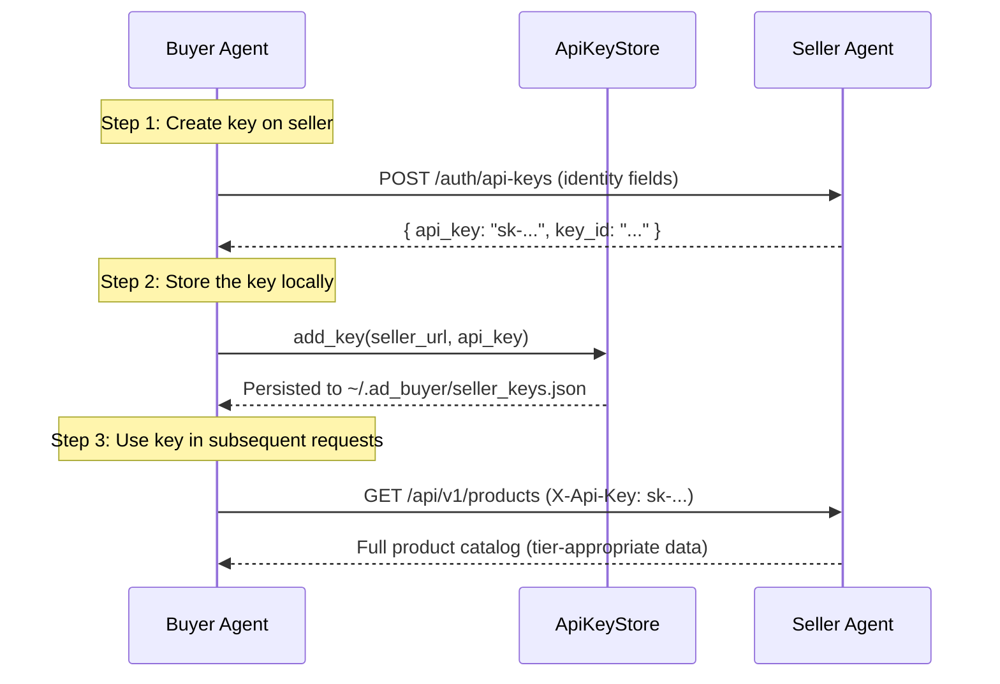

# Authentication

The buyer agent has two distinct authentication concerns:

1. **Inbound authentication** -- protecting the buyer's own API from unauthorized callers.
2. **Outbound authentication** -- attaching the correct credentials when the buyer calls seller endpoints.

This page covers both, including the `ApiKeyStore` for managing per-seller credentials and the `AuthMiddleware` that injects keys into outgoing requests.

!!! info "Seller-side reference"
    For full details on how the seller validates keys, issues access tiers, and manages trust levels, see the [Seller Authentication docs](https://iabtechlab.github.io/seller-agent/api/authentication/).

---

## Inbound Authentication

### X-Api-Key Header

Protected endpoints on the buyer agent require the `X-Api-Key` header:

```bash
curl -H "X-Api-Key: your-secret-key" http://localhost:8001/bookings
```

The middleware compares the provided key against the `api_key` setting. If the key is missing or does not match, the server returns `401`:

```json
{"detail": "Invalid or missing API key"}
```

### Development Mode

When `api_key` is empty (the default), authentication is **disabled entirely**. All requests are allowed without a key. This is the intended mode for local development.

To enable auth, set the `API_KEY` environment variable or add it to your `.env` file:

```dotenv
API_KEY=my-secret-buyer-key
```

### Public Paths

The following paths always skip authentication, even when an API key is configured:

| Path | Purpose |
|------|---------|
| `/health` | Health check |
| `/docs` | Swagger UI |
| `/openapi.json` | OpenAPI schema |
| `/redoc` | ReDoc documentation |

### Configuration

The API key is loaded through `pydantic-settings` in `ad_buyer.config.settings.Settings`:

```python
class Settings(BaseSettings):
    # Inbound API key for authenticating requests to this service.
    # When empty/not set, authentication is disabled (development mode).
    api_key: str = ""
```

Set it via any method that `pydantic-settings` supports: environment variable, `.env` file, or constructor argument.

---

## Outbound Authentication

When the buyer calls seller endpoints (quotes, deals, media kits, etc.), it needs to present valid credentials. The seller uses these credentials to determine the buyer's [access tier](https://iabtechlab.github.io/seller-agent/api/authentication/) and unlock tiered pricing, negotiation capabilities, and richer data in responses.

### How Sellers Authenticate Buyers

Sellers accept credentials in two formats on every endpoint:

```
Authorization: Bearer <api_key>
```

```
X-Api-Key: <api_key>
```

Unauthenticated requests receive `public`-tier access only -- price ranges instead of exact prices, no negotiation, and limited data.

### Seller Access Tiers

The tier the buyer receives depends on the identity fields associated with its API key:

| Tier | Identity Required | Pricing Visibility | Negotiation |
|------|-------------------|-------------------|-------------|
| `public` | None (anonymous) | Price ranges only | No |
| `seat` | DSP seat ID | Exact prices, no discounts | Limited |
| `agency` | Agency ID | Tier discounts applied | Standard |
| `advertiser` | Full advertiser identity | Full discounts + volume pricing | Premium |

!!! tip "Maximize your access"
    When creating an API key on the seller, include `seat_id`, `agency_id`, and `advertiser_id` to receive the highest tier. Keys with only a `seat_id` will be limited to seat-tier pricing.

---

## ApiKeyStore

The `ApiKeyStore` provides file-backed credential storage for seller API keys. It stores one key per seller URL in a JSON file at `~/.ad_buyer/seller_keys.json`. Values are base64-encoded on disk to prevent accidental exposure in casual file reads.

!!! warning "Not encryption"
    Base64 encoding is an obfuscation layer, not encryption. For production deployments, back the store with a secrets manager or encrypted file system.

### Initialization

```python
from ad_buyer.auth.key_store import ApiKeyStore

# Default location: ~/.ad_buyer/seller_keys.json
store = ApiKeyStore()

# Custom location
from pathlib import Path
store = ApiKeyStore(store_path=Path("/etc/ad_buyer/keys.json"))
```

The store loads existing keys from disk on initialization. If the file does not exist, the store starts empty.

### Store a Key

Add or replace the API key for a seller URL:

```python
store.add_key("http://seller.example.com:8001", "sk-abc123secret")
```

The key is persisted to disk immediately. Trailing slashes on the URL are stripped for consistent lookup.

```bash
# Verify the key was stored (file contents are base64-encoded)
cat ~/.ad_buyer/seller_keys.json
```

```json
{
  "http://seller.example.com:8001": "c2stYWJjMTIzc2VjcmV0"
}
```

### Retrieve a Key

```python
key = store.get_key("http://seller.example.com:8001")
if key:
    print(f"Key: {key}")  # "sk-abc123secret"
else:
    print("No key stored for this seller")
```

Returns `None` if no key is stored for the given URL.

### Remove a Key

```python
removed = store.remove_key("http://seller.example.com:8001")
print(removed)  # True if the key existed, False otherwise
```

The file is updated on disk immediately after removal.

### Rotate a Key

Replace an existing key with a new one. This is functionally identical to `add_key` but communicates intent:

```python
store.rotate_key("http://seller.example.com:8001", "sk-new-key-456")
```

### List All Sellers

Return all seller URLs that have a stored key:

```python
sellers = store.list_sellers()
for url in sellers:
    print(url)
# http://seller-a.example.com:8001
# http://seller-b.example.com:8001
```

### Full ApiKeyStore API

| Method | Signature | Returns | Description |
|--------|-----------|---------|-------------|
| `add_key` | `(seller_url: str, api_key: str)` | `None` | Store or replace a key |
| `get_key` | `(seller_url: str)` | `str \| None` | Retrieve a key |
| `remove_key` | `(seller_url: str)` | `bool` | Remove a key; `True` if it existed |
| `rotate_key` | `(seller_url: str, new_key: str)` | `None` | Replace with a new key |
| `list_sellers` | `()` | `list[str]` | All seller URLs with stored keys |

---

## AuthMiddleware

The `AuthMiddleware` sits between the buyer's HTTP clients and the network. It automatically attaches stored API keys to outgoing requests and inspects responses for `401` status codes that indicate expired or revoked credentials.

### Initialization

```python
from ad_buyer.auth.key_store import ApiKeyStore
from ad_buyer.auth.middleware import AuthMiddleware

store = ApiKeyStore()
store.add_key("http://seller.example.com:8001", "sk-abc123secret")

# Send keys as X-Api-Key header (default)
middleware = AuthMiddleware(key_store=store, header_type="api_key")

# Or send keys as Bearer tokens
middleware = AuthMiddleware(key_store=store, header_type="bearer")
```

| Parameter | Type | Default | Description |
|-----------|------|---------|-------------|
| `key_store` | `ApiKeyStore` | *required* | The key store holding per-seller credentials |
| `header_type` | `"api_key" \| "bearer"` | `"api_key"` | How to send the key in the HTTP header |

### Adding Auth to Requests

The `add_auth` method takes an `httpx.Request` and returns a new request with the appropriate auth header attached. If no key is stored for the request's seller URL, the request is returned unchanged.

```python
import httpx

request = httpx.Request("GET", "http://seller.example.com:8001/api/v1/products")
authenticated_request = middleware.add_auth(request)

# The returned request now includes:
#   X-Api-Key: sk-abc123secret       (if header_type="api_key")
#   Authorization: Bearer sk-abc123   (if header_type="bearer")
```

The middleware extracts the base URL (`scheme://host:port`) from the request URL and looks up the key in the store. This means all paths on the same seller host share a single key.

### Handling 401 Responses

The `handle_response` method inspects HTTP responses and returns an `AuthResponse` indicating whether re-authentication is needed:

```python
from ad_buyer.auth.middleware import AuthResponse

response = await http_client.send(authenticated_request)
auth_result: AuthResponse = middleware.handle_response(response)

if auth_result.needs_reauth:
    print(f"Key expired for {auth_result.seller_url}")
    # Acquire a new key from the seller and update the store
    new_key = await acquire_new_key(auth_result.seller_url)
    store.rotate_key(auth_result.seller_url, new_key)
```

| Field | Type | Description |
|-------|------|-------------|
| `needs_reauth` | `bool` | `True` if the response was HTTP 401 |
| `seller_url` | `str` | Base URL of the seller that returned the error |
| `status_code` | `int` | HTTP status code from the response |

!!! note "403 is not re-auth"
    Only HTTP 401 (authentication failure) triggers `needs_reauth`. HTTP 403 (authorization / insufficient permissions) is intentionally excluded -- it means the key is valid but the buyer lacks access to the requested resource.

---

## Multi-Seller Credential Management

The `ApiKeyStore` is designed for buyers that work with multiple sellers simultaneously. Each seller URL maps to its own API key, and the `AuthMiddleware` automatically selects the correct key based on the request URL.

```python
store = ApiKeyStore()

# Register keys for multiple sellers
store.add_key("http://seller-sports.example.com:8001", "sk-sports-key")
store.add_key("http://seller-news.example.com:8001", "sk-news-key")
store.add_key("http://seller-entertainment.example.com:8001", "sk-ent-key")

middleware = AuthMiddleware(key_store=store)

# Each request automatically gets the right key
sports_req = httpx.Request("GET", "http://seller-sports.example.com:8001/api/v1/products")
news_req = httpx.Request("GET", "http://seller-news.example.com:8001/api/v1/products")

sports_auth = middleware.add_auth(sports_req)   # X-Api-Key: sk-sports-key
news_auth = middleware.add_auth(news_req)       # X-Api-Key: sk-news-key
```

### URL Normalization

The store strips trailing slashes to ensure consistent key lookup. These all resolve to the same key:

```python
store.add_key("http://seller.example.com:8001/", "sk-key")
store.get_key("http://seller.example.com:8001")   # "sk-key"
store.get_key("http://seller.example.com:8001/")  # "sk-key"
```

---

## Key Acquisition Workflow

Before the buyer can authenticate to a seller, it needs to obtain an API key. The seller's `/auth/api-keys` endpoint issues keys with identity fields that determine the buyer's access tier.



### Step 1: Request a Key from the Seller

```bash
curl -X POST http://seller.example.com:8001/auth/api-keys \
  -H "Content-Type: application/json" \
  -d '{
    "seat_id": "seat-acme-001",
    "seat_name": "Acme DSP",
    "agency_id": "agency-mega",
    "agency_name": "Mega Agency",
    "advertiser_id": "adv-widget-co",
    "advertiser_name": "Widget Co",
    "label": "Widget Co production key",
    "expires_in_days": 365
  }'
```

!!! warning "Save the key immediately"
    The seller returns the full API key **only once** in the creation response. It cannot be retrieved later. Store it immediately using `ApiKeyStore.add_key()`.

### Step 2: Store the Key

```python
store = ApiKeyStore()
store.add_key("http://seller.example.com:8001", "sk-returned-key-from-seller")
```

### Step 3: Verify Access

```bash
# Test that the key works and check your tier
curl -H "X-Api-Key: sk-returned-key-from-seller" \
  http://seller.example.com:8001/api/v1/products
```

A successful response with exact pricing (not just ranges) confirms the key is working and the buyer has been assigned an appropriate tier.

### Key Rotation

When a key expires or is compromised:

1. Create a new key on the seller (`POST /auth/api-keys`)
2. Rotate the local key: `store.rotate_key(seller_url, new_key)`
3. Optionally revoke the old key on the seller (`DELETE /auth/api-keys/{key_id}`)

```python
# Rotate after receiving a 401
auth_result = middleware.handle_response(response)
if auth_result.needs_reauth:
    # 1. Get a new key from the seller
    new_key = await create_seller_api_key(auth_result.seller_url)

    # 2. Update the local store
    store.rotate_key(auth_result.seller_url, new_key)

    # 3. Retry the failed request (middleware will use the new key)
    retry_request = middleware.add_auth(original_request)
    response = await client.send(retry_request)
```

---

## DealsClient Authentication

The `DealsClient` accepts credentials directly in its constructor and attaches them to every request. This is the simplest path for buyers that interact with a single seller per client instance.

```python
from ad_buyer.clients.deals_client import DealsClient

# API key authentication (sent as X-Api-Key header)
client = DealsClient(
    seller_url="http://seller.example.com:8001",
    api_key="sk-abc123secret",
)

# Bearer token authentication (sent as Authorization: Bearer header)
client = DealsClient(
    seller_url="http://seller.example.com:8001",
    bearer_token="eyJhbGciOiJIUzI1NiIs...",
)
```

!!! note "One auth method per client"
    Provide either `api_key` **or** `bearer_token`, not both. If both are set, `api_key` takes precedence and is sent as the `X-Api-Key` header.

For multi-seller scenarios, use `ApiKeyStore` + `AuthMiddleware` to manage credentials centrally, or create one `DealsClient` per seller with its own key.

---

## Related

- [Seller Authentication](https://iabtechlab.github.io/seller-agent/api/authentication/) -- Seller-side key management, access tiers, and trust levels
- [Deals API](deals.md) -- Deal client that uses these auth mechanisms
- [Seller Discovery](seller-discovery.md) -- Discovering sellers to authenticate with
- [Identity Strategy](../guides/identity.md) -- How buyer identity maps to seller tiers
