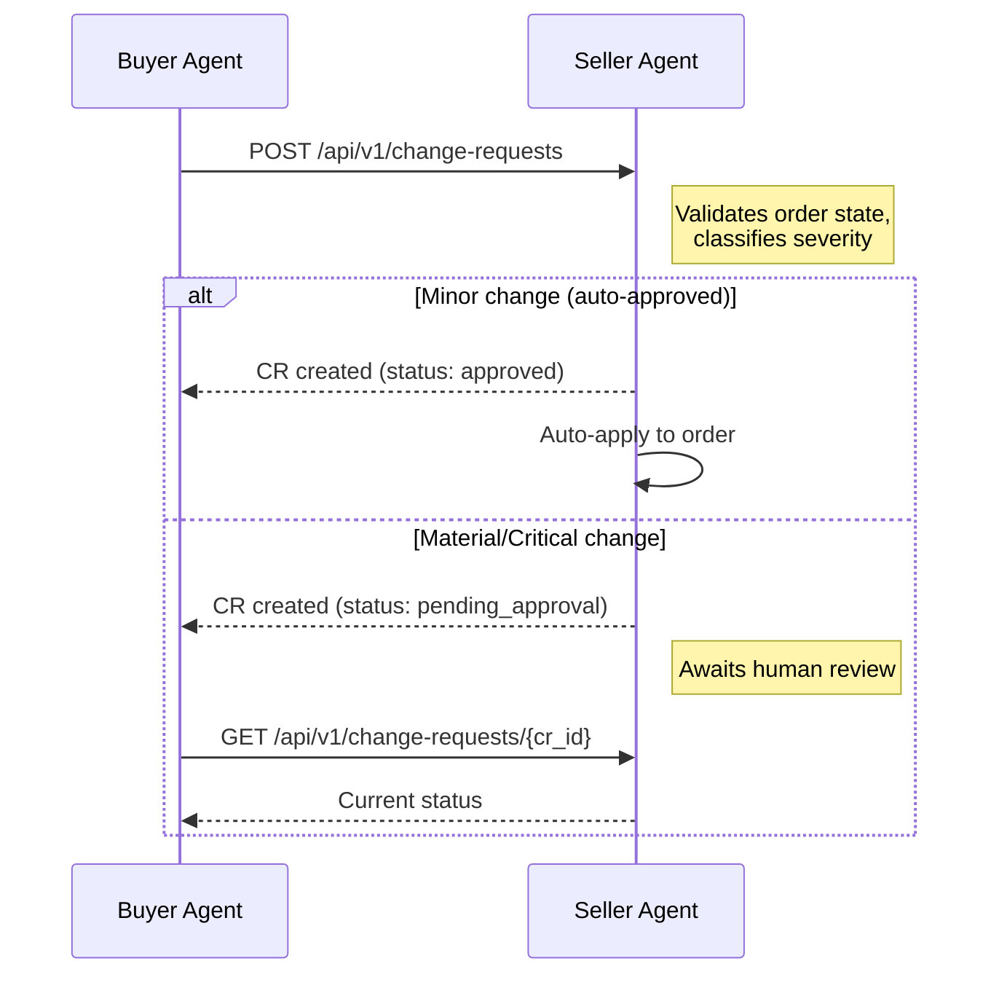

# Change Requests

Change requests allow the buyer to propose post-deal modifications to orders on the seller. Each request is validated against the current order state, assigned a severity level, and routed through the appropriate approval path on the seller side.

!!! tip "Seller-side reference"
    For the full server-side behavior --- including severity auto-classification, validation rules, and the review/apply workflow --- see the [Seller Change Requests docs](https://iabtechlab.github.io/seller-agent/api/change-requests/).

---

## Overview



The buyer submits a change request and receives a change request ID. Minor changes (e.g., small flight date shifts, creative swaps) are auto-approved and applied immediately. Material and critical changes enter a review queue on the seller side.

!!! info "Planned client"
    The buyer does not yet have a dedicated `ChangeRequestsClient`. The workflows below document the seller's REST API that the buyer calls directly. A typed client is planned for a future release.

---

## Severity Levels

The seller automatically classifies each change request into one of three severity levels:

| Severity | Approval Path | Description |
|----------|--------------|-------------|
| `minor` | Auto-approved | Low-impact changes: creative swaps, flight date shifts of 3 days or less |
| `material` | Human review required | Significant changes: impression adjustments, targeting modifications |
| `critical` | Senior review required | High-impact changes: pricing changes exceeding 20%, cancellations |

### Severity by Change Type

| Change Type | Default Severity | Notes |
|------------|-----------------|-------|
| `flight_dates` | `material` | Downgraded to `minor` if the shift is 3 days or less |
| `impressions` | `material` | -- |
| `pricing` | `critical` | Always `critical` when the price change exceeds 20% |
| `creative` | `minor` | Auto-approved |
| `targeting` | `material` | -- |
| `cancellation` | `critical` | -- |
| `other` | `material` | -- |

!!! tip "Faster approvals"
    Structure your changes to qualify as `minor` when possible. A 2-day flight shift is auto-approved; a 4-day shift requires human review.

---

## Submitting a Change Request

**Endpoint:** `POST /api/v1/change-requests`

### Request Fields

| Field | Type | Required | Description |
|-------|------|----------|-------------|
| `order_id` | `str` | yes | The order to modify (seller-issued order/deal ID) |
| `change_type` | `str` | yes | One of: `flight_dates`, `impressions`, `pricing`, `creative`, `targeting`, `cancellation`, `other` |
| `diffs` | `list[object]` | no | Field-level changes with `field`, `old_value`, and `new_value` |
| `proposed_values` | `object` | no | Key-value pairs of proposed new values |
| `reason` | `str` | no | Explanation for the change |
| `requested_by` | `str` | no | Identity of the requester (default: `system`) |

### Diff Object

Each entry in the `diffs` array describes one field-level change:

| Field | Type | Description |
|-------|------|-------------|
| `field` | `str` | Name of the field being changed |
| `old_value` | `any` | Current value |
| `new_value` | `any` | Proposed new value |

---

### Example: Flight Date Shift (Auto-Approved)

A 2-day shift falls within the 3-day threshold, so it receives `minor` classification and is auto-approved.

```bash
curl -X POST http://seller.example.com:8001/api/v1/change-requests \
  -H "Content-Type: application/json" \
  -H "X-Api-Key: your-api-key" \
  -d '{
    "order_id": "ORD-A1B2C3D4E5F6",
    "change_type": "flight_dates",
    "diffs": [
      {"field": "flight_start", "old_value": "2026-04-01", "new_value": "2026-04-03"},
      {"field": "flight_end", "old_value": "2026-04-30", "new_value": "2026-05-02"}
    ],
    "reason": "Campaign launch delayed by 2 days",
    "requested_by": "agent:buyer-001"
  }'
```

**Expected response** (status `approved`, auto-applied):

```json
{
  "change_request_id": "CR-X1Y2Z3",
  "order_id": "ORD-A1B2C3D4E5F6",
  "change_type": "flight_dates",
  "severity": "minor",
  "status": "approved",
  "diffs": [
    {"field": "flight_start", "old_value": "2026-04-01", "new_value": "2026-04-03"},
    {"field": "flight_end", "old_value": "2026-04-30", "new_value": "2026-05-02"}
  ],
  "reason": "Campaign launch delayed by 2 days"
}
```

### Example: Creative Swap (Auto-Approved)

```bash
curl -X POST http://seller.example.com:8001/api/v1/change-requests \
  -H "Content-Type: application/json" \
  -H "X-Api-Key: your-api-key" \
  -d '{
    "order_id": "ORD-A1B2C3D4E5F6",
    "change_type": "creative",
    "diffs": [
      {"field": "creative_id", "old_value": "cr-old-001", "new_value": "cr-new-002"}
    ],
    "reason": "Updated brand creative for Q3",
    "requested_by": "agent:buyer-001"
  }'
```

### Example: Impression Adjustment (Requires Review)

```bash
curl -X POST http://seller.example.com:8001/api/v1/change-requests \
  -H "Content-Type: application/json" \
  -H "X-Api-Key: your-api-key" \
  -d '{
    "order_id": "ORD-A1B2C3D4E5F6",
    "change_type": "impressions",
    "diffs": [
      {"field": "impressions", "old_value": 500000, "new_value": 750000}
    ],
    "proposed_values": {"impressions": 750000},
    "reason": "Increasing budget for stronger Q3 performance",
    "requested_by": "agent:buyer-001"
  }'
```

**Expected response** (status `pending_approval`):

```json
{
  "change_request_id": "CR-D4E5F6",
  "order_id": "ORD-A1B2C3D4E5F6",
  "change_type": "impressions",
  "severity": "material",
  "status": "pending_approval",
  "diffs": [
    {"field": "impressions", "old_value": 500000, "new_value": 750000}
  ],
  "reason": "Increasing budget for stronger Q3 performance"
}
```

### Example: Pricing Change (Critical, Senior Review)

```bash
curl -X POST http://seller.example.com:8001/api/v1/change-requests \
  -H "Content-Type: application/json" \
  -H "X-Api-Key: your-api-key" \
  -d '{
    "order_id": "ORD-A1B2C3D4E5F6",
    "change_type": "pricing",
    "diffs": [
      {"field": "final_cpm", "old_value": 10.00, "new_value": 8.50}
    ],
    "proposed_values": {"final_cpm": 8.50},
    "reason": "Requesting discount after volume commitment increase",
    "requested_by": "agent:buyer-001"
  }'
```

### Example: Order Cancellation (Critical)

```bash
curl -X POST http://seller.example.com:8001/api/v1/change-requests \
  -H "Content-Type: application/json" \
  -H "X-Api-Key: your-api-key" \
  -d '{
    "order_id": "ORD-A1B2C3D4E5F6",
    "change_type": "cancellation",
    "reason": "Campaign cancelled by advertiser",
    "requested_by": "agent:buyer-001"
  }'
```

---

## Checking Change Request Status

After submitting a change request, poll its status to track progress through the approval pipeline.

### Get a Specific Change Request

**Endpoint:** `GET /api/v1/change-requests/{cr_id}`

```bash
curl -H "X-Api-Key: your-api-key" \
  http://seller.example.com:8001/api/v1/change-requests/CR-X1Y2Z3
```

### List Change Requests for an Order

**Endpoint:** `GET /api/v1/change-requests`

```bash
# All change requests for an order
curl -H "X-Api-Key: your-api-key" \
  "http://seller.example.com:8001/api/v1/change-requests?order_id=ORD-A1B2C3D4E5F6"

# Filter by status
curl -H "X-Api-Key: your-api-key" \
  "http://seller.example.com:8001/api/v1/change-requests?order_id=ORD-A1B2C3D4E5F6&status=pending_approval"
```

| Query Parameter | Type | Description |
|----------------|------|-------------|
| `order_id` | `str` | Filter by order ID |
| `status` | `str` | Filter by status (see lifecycle below) |

---

## Change Request Lifecycle

Change requests move through a 7-state lifecycle on the seller:

```
pending --> validating --> pending_approval --> approved --> applied
                 |                  |
                 v                  v
              failed           rejected
```

| Status | Description | Buyer Action |
|--------|-------------|--------------|
| `pending` | Created, awaiting validation | Wait |
| `validating` | Being validated against order state | Wait |
| `pending_approval` | Material/critical changes awaiting human review | Poll for updates |
| `approved` | Approved (auto or manual), ready to apply | None required; seller applies |
| `rejected` | Rejected by reviewer | Submit a revised request or accept rejection |
| `applied` | Changes applied to the order | Verify updated order state |
| `failed` | Validation failed (e.g., invalid order state) | Fix and resubmit |

!!! note "Auto-approved changes skip the queue"
    Minor changes (`creative`, small `flight_dates` shifts) go directly from `validating` to `approved` to `applied` without entering `pending_approval`.

---

## Validation Rules

The seller enforces these constraints when processing change requests:

| Rule | Detail | HTTP Response |
|------|--------|---------------|
| Order must be modifiable | Orders in `completed`, `cancelled`, or `failed` status cannot be changed | `422` with error details |
| Cancellation requires active state | Cancellations only allowed from: `draft`, `submitted`, `pending_approval`, `approved`, `in_progress`, `booked` | `422` |
| Impressions must be positive | Impression values must be positive integers | `422` |
| Order must exist | The `order_id` must reference a valid order | `404` |

### Error Response

When validation fails, the seller returns HTTP `422` with the change request ID and error details:

```json
{
  "change_request_id": "CR-X1Y2Z3",
  "error": "validation_failed",
  "detail": "Order ORD-A1B2C3D4E5F6 is in 'completed' status and cannot be modified"
}
```

---

## Buyer Workflow Patterns

### Pattern 1: Simple Modification

For changes that are likely auto-approved (creative swaps, small date shifts):

```python
import httpx

async def submit_minor_change(seller_url: str, api_key: str, order_id: str):
    async with httpx.AsyncClient() as client:
        response = await client.post(
            f"{seller_url}/api/v1/change-requests",
            headers={"X-Api-Key": api_key, "Content-Type": "application/json"},
            json={
                "order_id": order_id,
                "change_type": "creative",
                "diffs": [
                    {"field": "creative_id", "old_value": "cr-old", "new_value": "cr-new"}
                ],
                "reason": "Updated creative asset",
                "requested_by": "agent:buyer-001",
            },
        )
        cr = response.json()
        print(f"CR {cr['change_request_id']}: {cr['status']}")
        # Expected: status = "approved" (auto-approved)
```

### Pattern 2: Submit and Poll

For material/critical changes that require seller review:

```python
import asyncio
import httpx

async def submit_and_poll(seller_url: str, api_key: str, order_id: str):
    headers = {"X-Api-Key": api_key, "Content-Type": "application/json"}

    async with httpx.AsyncClient() as client:
        # Submit the change request
        response = await client.post(
            f"{seller_url}/api/v1/change-requests",
            headers=headers,
            json={
                "order_id": order_id,
                "change_type": "impressions",
                "diffs": [
                    {"field": "impressions", "old_value": 500000, "new_value": 750000}
                ],
                "proposed_values": {"impressions": 750000},
                "reason": "Increasing volume for Q3",
                "requested_by": "agent:buyer-001",
            },
        )
        cr = response.json()
        cr_id = cr["change_request_id"]
        print(f"Submitted: {cr_id} (status: {cr['status']})")

        # Poll until resolved
        terminal_statuses = {"approved", "rejected", "applied", "failed"}
        while cr["status"] not in terminal_statuses:
            await asyncio.sleep(5)
            response = await client.get(
                f"{seller_url}/api/v1/change-requests/{cr_id}",
                headers=headers,
            )
            cr = response.json()
            print(f"  Status: {cr['status']}")

        print(f"Final: {cr_id} -> {cr['status']}")
```

### Pattern 3: Batch Changes

When multiple changes are needed on the same order, submit them individually. The seller processes each change request independently.

```python
changes = [
    {
        "change_type": "flight_dates",
        "diffs": [
            {"field": "flight_start", "old_value": "2026-04-01", "new_value": "2026-04-03"},
            {"field": "flight_end", "old_value": "2026-04-30", "new_value": "2026-05-02"},
        ],
        "reason": "Shift flight by 2 days",
    },
    {
        "change_type": "creative",
        "diffs": [
            {"field": "creative_id", "old_value": "cr-old", "new_value": "cr-new"},
        ],
        "reason": "Updated creative",
    },
]

for change in changes:
    change["order_id"] = order_id
    change["requested_by"] = "agent:buyer-001"
    response = await client.post(
        f"{seller_url}/api/v1/change-requests",
        headers=headers,
        json=change,
    )
    cr = response.json()
    print(f"  {cr['change_type']}: {cr['status']}")
```

---

## Related

- [Seller Change Requests](https://iabtechlab.github.io/seller-agent/api/change-requests/) --- Full server-side behavior, review/apply workflow
- [Deals API](deals.md) --- Creating the deals that change requests modify
- [Bookings API](bookings.md) --- Campaign booking workflow
- [Authentication](authentication.md) --- API key setup for seller communication
