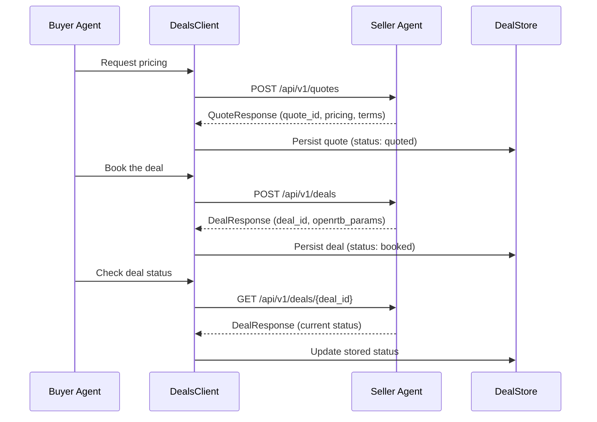

# Deals API Client

The `DealsClient` is the buyer's interface to the seller's **quote-then-book** deal endpoints. Instead of fabricating deal IDs client-side, the buyer requests a non-binding price quote from the seller, optionally negotiates, and then books a deal -- receiving a seller-issued Deal ID with OpenRTB activation parameters.

## Overview



!!! info "Why quote-then-book?"
    Earlier versions of the buyer generated deal IDs locally and hoped the seller would accept them. The quote-then-book flow ensures the seller validates inventory availability, applies tier-based pricing, and issues the authoritative Deal ID. This matches the IAB OpenDirect pattern where the sell-side is the system of record.

---

## Client Initialization

The `DealsClient` is an async HTTP client backed by [httpx](https://www.python-httpx.org/). It supports API key or bearer token authentication, configurable timeouts, automatic retries for transient failures, and optional local persistence via a `DealStore`.

```python
from ad_buyer.clients.deals_client import DealsClient

# Minimal — API key auth
client = DealsClient(
    seller_url="http://seller.example.com:8001",
    api_key="your-api-key",
)

# Full configuration with DealStore
from ad_buyer.storage.deal_store import DealStore

store = DealStore("sqlite:///./ad_buyer.db")
store.connect()

client = DealsClient(
    seller_url="http://seller.example.com:8001",
    bearer_token="eyJhbGci...",
    timeout=60.0,
    max_retries=5,
    deal_store=store,
)
```

### Constructor Parameters

| Parameter | Type | Default | Description |
|-----------|------|---------|-------------|
| `seller_url` | `str` | *required* | Base URL of the seller system |
| `api_key` | `str` | `None` | API key sent via `X-Api-Key` header |
| `bearer_token` | `str` | `None` | Bearer token sent via `Authorization` header |
| `timeout` | `float` | `30.0` | Request timeout in seconds |
| `max_retries` | `int` | `3` | Max retries for transient failures (502/503/504) |
| `deal_store` | `DealStore` | `None` | Optional local persistence store |

!!! note "Authentication"
    Provide either `api_key` **or** `bearer_token`, not both. If an API key is set, it takes precedence as the `X-Api-Key` header. Bearer tokens are sent as `Authorization: Bearer <token>`.

### Async Context Manager

The client implements the async context manager protocol for clean resource management:

```python
async with DealsClient(seller_url, api_key="key") as client:
    quote = await client.request_quote(quote_request)
    deal = await client.book_deal(booking_request)
# HTTP client is automatically closed
```

Alternatively, call `await client.close()` manually when done.

---

## Core Methods

### Request a Quote

Request non-binding pricing from the seller for a specific product.

**Endpoint:** `POST /api/v1/quotes`

```python
from ad_buyer.models.deals import QuoteRequest, BuyerIdentityPayload

quote_request = QuoteRequest(
    product_id="prod-ctv-sports-001",
    deal_type="PD",
    impressions=500_000,
    flight_start="2026-07-01",
    flight_end="2026-09-30",
    target_cpm=12.50,
    buyer_identity=BuyerIdentityPayload(
        seat_id="ttd-seat-123",
        agency_id="omnicom-456",
        advertiser_id="coca-cola",
    ),
)

async with DealsClient(seller_url, api_key="key") as client:
    quote = await client.request_quote(quote_request)

    print(f"Quote ID: {quote.quote_id}")
    print(f"Status: {quote.status}")           # "available"
    print(f"Final CPM: ${quote.pricing.final_cpm}")
    print(f"Tier: {quote.buyer_tier}")
    print(f"Expires: {quote.expires_at}")
```

**curl equivalent:**

```bash
curl -X POST http://seller.example.com:8001/api/v1/quotes \
  -H "Content-Type: application/json" \
  -H "X-Api-Key: your-api-key" \
  -d '{
    "product_id": "prod-ctv-sports-001",
    "deal_type": "PD",
    "impressions": 500000,
    "flight_start": "2026-07-01",
    "flight_end": "2026-09-30",
    "target_cpm": 12.50,
    "buyer_identity": {
      "seat_id": "ttd-seat-123",
      "agency_id": "omnicom-456",
      "advertiser_id": "coca-cola"
    }
  }'
```

If a `DealStore` is attached, the quote is automatically persisted with status `quoted`.

### Retrieve a Quote

Fetch a previously issued quote to check its current status (e.g., whether it has expired).

**Endpoint:** `GET /api/v1/quotes/{quote_id}`

```python
quote = await client.get_quote("qt-abc123")
print(f"Status: {quote.status}")  # available, expired, declined, booked
```

### Book a Deal

Convert a quote into a confirmed deal. The seller validates the quote is still available and issues a Deal ID.

**Endpoint:** `POST /api/v1/deals`

```python
from ad_buyer.models.deals import DealBookingRequest

booking = DealBookingRequest(
    quote_id="qt-abc123",
    buyer_identity=BuyerIdentityPayload(
        seat_id="ttd-seat-123",
    ),
    notes="Q3 CTV campaign for Coca-Cola",
)

deal = await client.book_deal(booking)

print(f"Deal ID: {deal.deal_id}")
print(f"Status: {deal.status}")           # "proposed" or "active"
print(f"CPM: ${deal.pricing.final_cpm}")

# OpenRTB activation parameters for DSP integration
if deal.openrtb_params:
    print(f"OpenRTB Deal ID: {deal.openrtb_params.id}")
    print(f"Bid Floor: ${deal.openrtb_params.bidfloor}")
```

**curl equivalent:**

```bash
curl -X POST http://seller.example.com:8001/api/v1/deals \
  -H "Content-Type: application/json" \
  -H "X-Api-Key: your-api-key" \
  -d '{
    "quote_id": "qt-abc123",
    "buyer_identity": {"seat_id": "ttd-seat-123"},
    "notes": "Q3 CTV campaign for Coca-Cola"
  }'
```

If a `DealStore` is attached, the deal is automatically persisted with status `booked`.

### Get Deal Status

Retrieve the current state of a deal. Useful for tracking deals through their lifecycle.

**Endpoint:** `GET /api/v1/deals/{deal_id}`

```python
deal = await client.get_deal("deal-xyz789")

print(f"Status: {deal.status}")  # proposed, active, rejected, expired, completed
print(f"Type: {deal.deal_type}")
print(f"Product: {deal.product.name}")
```

If a `DealStore` is attached, the stored deal status is updated automatically when the seller reports a new status.

---

## Deal Lifecycle

Quotes and deals move through distinct status flows:

### Quote Statuses

```
available --> booked
          \-> expired
          \-> declined
```

| Status | Meaning |
|--------|---------|
| `available` | Quote is valid and can be booked |
| `expired` | Quote has passed its `expires_at` time |
| `declined` | Seller declined the quote |
| `booked` | Quote was converted into a deal |

### Deal Statuses

```
proposed --> active --> completed
         \-> rejected
         \-> expired
```

| Status | Meaning |
|--------|---------|
| `proposed` | Deal created, awaiting seller activation |
| `active` | Deal is live and accepting bids |
| `rejected` | Seller rejected the deal |
| `expired` | Deal passed its expiration without activation |
| `completed` | Deal fulfilled its impression target |

---

## Data Models

All models use [Pydantic](https://docs.pydantic.dev/) for validation and serialization.

### Request Models

#### QuoteRequest

Request body for `POST /api/v1/quotes`:

| Field | Type | Required | Description |
|-------|------|----------|-------------|
| `product_id` | `str` | yes | Product to quote |
| `deal_type` | `str` | no | `PG` (guaranteed), `PD` (preferred), or `PA` (auction). Default: `PD` |
| `impressions` | `int` | no | Requested impression volume |
| `flight_start` | `str` | no | Start date (ISO 8601) |
| `flight_end` | `str` | no | End date (ISO 8601) |
| `target_cpm` | `float` | no | Buyer's target CPM (hint for pricing) |
| `buyer_identity` | `BuyerIdentityPayload` | no | Buyer identity for tier-based pricing |
| `agent_url` | `str` | no | Callback URL for the buyer agent |

#### DealBookingRequest

Request body for `POST /api/v1/deals`:

| Field | Type | Required | Description |
|-------|------|----------|-------------|
| `quote_id` | `str` | yes | Quote to convert into a deal |
| `buyer_identity` | `BuyerIdentityPayload` | no | Buyer identity context |
| `notes` | `str` | no | Free-text notes for the seller |

#### BuyerIdentityPayload

Buyer identity included in requests for tier resolution:

| Field | Type | Required | Description |
|-------|------|----------|-------------|
| `seat_id` | `str` | no | DSP seat identifier |
| `agency_id` | `str` | no | Agency identifier |
| `advertiser_id` | `str` | no | Advertiser identifier |
| `dsp_platform` | `str` | no | DSP platform name |

### Response Models

#### QuoteResponse

Response from `GET/POST /api/v1/quotes`:

| Field | Type | Description |
|-------|------|-------------|
| `quote_id` | `str` | Unique quote identifier |
| `status` | `str` | `available`, `expired`, `declined`, or `booked` |
| `product` | `ProductInfo` | Product summary |
| `pricing` | `PricingInfo` | Pricing breakdown |
| `terms` | `TermsInfo` | Volume, flight dates, guarantee |
| `availability` | `AvailabilityInfo` | Inventory availability (optional) |
| `buyer_tier` | `str` | Resolved buyer tier (e.g. `seat`, `agency`) |
| `expires_at` | `str` | ISO 8601 expiration timestamp |
| `seller_id` | `str` | Seller identifier (optional) |
| `created_at` | `str` | ISO 8601 creation timestamp |

#### DealResponse

Response from `GET/POST /api/v1/deals`:

| Field | Type | Description |
|-------|------|-------------|
| `deal_id` | `str` | Seller-issued deal identifier |
| `deal_type` | `str` | `PG`, `PD`, or `PA` |
| `status` | `str` | `proposed`, `active`, `rejected`, `expired`, or `completed` |
| `quote_id` | `str` | Source quote ID |
| `product` | `ProductInfo` | Product summary |
| `pricing` | `PricingInfo` | Final pricing breakdown |
| `terms` | `TermsInfo` | Agreed terms |
| `buyer_tier` | `str` | Resolved buyer tier |
| `expires_at` | `str` | ISO 8601 expiration timestamp |
| `activation_instructions` | `dict` | Key-value pairs for DSP setup |
| `openrtb_params` | `OpenRTBParams` | OpenRTB deal parameters (optional) |
| `created_at` | `str` | ISO 8601 creation timestamp |

### Nested Models

#### ProductInfo

| Field | Type | Description |
|-------|------|-------------|
| `product_id` | `str` | Product identifier |
| `name` | `str` | Product name |
| `inventory_type` | `str` | Inventory type (optional) |

#### PricingInfo

| Field | Type | Description |
|-------|------|-------------|
| `base_cpm` | `float` | Pre-discount CPM |
| `tier_discount_pct` | `float` | Tier-based discount percentage |
| `volume_discount_pct` | `float` | Volume-based discount percentage |
| `final_cpm` | `float` | After-discount CPM |
| `currency` | `str` | ISO 4217 currency code (default: `USD`) |
| `pricing_model` | `str` | Pricing model (default: `cpm`) |
| `rationale` | `str` | Pricing explanation from the seller |

#### TermsInfo

| Field | Type | Description |
|-------|------|-------------|
| `impressions` | `int` | Contracted impressions (optional) |
| `flight_start` | `str` | Flight start date (optional) |
| `flight_end` | `str` | Flight end date (optional) |
| `guaranteed` | `bool` | Whether impressions are guaranteed |

#### AvailabilityInfo

| Field | Type | Description |
|-------|------|-------------|
| `inventory_available` | `bool` | Whether inventory is available |
| `estimated_fill_rate` | `float` | Estimated fill rate (optional) |
| `competing_demand` | `str` | Competing demand level (optional) |

#### OpenRTBParams

OpenRTB deal parameters for DSP activation:

| Field | Type | Description |
|-------|------|-------------|
| `id` | `str` | OpenRTB deal ID |
| `bidfloor` | `float` | Bid floor price |
| `bidfloorcur` | `str` | Bid floor currency (default: `USD`) |
| `at` | `int` | Auction type (default: `3` = fixed price) |
| `wseat` | `list[str]` | Allowed seat IDs |
| `wadomain` | `list[str]` | Allowed advertiser domains |

---

## DealStore Integration

The `DealStore` provides SQLite-backed local persistence for deals, negotiation history, and booking records. When a `DealStore` is attached to the `DealsClient`, quotes and deals are automatically saved and updated.

### Setup

```python
from ad_buyer.storage.deal_store import DealStore
from ad_buyer.clients.deals_client import DealsClient

# Initialize the store
store = DealStore("sqlite:///./ad_buyer.db")
store.connect()

# Attach to the client
client = DealsClient(
    seller_url="http://seller.example.com:8001",
    api_key="your-key",
    deal_store=store,
)
```

### Automatic Persistence

The `DealsClient` persists data at three points:

| Method | Action | Stored Status |
|--------|--------|---------------|
| `request_quote()` | Saves quote as a deal record | `quoted` |
| `book_deal()` | Saves deal with seller-issued ID | `booked` |
| `get_deal()` | Updates stored status to match seller | *current status* |

!!! tip "Non-fatal persistence"
    DealStore failures are logged but never raised to the caller. The API call succeeds even if local persistence fails.

### Querying the Store Directly

```python
# List all deals for a seller
deals = store.list_deals(seller_url="http://seller.example.com:8001")

# Filter by status
booked = store.list_deals(status="booked")

# Get a specific deal
deal = store.get_deal("deal-uuid-here")

# View status transition history
history = store.get_status_history("deal", "deal-uuid-here")
for transition in history:
    print(f"{transition['from_status']} -> {transition['to_status']}")
```

### Negotiation Tracking

The `DealStore` also tracks negotiation rounds:

```python
store.save_negotiation_round(
    deal_id="deal-uuid",
    proposal_id="prop-001",
    round_number=1,
    buyer_price=10.0,
    seller_price=15.0,
    action="counter",
    rationale="Countered at $10 CPM based on historical rates",
)

history = store.get_negotiation_history("deal-uuid")
```

### Cleanup

```python
store.disconnect()
```

---

## Error Handling

The client raises `DealsClientError` on failures. This exception carries structured error information from the seller's response.

```python
from ad_buyer.clients.deals_client import DealsClientError

try:
    quote = await client.request_quote(quote_request)
except DealsClientError as e:
    print(f"Error: {e}")
    print(f"HTTP status: {e.status_code}")
    print(f"Error code: {e.error_code}")
    print(f"Detail: {e.detail}")
```

### Error Scenarios

| Scenario | `status_code` | `error_code` | Behavior |
|----------|--------------|--------------|----------|
| Seller unreachable | `0` | `connect_error` | Raised immediately, no retry |
| Request timeout | `0` | `timeout` | Retried up to `max_retries` times |
| HTTP 4xx (client error) | *status* | *from response* | Raised immediately, no retry |
| HTTP 502/503/504 | *status* | *from response* | Retried up to `max_retries` times |
| Other HTTP 5xx | *status* | *from response* | Raised immediately, no retry |
| Quote expired | `409` | `quote_expired` | Raised immediately |
| Product not found | `404` | `not_found` | Raised immediately |

!!! warning "Retry behavior"
    Only 502, 503, and 504 status codes trigger automatic retries. Client errors (4xx) are never retried -- they indicate a problem with the request itself.

### Seller Error Response

When the seller returns a structured error, the client parses it into the exception fields:

```json
{
  "error": "quote_expired",
  "detail": "Quote qt-abc123 expired at 2026-07-01T00:00:00Z"
}
```

---

## Full Workflow Example

End-to-end: browse media kit, request a quote, book the deal.

```python
from ad_buyer.clients.deals_client import DealsClient, DealsClientError
from ad_buyer.models.deals import (
    QuoteRequest,
    DealBookingRequest,
    BuyerIdentityPayload,
)
from ad_buyer.storage.deal_store import DealStore

# Setup
store = DealStore("sqlite:///./ad_buyer.db")
store.connect()

seller_url = "http://seller.example.com:8001"
identity = BuyerIdentityPayload(
    seat_id="ttd-seat-123",
    agency_id="omnicom-456",
    advertiser_id="coca-cola",
)

async with DealsClient(seller_url, api_key="key", deal_store=store) as client:
    # 1. Request a quote
    quote = await client.request_quote(QuoteRequest(
        product_id="prod-ctv-sports-001",
        deal_type="PD",
        impressions=500_000,
        flight_start="2026-07-01",
        flight_end="2026-09-30",
        target_cpm=12.50,
        buyer_identity=identity,
    ))
    print(f"Quote {quote.quote_id}: ${quote.pricing.final_cpm} CPM")

    # 2. Book the deal
    deal = await client.book_deal(DealBookingRequest(
        quote_id=quote.quote_id,
        buyer_identity=identity,
        notes="Q3 CTV sports campaign",
    ))
    print(f"Deal {deal.deal_id} booked at ${deal.pricing.final_cpm} CPM")

    # 3. Activate in DSP via OpenRTB params
    if deal.openrtb_params:
        print(f"OpenRTB: id={deal.openrtb_params.id}, "
              f"floor=${deal.openrtb_params.bidfloor}")

    # 4. Track deal status
    updated = await client.get_deal(deal.deal_id)
    print(f"Current status: {updated.status}")

store.disconnect()
```

---

## Related

- [Seller Quotes API](https://iabtechlab.github.io/seller-agent/api/quotes/) -- Seller-side quote endpoints
- [Seller Orders API](https://iabtechlab.github.io/seller-agent/api/orders/) -- Seller-side deal/order endpoints
- [Negotiation Guide](../guides/negotiation.md) -- How to negotiate pricing with sellers
- [Media Kit Discovery](media-kit.md) -- Browse seller inventory before requesting quotes
- [Bookings API](bookings.md) -- Campaign booking workflow (brief-based)
- [Authentication](authentication.md) -- API key and token setup
