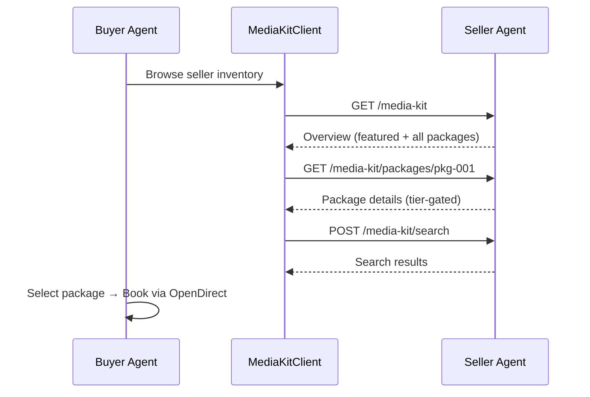
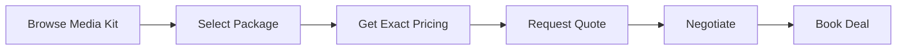

# Media Kit Discovery

The media kit is a seller's **inventory catalog** — a curated collection of ad packages that buyer agents browse to discover available inventory. The buyer agent includes a dedicated `MediaKitClient` for consuming seller media kits.

## Overview



## MediaKitClient

The `MediaKitClient` handles all media kit interactions. Authentication is optional — unauthenticated requests receive public views with price ranges; authenticated requests receive exact pricing and full placement details.

### Initialization

```python
from ad_buyer.media_kit import MediaKitClient

# Public access (no auth) — price ranges only
public_client = MediaKitClient()

# Authenticated access — exact pricing + placements
auth_client = MediaKitClient(api_key="your-seller-api-key")
```

When an API key is provided, the client includes an `X-API-Key` header on all requests.

## Browsing a Seller's Media Kit

### Get Media Kit Overview

Fetch the seller's full catalog with featured packages highlighted:

```python
async with MediaKitClient(api_key="my-key") as client:
    kit = await client.get_media_kit("http://seller.example.com:8001")

    print(f"Seller: {kit.seller_name}")
    print(f"Total packages: {kit.total_packages}")

    for pkg in kit.featured:
        print(f"  Featured: {pkg.name} — {pkg.price_range}")
```

**curl equivalent:**

```bash
# Public (no auth)
curl http://seller.example.com:8001/media-kit

# Authenticated
curl http://seller.example.com:8001/media-kit \
  -H "X-API-Key: your-key"
```

### List Packages

Filter packages by layer or featured status:

```python
# All packages
packages = await client.list_packages("http://seller.example.com:8001")

# Only curated packages
curated = await client.list_packages(
    "http://seller.example.com:8001",
    layer="curated",
)

# Only featured packages
featured = await client.list_packages(
    "http://seller.example.com:8001",
    featured_only=True,
)
```

### Get Package Detail

Retrieve a single package. Authenticated requests receive a `PackageDetail` with exact pricing and placements:

```python
pkg = await client.get_package(
    "http://seller.example.com:8001",
    "pkg-abc12345",
)

if isinstance(pkg, PackageDetail):
    # Authenticated view
    print(f"Exact price: ${pkg.exact_price} CPM")
    print(f"Floor price: ${pkg.floor_price} CPM")
    for p in pkg.placements:
        print(f"  Product: {p.product_name} ({p.ad_formats})")
else:
    # Public view
    print(f"Price range: {pkg.price_range}")
```

### Search Packages

Keyword search across package names, descriptions, tags, and content categories:

```python
from ad_buyer.media_kit.models import SearchFilter

# Simple search
results = await client.search_packages(
    "http://seller.example.com:8001",
    query="sports video",
)

# Search with identity context (may unlock better pricing)
results = await client.search_packages(
    "http://seller.example.com:8001",
    query="sports video",
    filters=SearchFilter(
        buyer_tier="agency",
        agency_id="omnicom-456",
        advertiser_id="coca-cola",
    ),
)
```

### Aggregate Across Multiple Sellers

Query multiple sellers in parallel and combine their packages:

```python
sellers = [
    "http://seller-a.example.com:8001",
    "http://seller-b.example.com:8002",
    "http://seller-c.example.com:8003",
]

all_packages = await client.aggregate_across_sellers(sellers)
print(f"Found {len(all_packages)} packages across {len(sellers)} sellers")
```

Failed sellers are silently skipped — the client logs warnings but continues with responsive sellers.

## Unauthenticated vs Authenticated Access

The seller returns different views depending on whether an `X-API-Key` header is present:

### Public View (No API Key)

| Field | Included |
|-------|----------|
| Package name, description | Yes |
| Ad formats, device types | Yes |
| Content categories (`cat`) | Yes |
| Geo targets, tags | Yes |
| Featured status | Yes |
| **Price range** (e.g. "$28–$42 CPM") | Yes |
| Exact price | **No** |
| Floor price | **No** |
| Placements (products) | **No** |
| Audience segments | **No** |
| Negotiation flags | **No** |

### Authenticated View (With API Key)

All public fields **plus**:

| Field | Description |
|-------|-------------|
| `exact_price` | Tier-adjusted CPM (e.g. `33.25`) |
| `floor_price` | Minimum acceptable price |
| `currency` | ISO 4217 code (e.g. `"USD"`) |
| `placements` | Individual products with ad formats, device types, weights |
| `audience_segment_ids` | IAB Audience Taxonomy 1.1 IDs |
| `negotiation_enabled` | Whether this tier can negotiate |
| `volume_discounts_available` | Whether volume discounts apply |

### Pricing Tiers

Sellers apply tier-based discounts. Higher identity revelation unlocks better pricing:

| Tier | Identity Required | Typical Discount |
|------|-------------------|-----------------|
| PUBLIC | None | 0% (range only) |
| SEAT | API key (DSP seat) | ~5% |
| AGENCY | Agency ID header | ~10% |
| ADVERTISER | Advertiser ID header | ~15% |

!!! tip "Progressive Identity Revelation"
    Start with public browsing to evaluate inventory, then authenticate to see exact pricing. Provide agency/advertiser identity during search to unlock the best rates.

## Identity-Based Access

Beyond the API key, the buyer can reveal its identity for seller-side tier resolution. The `SearchFilter` supports this:

```python
# Search with full identity context
results = await client.search_packages(
    seller_url,
    query="premium video",
    filters=SearchFilter(
        buyer_tier="advertiser",
        agency_id="omnicom-456",
        advertiser_id="coca-cola",
    ),
)
```

Alternatively, the `BuyerIdentity` model can generate identity headers for direct HTTP calls:

```python
from ad_buyer.models.buyer_identity import BuyerIdentity

identity = BuyerIdentity(
    seat_id="ttd-seat-123",
    agency_id="omnicom-456",
    advertiser_id="coca-cola",
)

# Produces: {"X-DSP-Seat-ID": "...", "X-Agency-ID": "...", "X-Advertiser-ID": "..."}
headers = identity.to_header_dict()
```

## Data Models

### PackageSummary (Public)

```python
@dataclass
class PackageSummary:
    package_id: str
    name: str
    description: Optional[str]
    ad_formats: list[str]       # ["video", "banner"]
    device_types: list[int]     # [3, 4, 5] (CTV, Phone, Tablet)
    cat: list[str]              # ["IAB19"] (IAB Content Taxonomy)
    geo_targets: list[str]      # ["US", "US-NY"]
    tags: list[str]             # ["premium", "sports"]
    price_range: str            # "$28-$42 CPM"
    is_featured: bool
    seller_url: Optional[str]   # Set when aggregating across sellers
```

### PackageDetail (Authenticated)

Extends `PackageSummary` with:

```python
@dataclass
class PackageDetail(PackageSummary):
    exact_price: Optional[float]     # 33.25
    floor_price: Optional[float]     # 29.40
    currency: str                    # "USD"
    placements: list[PlacementDetail]
    audience_segment_ids: list[str]  # IAB Audience Taxonomy 1.1
    negotiation_enabled: bool
    volume_discounts_available: bool
```

### MediaKit (Overview)

```python
@dataclass
class MediaKit:
    seller_url: str
    seller_name: str
    total_packages: int
    featured: list[PackageSummary]
    all_packages: list[PackageSummary]
```

## Package Layers

Sellers organize inventory into three layers:

| Layer | Source | Description |
|-------|--------|-------------|
| **synced** | Ad server import | Auto-created from GAM/FreeWheel inventory |
| **curated** | Publisher manual | Hand-built premium bundles |
| **dynamic** | Agent-assembled | Created on-the-fly during negotiations |

Filter by layer when listing:

```python
# Only show synced (ad server) packages
synced = await client.list_packages(seller_url, layer="synced")

# Only show curated (premium) packages
curated = await client.list_packages(seller_url, layer="curated")
```

## Error Handling

The client raises `MediaKitError` on failures:

```python
from ad_buyer.media_kit.models import MediaKitError

try:
    kit = await client.get_media_kit(seller_url)
except MediaKitError as e:
    print(f"Failed: {e}")
    print(f"Seller: {e.seller_url}")
    print(f"HTTP status: {e.status_code}")
```

Common error scenarios:

| Scenario | Behavior |
|----------|----------|
| Seller unreachable | `MediaKitError` with no status code |
| Request timeout | `MediaKitError` (default 30s timeout) |
| HTTP 4xx/5xx | `MediaKitError` with status code |
| Failed seller in aggregation | Silently skipped, warning logged |

## Workflow: From Media Kit to Booking

The media kit is the first step in the deal lifecycle:



1. **Browse** the seller's media kit (public or authenticated)
2. **Select** a package that matches campaign requirements
3. **Get exact pricing** by authenticating with your API key
4. **Request a quote** via the OpenDirect API for specific products in the package
5. **Negotiate** if your tier allows it (Agency/Advertiser)
6. **Book** the deal through the standard booking flow

See [Booking Lifecycle](bookings.md) and [Seller Agent Integration](../integration/seller-agent.md) for the full workflow.

## Related

- [Seller Agent Media Kit Setup](https://iabtechlab.github.io/seller-agent/guides/media-kit/) — How publishers configure their media kit
- [Authentication](authentication.md) — API key setup for authenticated access
- [Products](products.md) — Product search endpoint
- [Seller Agent Integration](../integration/seller-agent.md) — Full integration guide
