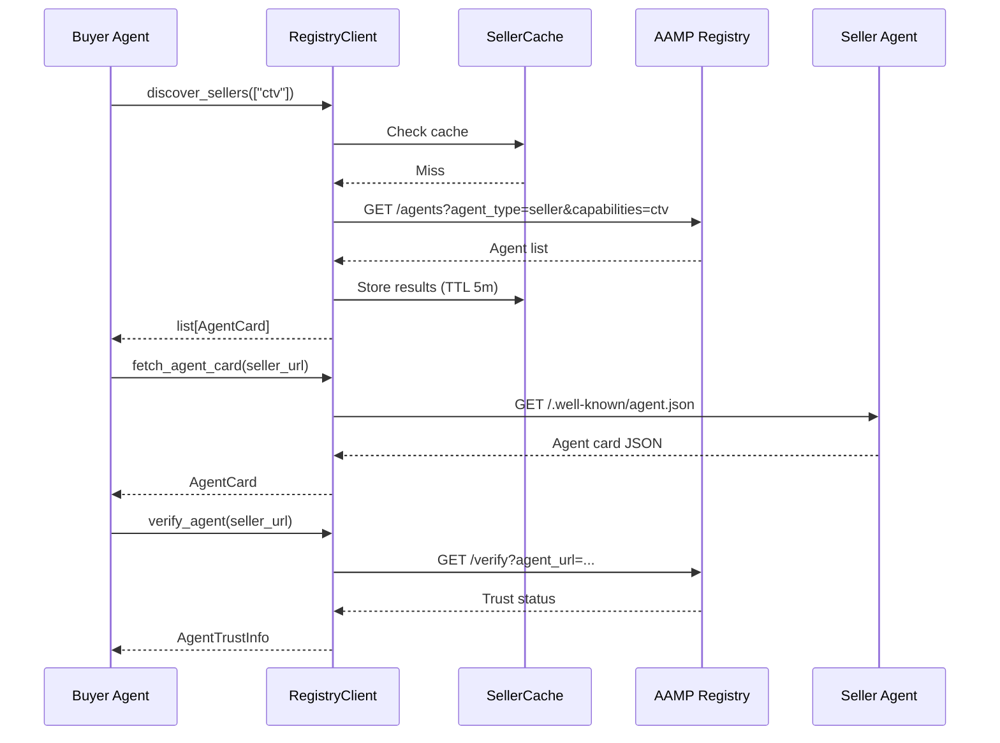
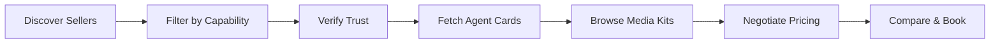

# Seller Discovery

The buyer agent discovers seller agents through the **IAB AAMP agent registry** — a centralized directory where agents register their identity, capabilities, and connection details. The `RegistryClient` handles discovery, agent card fetching, buyer registration, and trust verification, with built-in caching to minimize registry round-trips.

## Overview



## RegistryClient

The `RegistryClient` manages all interactions with the AAMP agent registry. It wraps HTTP calls with caching, error handling, and Pydantic validation.

### Initialization

```python
from ad_buyer.registry import RegistryClient

# Default — local development registry
client = RegistryClient()

# Production registry with custom TTL and timeout
client = RegistryClient(
    registry_url="https://registry.aamp.iab.com/agent-registry",
    cache_ttl_seconds=600,  # 10 minute cache
    timeout=30.0,           # 30 second HTTP timeout
)
```

| Parameter | Type | Default | Description |
|-----------|------|---------|-------------|
| `registry_url` | `str` | `http://localhost:8080/agent-registry` | Base URL of the AAMP agent registry |
| `cache_ttl_seconds` | `float` | `300.0` | TTL for cached entries (seconds) |
| `timeout` | `float` | `15.0` | HTTP request timeout (seconds) |

## Discovering Sellers

### Discover All Sellers

Query the registry for all registered seller agents:

```python
sellers = await client.discover_sellers()

for seller in sellers:
    print(f"{seller.name} ({seller.agent_id})")
    print(f"  URL: {seller.url}")
    print(f"  Protocols: {seller.protocols}")
    print(f"  Trust: {seller.trust_level.value}")
```

### Filter by Capability

Pass a capabilities filter to narrow results to sellers that support specific inventory types:

```python
# Only CTV sellers
ctv_sellers = await client.discover_sellers(
    capabilities_filter=["ctv"],
)

# Sellers with both display and video
av_sellers = await client.discover_sellers(
    capabilities_filter=["display", "video"],
)
```

The filter is sent as a comma-separated query parameter. The registry returns sellers that match any of the requested capabilities.

### Fetch an Agent Card Directly

If you already know a seller's URL, fetch its agent card from the standard `.well-known/agent.json` endpoint without going through the registry:

```python
card = await client.fetch_agent_card("https://seller.example.com")

if card:
    print(f"Agent: {card.name}")
    for cap in card.capabilities:
        print(f"  Capability: {cap.name} — {cap.description}")
else:
    print("Agent card not available")
```

This is useful when you have a known seller URL (e.g., from a previous deal or a direct partnership) and want to refresh its capabilities without a full registry query.

### Register the Buyer

Register the buyer agent in the registry so that sellers can discover and verify it:

```python
from ad_buyer.registry import AgentCard, AgentCapability

buyer_card = AgentCard(
    agent_id="buyer-ttd-001",
    name="IAB Buyer Agent (TTD)",
    url="https://buyer.example.com",
    protocols=["opendirect-2.1", "openrtb-2.6"],
    capabilities=[
        AgentCapability(
            name="ctv",
            description="Connected TV buying",
            tags=["premium", "programmatic"],
        ),
        AgentCapability(
            name="display",
            description="Display ad buying",
            tags=["programmatic"],
        ),
    ],
)

success = await client.register_buyer(buyer_card)
if success:
    print("Buyer registered in AAMP registry")
```

### Verify Agent Trust

Before transacting with a seller, verify its trust status in the registry:

```python
trust = await client.verify_agent("https://seller.example.com")

print(f"Registered: {trust.is_registered}")
print(f"Trust level: {trust.trust_level.value}")
print(f"Registry ID: {trust.registry_id}")

if trust.trust_level == TrustLevel.BLOCKED:
    print("WARNING: This agent is blocked — do not transact")
```

## SellerCache

The `SellerCache` is an in-memory TTL cache that sits in front of all registry calls. It stores both individual `AgentCard` objects and lists of cards returned by discovery queries.

### Caching Strategy

| Behavior | Detail |
|----------|--------|
| **Storage** | In-memory dictionary (no external dependencies) |
| **TTL** | Configurable via `cache_ttl_seconds` (default 5 minutes) |
| **Expiry** | Lazy — expired entries are evicted on access, not on a timer |
| **Scope** | Per-`RegistryClient` instance |
| **Key format** | `discover:<sorted-capabilities>` for lists, `card:<url>` for individual cards |

### Cache Behavior by Method

| Method | Cache Key | Cache Type |
|--------|-----------|------------|
| `discover_sellers()` | `discover:` (empty filter) | List cache |
| `discover_sellers(["ctv"])` | `discover:ctv` | List cache |
| `discover_sellers(["ctv", "display"])` | `discover:ctv,display` | List cache |
| `fetch_agent_card(url)` | `card:<url>` | Individual cache |
| `verify_agent(url)` | Not cached | — |

Discovery results are also cross-cached: each individual `AgentCard` from a discovery response is stored in the individual cache by `agent_id`, so subsequent lookups by ID avoid re-fetching.

### Manual Cache Management

```python
# Access the cache directly
cache = client._cache

# Invalidate a specific seller
cache.invalidate("card:https://seller.example.com")

# Clear everything (e.g., after a known registry update)
cache.clear()
```

!!! tip "When to Invalidate"
    Invalidate a seller's cache entry after a failed transaction or when you receive an error suggesting the seller's capabilities have changed. Clear the entire cache when the registry announces a bulk update.

## Data Models

### AgentCard

Represents a discovered agent (seller or buyer) in the registry. Modeled after the [A2A agent card](https://google.github.io/A2A/) served at `.well-known/agent.json`.

```python
from ad_buyer.registry import AgentCard

class AgentCard(BaseModel):
    agent_id: str                           # Unique identifier
    name: str                               # Human-readable name
    url: str                                # Base URL of the agent
    protocols: list[str] = []               # ["opendirect-2.1", "openrtb-2.6"]
    capabilities: list[AgentCapability] = [] # What the agent can do
    trust_level: TrustLevel = "unknown"     # Registry trust status
```

### AgentCapability

A declared capability of an agent — what inventory types or deal types it supports:

```python
from ad_buyer.registry import AgentCapability

class AgentCapability(BaseModel):
    name: str               # "ctv", "display", "video", "audio"
    description: str        # Human-readable description
    tags: list[str] = []    # ["premium", "programmatic", "direct"]
```

### TrustLevel

Trust status of an agent as determined by the AAMP registry:

| Level | Value | Meaning |
|-------|-------|---------|
| `UNKNOWN` | `"unknown"` | Not found in any registry |
| `REGISTERED` | `"registered"` | Found in the AAMP registry |
| `VERIFIED` | `"verified"` | Verified by the registry operator |
| `PREFERRED` | `"preferred"` | Strategic partner with elevated trust |
| `BLOCKED` | `"blocked"` | Explicitly blocked — do not transact |

### AgentTrustInfo

Result of a trust verification check against the registry:

```python
from ad_buyer.registry import AgentTrustInfo

class AgentTrustInfo(BaseModel):
    agent_url: str                          # URL that was verified
    is_registered: bool                     # Whether agent is in registry
    trust_level: TrustLevel = "unknown"     # Trust status
    registry_id: Optional[str] = None       # Registry-assigned ID (if registered)
```

## Multi-Seller Discovery Workflow

A typical buying workflow discovers multiple sellers, verifies trust, then shops across their media kits:



### Portfolio Shopping Example

Discover CTV sellers, verify trust, and aggregate their media kits for comparison:

```python
from ad_buyer.registry import RegistryClient, TrustLevel
from ad_buyer.media_kit import MediaKitClient

registry = RegistryClient(
    registry_url="https://registry.aamp.iab.com/agent-registry",
)

# Step 1: Discover CTV sellers
sellers = await registry.discover_sellers(
    capabilities_filter=["ctv"],
)
print(f"Found {len(sellers)} CTV sellers")

# Step 2: Verify trust — only transact with registered+ sellers
trusted_sellers = []
for seller in sellers:
    trust = await registry.verify_agent(seller.url)
    if trust.trust_level in (
        TrustLevel.REGISTERED,
        TrustLevel.VERIFIED,
        TrustLevel.PREFERRED,
    ):
        trusted_sellers.append(seller)
    else:
        print(f"Skipping {seller.name} (trust: {trust.trust_level.value})")

print(f"{len(trusted_sellers)} trusted sellers")

# Step 3: Browse media kits across trusted sellers
async with MediaKitClient(api_key="my-key") as media_client:
    seller_urls = [s.url for s in trusted_sellers]
    all_packages = await media_client.aggregate_across_sellers(seller_urls)

print(f"Found {len(all_packages)} packages across {len(trusted_sellers)} sellers")
```

### Capability-Based Routing

Route campaign requirements to the right sellers based on declared capabilities:

```python
# Campaign needs CTV + display
campaign_needs = ["ctv", "display"]

# Find sellers that support these capabilities
matching_sellers = await registry.discover_sellers(
    capabilities_filter=campaign_needs,
)

# Group by capability for mixed-media campaigns
ctv_sellers = [
    s for s in matching_sellers
    if any(c.name == "ctv" for c in s.capabilities)
]
display_sellers = [
    s for s in matching_sellers
    if any(c.name == "display" for c in s.capabilities)
]
```

## Error Handling

The `RegistryClient` handles errors gracefully — failed calls return empty results or `None` rather than raising exceptions:

| Scenario | Method | Return Value |
|----------|--------|-------------|
| Registry unreachable | `discover_sellers()` | `[]` (empty list) |
| Registry returns non-200 | `discover_sellers()` | `[]` (empty list) |
| Agent card not found | `fetch_agent_card()` | `None` |
| Agent card endpoint down | `fetch_agent_card()` | `None` |
| Verification fails | `verify_agent()` | `AgentTrustInfo(is_registered=False, trust_level=UNKNOWN)` |
| Registration fails | `register_buyer()` | `False` |
| Invalid JSON / validation error | Any | Logged warning, graceful fallback |

All errors are logged at `WARNING` or `DEBUG` level. The client never raises `httpx.HTTPError` or `pydantic.ValidationError` to the caller.

!!! warning "Silent Failures"
    Because the client returns empty results on failure, always check the length of discovery results. An empty list could mean "no sellers match" or "the registry is down." Monitor logs for `WARNING`-level messages to distinguish the two.

## Related

- [Seller Agent Discovery](https://iabtechlab.github.io/seller-agent/api/agent-discovery/) — How seller agents register and expose their agent cards
- [Media Kit Discovery](media-kit.md) — Browse seller inventory after discovering sellers
- [Authentication](authentication.md) — API key setup for accessing seller endpoints
- [A2A Client](a2a-client.md) — Agent-to-agent communication protocol
- [Seller Agent Integration](../integration/seller-agent.md) — Full integration guide
