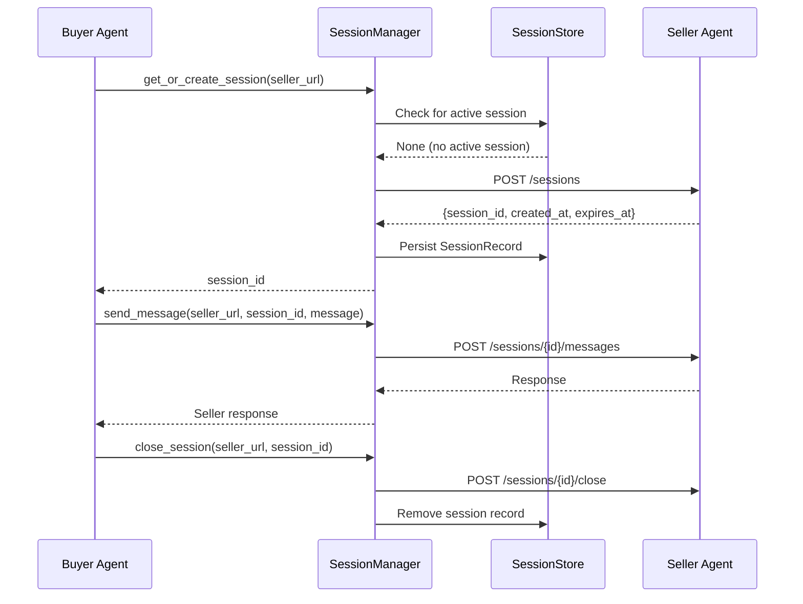
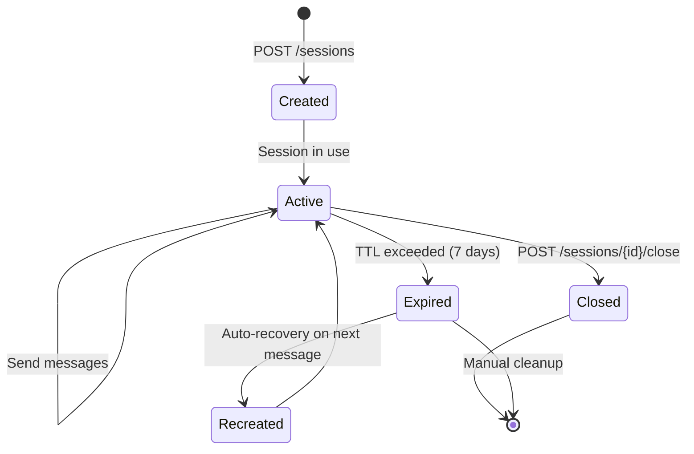

# Sessions API Reference

This page documents the `SessionManager` and `SessionStore` classes --- their methods, parameters, return types, and error behavior. Sessions enable multi-turn conversations between the buyer agent and seller agents, maintaining context across a sequence of messages.

!!! tip "Looking for usage patterns?"
    For practical guidance on when and how to use sessions --- conversation patterns, negotiation flows, multi-seller strategies, and best practices --- see the [Session Management Guide](../guides/sessions.md).

## Overview

The buyer agent uses two components for session management:

| Component | Role |
|-----------|------|
| **SessionManager** | Orchestrates the session lifecycle --- creation, reuse, messaging, and closure |
| **SessionStore** | File-backed persistence layer that stores active sessions as JSON |



---

## SessionManager

The `SessionManager` is the primary interface for session operations.

### Initialization

```python
from ad_buyer.sessions import SessionManager

# Default store (~/.ad_buyer/sessions.json)
manager = SessionManager()

# Custom store path and timeout
manager = SessionManager(
    store_path="/path/to/sessions.json",
    timeout=60.0,
)
```

### Constructor Parameters

| Parameter | Type | Default | Description |
|-----------|------|---------|-------------|
| `store_path` | `str` | `~/.ad_buyer/sessions.json` | Path to the JSON persistence file |
| `timeout` | `float` | `30.0` | HTTP request timeout in seconds |

---

## Methods

### `create_session(seller_url, buyer_identity)`

Establish a new session with a seller by posting to their `/sessions` endpoint.

| Parameter | Type | Required | Description |
|-----------|------|----------|-------------|
| `seller_url` | `str` | yes | Base URL of the seller agent |
| `buyer_identity` | `dict` | yes | Buyer identity fields (`seat_id`, `name`, `agency_id`, etc.) |

**Returns:** `str` --- the session ID.

**Seller endpoint:** `POST /sessions`

```python
session_id = await manager.create_session(
    seller_url="http://seller.example.com:8001",
    buyer_identity={
        "seat_id": "ttd-seat-123",
        "name": "Acme Media Buying",
        "agency_id": "omnicom-456",
    },
)
```

The manager persists the returned session record to the `SessionStore` automatically. Sessions follow a **7-day TTL** by default.

### `get_or_create_session(seller_url, buyer_identity)`

Check for an existing active session with the seller; create a new one if none exists.

| Parameter | Type | Required | Description |
|-----------|------|----------|-------------|
| `seller_url` | `str` | yes | Base URL of the seller agent |
| `buyer_identity` | `dict` | no | Buyer identity (required if creating a new session) |

**Returns:** `str` --- the session ID (existing or newly created).

```python
session_id = await manager.get_or_create_session(
    seller_url="http://seller.example.com:8001",
    buyer_identity={"seat_id": "ttd-seat-123"},
)
```

!!! tip "Prefer `get_or_create_session`"
    This is the recommended entry point. It avoids creating unnecessary sessions and handles the common case of resuming work with a seller.

### `send_message(seller_url, session_id, message, buyer_identity)`

Send a message to the seller on an existing session.

| Parameter | Type | Required | Description |
|-----------|------|----------|-------------|
| `seller_url` | `str` | yes | Base URL of the seller agent |
| `session_id` | `str` | yes | Active session ID |
| `message` | `dict` | yes | Message payload with `type` and content fields |
| `buyer_identity` | `dict` | no | Needed for auto-recovery if the session has expired |

**Returns:** Seller response (dict).

**Seller endpoint:** `POST /sessions/{session_id}/messages`

**Automatic recovery:** If the seller returns 404 (session expired), the manager transparently removes the stale session, creates a new one, and retries the message.

### `close_session(seller_url, session_id)`

Close a session and remove it from the local store.

| Parameter | Type | Required | Description |
|-----------|------|----------|-------------|
| `seller_url` | `str` | yes | Base URL of the seller agent |
| `session_id` | `str` | yes | Session ID to close |

**Returns:** None.

**Seller endpoint:** `POST /sessions/{session_id}/close`

Close failures are logged but not raised --- local cleanup always occurs.

### `list_active_sessions()`

Return all active (non-expired) sessions.

**Returns:** `dict[str, str]` --- mapping of seller URLs to session IDs.

---

## SessionStore

The `SessionStore` is the persistence backend, storing session records as a JSON file on disk. It is used internally by `SessionManager` and can also be accessed directly for inspection or maintenance.

### How It Works

- Sessions are keyed by **seller URL** --- one active session per seller
- The store file is created automatically if it does not exist
- Reads happen on initialization; writes happen on every save/remove
- Expired sessions are retained in the file but filtered out by `get()`

### File Format

```json
{
  "http://seller-a.example.com:8001": {
    "session_id": "sess-a1b2c3d4",
    "seller_url": "http://seller-a.example.com:8001",
    "created_at": "2026-03-10T14:00:00Z",
    "expires_at": "2026-03-17T14:00:00Z"
  }
}
```

### Direct Access

```python
from ad_buyer.sessions import SessionStore, SessionRecord

store = SessionStore("/path/to/sessions.json")

# Look up a specific seller's session
record = store.get("http://seller.example.com:8001")
if record:
    print(f"Session: {record.session_id}")
    print(f"Expires: {record.expires_at}")
    print(f"Expired? {record.is_expired()}")

# List all sessions (including expired)
all_sessions = store.list_sessions()

# Clean up expired sessions
removed = store.cleanup_expired()
print(f"Removed {removed} expired sessions")
```

### SessionRecord

Each session is stored as a `SessionRecord` dataclass:

| Field | Type | Description |
|-------|------|-------------|
| `session_id` | `str` | Unique session identifier issued by the seller |
| `seller_url` | `str` | Base URL of the seller endpoint |
| `created_at` | `str` | ISO 8601 timestamp of session creation |
| `expires_at` | `str` | ISO 8601 timestamp of session expiry |

Key methods:

| Method | Returns | Description |
|--------|---------|-------------|
| `is_expired()` | `bool` | Whether the session has passed its expiry time |
| `to_dict()` | `dict` | Serialize for JSON storage |
| `from_dict(data)` | `SessionRecord` | Deserialize from a dictionary |

---

## Session Lifecycle



### Expiry Handling

Sessions expire after **7 days** (or the TTL specified by the seller). Expiry is handled at two levels:

| Level | Behavior |
|-------|----------|
| **Local (SessionStore)** | `get()` returns `None` for expired records; `cleanup_expired()` removes them from disk |
| **Remote (Seller)** | Seller returns 404; `send_message()` auto-recovers by creating a new session |

---

## Error Handling

The `SessionManager` raises `RuntimeError` on failures:

| Scenario | Behavior |
|----------|----------|
| Seller rejects session creation (non-200/201) | `RuntimeError` with status code and response body |
| Message fails after auto-recovery retry | `RuntimeError` with status code |
| Session close fails | Logged as warning, **not raised** (local cleanup still happens) |
| Seller unreachable | `httpx` connection error propagated |

```python
try:
    session_id = await manager.create_session(seller_url)
except RuntimeError as e:
    print(f"Session creation failed: {e}")

try:
    response = await manager.send_message(
        seller_url, session_id, {"type": "inquiry", "content": "Hello"},
    )
except RuntimeError as e:
    print(f"Message failed: {e}")
```

!!! note "Close is fire-and-forget"
    `close_session()` never raises --- it logs a warning if the remote close fails and always cleans up the local store. This prevents cleanup errors from disrupting the caller's flow.

---

## Related

- [Session Management Guide](../guides/sessions.md) --- Practical patterns, negotiation flows, multi-seller strategies, and best practices
- [Seller Sessions API](https://iabtechlab.github.io/seller-agent/) --- Seller-side session endpoints (POST /sessions, GET /sessions, etc.)
- [Authentication](authentication.md) --- Buyer identity setup for session creation
- [Media Kit Discovery](media-kit.md) --- Browse seller inventory before starting a session
- [Bookings](bookings.md) --- Campaign booking workflow
