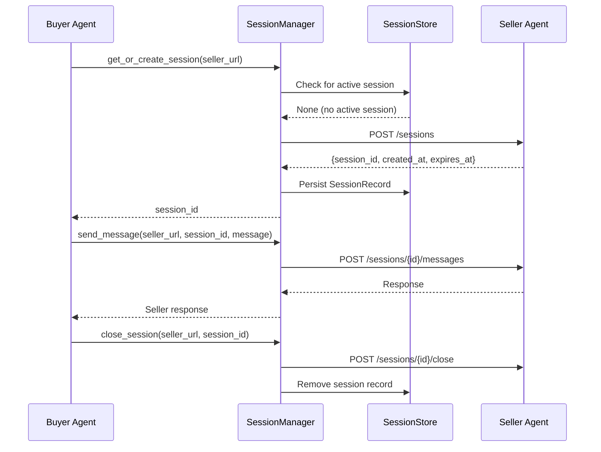
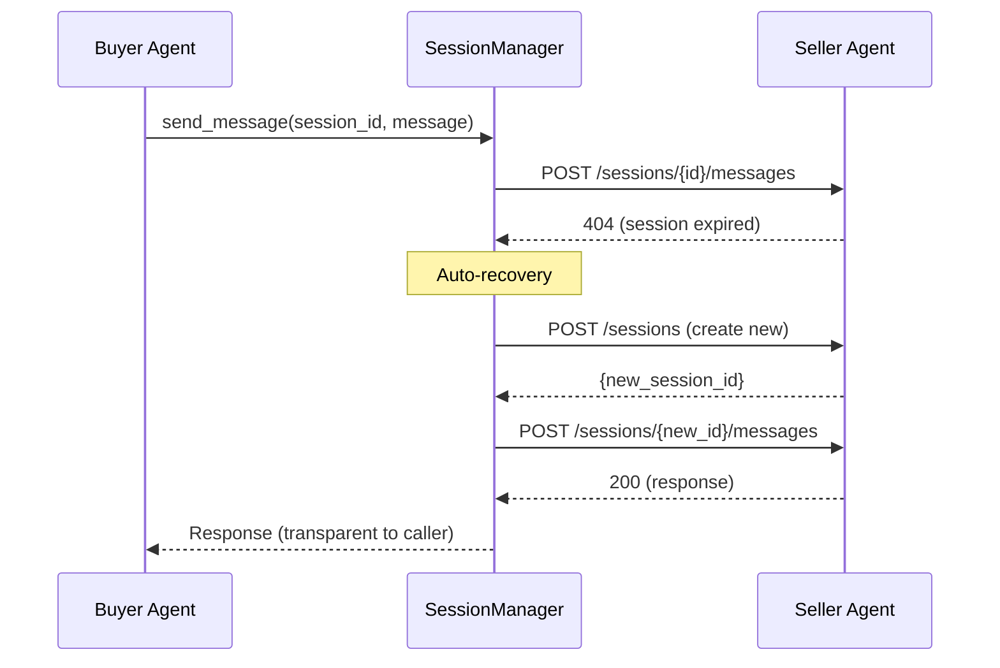
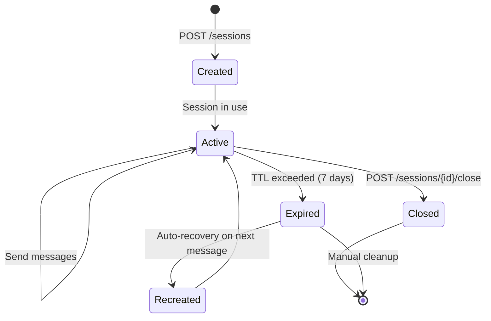
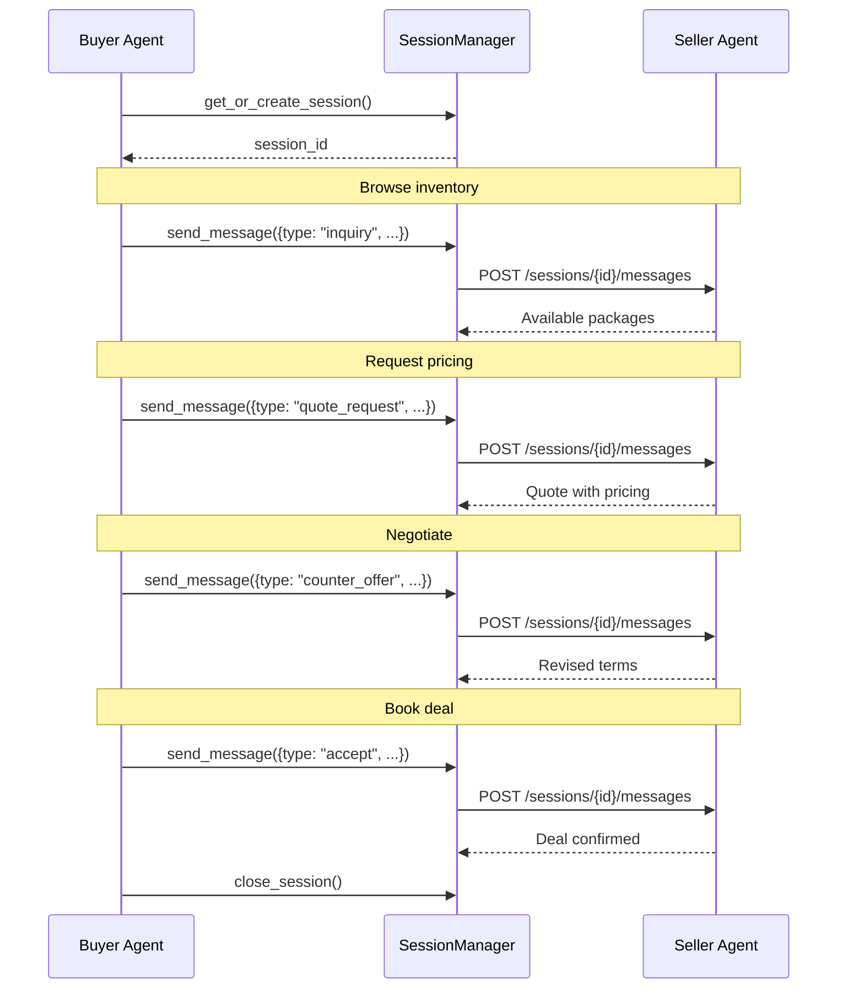

# Sessions & Persistence

Sessions enable **multi-turn conversations** between the buyer agent and seller agents. Rather than treating each API call as an isolated request, sessions maintain context across a sequence of messages --- allowing the buyer to browse inventory, negotiate pricing, and close deals within a single conversational thread.

## Overview



The buyer agent uses two components for session management:

| Component | Role |
|-----------|------|
| **SessionManager** | Orchestrates the session lifecycle --- creation, reuse, messaging, and closure |
| **SessionStore** | File-backed persistence layer that stores active sessions as JSON |

---

## SessionManager

The `SessionManager` is the primary interface for session operations. It handles creating sessions with seller endpoints, reusing active sessions, sending messages, and transparently recreating sessions that have expired.

### Initialization

```python
from ad_buyer.sessions import SessionManager

# Default store (~/.ad_buyer/sessions.json)
manager = SessionManager()

# Custom store path and timeout
manager = SessionManager(
    store_path="/path/to/sessions.json",
    timeout=60.0,
)
```

### Constructor Parameters

| Parameter | Type | Default | Description |
|-----------|------|---------|-------------|
| `store_path` | `str` | `~/.ad_buyer/sessions.json` | Path to the JSON persistence file |
| `timeout` | `float` | `30.0` | HTTP request timeout in seconds |

---

## Creating Sessions

### Create a New Session

Establish a new session with a seller by posting to their `/sessions` endpoint:

```python
session_id = await manager.create_session(
    seller_url="http://seller.example.com:8001",
    buyer_identity={
        "seat_id": "ttd-seat-123",
        "name": "Acme Media Buying",
        "agency_id": "omnicom-456",
    },
)
print(f"Session: {session_id}")
```

**Seller endpoint:** `POST /sessions`

```bash
curl -X POST http://seller.example.com:8001/sessions \
  -H "Content-Type: application/json" \
  -d '{
    "buyer_identity": {
      "seat_id": "ttd-seat-123",
      "name": "Acme Media Buying",
      "agency_id": "omnicom-456"
    }
  }'
```

**Response:**

```json
{
  "session_id": "sess-a1b2c3d4",
  "created_at": "2026-03-10T14:00:00Z",
  "expires_at": "2026-03-17T14:00:00Z"
}
```

The `SessionManager` automatically persists the returned session record to the `SessionStore`. Sessions follow a **7-day TTL** by default --- if the seller does not specify an `expires_at`, the manager uses its own 7-day fallback.

### Get or Create (Recommended)

In most cases, use `get_or_create_session` to reuse an existing active session or create a new one automatically:

```python
session_id = await manager.get_or_create_session(
    seller_url="http://seller.example.com:8001",
    buyer_identity={"seat_id": "ttd-seat-123"},
)
```

This method checks the local store for a non-expired session with the given seller. If one exists, it returns that session ID. Otherwise, it creates a new session and persists it.

!!! tip "Prefer `get_or_create_session`"
    This is the recommended entry point for session management. It avoids creating unnecessary sessions and handles the common case of resuming work with a seller you've already contacted.

---

## Sending Messages

Once a session is established, send messages to the seller on that session:

```python
response = await manager.send_message(
    seller_url="http://seller.example.com:8001",
    session_id=session_id,
    message={
        "type": "inquiry",
        "content": "What premium CTV inventory is available for Q3?",
    },
)
print(f"Seller says: {response}")
```

**Seller endpoint:** `POST /sessions/{session_id}/messages`

```bash
curl -X POST http://seller.example.com:8001/sessions/sess-a1b2c3d4/messages \
  -H "Content-Type: application/json" \
  -d '{
    "type": "inquiry",
    "content": "What premium CTV inventory is available for Q3?"
  }'
```

### Automatic Session Recovery

If the seller returns a **404** (session not found or expired on the seller side), the `SessionManager` transparently:

1. Removes the stale session from the local store
2. Creates a new session with the seller
3. Retries the message on the new session

This means callers do not need to handle session expiry manually --- the manager recovers automatically.



---

## Closing Sessions

Explicitly close a session when the conversation is complete:

```python
await manager.close_session(
    seller_url="http://seller.example.com:8001",
    session_id=session_id,
)
```

**Seller endpoint:** `POST /sessions/{session_id}/close`

This sends a close request to the seller and removes the session from the local store. If the close request fails (e.g., the session already expired on the seller side), the error is logged but not raised --- the local cleanup still occurs.

---

## Listing Active Sessions

Inspect all active (non-expired) sessions across sellers:

```python
active = manager.list_active_sessions()
for seller_url, session_id in active.items():
    print(f"{seller_url}: {session_id}")
```

Returns a dictionary mapping seller URLs to session IDs, excluding any sessions that have passed their expiry time.

---

## SessionStore

The `SessionStore` is the persistence backend, storing session records as a JSON file on disk. It is used internally by `SessionManager` and can also be accessed directly for inspection or maintenance.

### How It Works

- Sessions are keyed by **seller URL** --- one active session per seller
- The store file is created automatically if it does not exist
- Reads happen on initialization; writes happen on every save/remove
- Expired sessions are retained in the file but filtered out by `get()`

### File Format

The store file is a simple JSON dictionary:

```json
{
  "http://seller-a.example.com:8001": {
    "session_id": "sess-a1b2c3d4",
    "seller_url": "http://seller-a.example.com:8001",
    "created_at": "2026-03-10T14:00:00Z",
    "expires_at": "2026-03-17T14:00:00Z"
  },
  "http://seller-b.example.com:8002": {
    "session_id": "sess-e5f6g7h8",
    "seller_url": "http://seller-b.example.com:8002",
    "created_at": "2026-03-09T10:00:00Z",
    "expires_at": "2026-03-16T10:00:00Z"
  }
}
```

### Direct Access

```python
from ad_buyer.sessions import SessionStore, SessionRecord

store = SessionStore("/path/to/sessions.json")

# Look up a specific seller's session
record = store.get("http://seller.example.com:8001")
if record:
    print(f"Session: {record.session_id}")
    print(f"Expires: {record.expires_at}")
    print(f"Expired? {record.is_expired()}")

# List all sessions (including expired)
all_sessions = store.list_sessions()

# Clean up expired sessions
removed = store.cleanup_expired()
print(f"Removed {removed} expired sessions")
```

### SessionRecord

Each session is stored as a `SessionRecord` dataclass:

| Field | Type | Description |
|-------|------|-------------|
| `session_id` | `str` | Unique session identifier issued by the seller |
| `seller_url` | `str` | Base URL of the seller endpoint |
| `created_at` | `str` | ISO 8601 timestamp of session creation |
| `expires_at` | `str` | ISO 8601 timestamp of session expiry |

Key methods:

| Method | Returns | Description |
|--------|---------|-------------|
| `is_expired()` | `bool` | Whether the session has passed its expiry time |
| `to_dict()` | `dict` | Serialize for JSON storage |
| `from_dict(data)` | `SessionRecord` | Deserialize from a dictionary |

---

## Session Lifecycle

The complete lifecycle of a session from creation through closure:



### Typical Flow

1. **Create** --- Call `get_or_create_session()` to establish a session with a seller
2. **Converse** --- Send messages via `send_message()` for browsing, negotiation, or deal-making
3. **Close** --- Call `close_session()` when the conversation is complete

### Expiry Handling

Sessions expire after **7 days** (or the TTL specified by the seller). Expiry is handled at two levels:

| Level | Behavior |
|-------|----------|
| **Local (SessionStore)** | `get()` returns `None` for expired records; `cleanup_expired()` removes them from disk |
| **Remote (Seller)** | Seller returns 404; `send_message()` auto-recovers by creating a new session |

---

## Integration with Negotiation and Deals

Sessions are the transport layer for multi-turn negotiation flows. A typical negotiation sequence within a single session:



The session provides **context continuity** --- the seller knows the full conversation history and can reference previous offers, counter-offers, and agreements without the buyer needing to resend them.

### How Sessions Relate to Other APIs

| API | Relationship to Sessions |
|-----|--------------------------|
| [Media Kit](media-kit.md) | Browse results can inform session-based inquiries |
| [Deals](https://iabtechlab.github.io/seller-agent/api/quotes/) | Quotes and deals can be requested via session messages or the REST API directly |
| [Bookings](bookings.md) | Campaign bookings may reference deals negotiated within a session |
| [Authentication](authentication.md) | Buyer identity passed at session creation determines seller-side tier |

---

## Full Workflow Example

End-to-end: create a session, negotiate, and close.

```python
from ad_buyer.sessions import SessionManager

manager = SessionManager()

seller_url = "http://seller.example.com:8001"
buyer_identity = {
    "seat_id": "ttd-seat-123",
    "name": "Acme Media Buying",
    "agency_id": "omnicom-456",
    "advertiser_id": "coca-cola",
}

# 1. Establish a session
session_id = await manager.get_or_create_session(
    seller_url=seller_url,
    buyer_identity=buyer_identity,
)
print(f"Session: {session_id}")

# 2. Browse inventory
response = await manager.send_message(
    seller_url=seller_url,
    session_id=session_id,
    message={
        "type": "inquiry",
        "content": "Show me premium CTV sports packages for Q3",
    },
)
print(f"Available packages: {response}")

# 3. Request a quote
response = await manager.send_message(
    seller_url=seller_url,
    session_id=session_id,
    message={
        "type": "quote_request",
        "product_id": "prod-ctv-sports-001",
        "impressions": 500_000,
        "flight_start": "2026-07-01",
        "flight_end": "2026-09-30",
    },
)
print(f"Quote: ${response.get('pricing', {}).get('final_cpm')} CPM")

# 4. Counter-offer
response = await manager.send_message(
    seller_url=seller_url,
    session_id=session_id,
    message={
        "type": "counter_offer",
        "target_cpm": 10.50,
        "rationale": "Volume commitment of 500K+ impressions",
    },
)
print(f"Seller response: {response}")

# 5. Accept and close
response = await manager.send_message(
    seller_url=seller_url,
    session_id=session_id,
    message={"type": "accept"},
)
print(f"Deal confirmed: {response}")

await manager.close_session(seller_url, session_id)
print("Session closed")
```

### Resuming Work Across Restarts

Because sessions are persisted to disk, a buyer agent can resume where it left off after a process restart:

```python
# After restart -- SessionStore loads from disk automatically
manager = SessionManager()

# This returns the existing session, no new HTTP call
session_id = await manager.get_or_create_session(
    seller_url="http://seller.example.com:8001",
)
print(f"Resumed session: {session_id}")

# Continue the conversation
response = await manager.send_message(
    seller_url="http://seller.example.com:8001",
    session_id=session_id,
    message={"type": "inquiry", "content": "Any updates on my quote?"},
)
```

---

## Error Handling

The `SessionManager` raises `RuntimeError` on failures:

| Scenario | Behavior |
|----------|----------|
| Seller rejects session creation (non-200/201) | `RuntimeError` with status code and response body |
| Message fails after auto-recovery retry | `RuntimeError` with status code |
| Session close fails | Logged as warning, **not raised** (local cleanup still happens) |
| Seller unreachable | `httpx` connection error propagated |

```python
try:
    session_id = await manager.create_session(seller_url)
except RuntimeError as e:
    print(f"Session creation failed: {e}")

try:
    response = await manager.send_message(
        seller_url, session_id, {"type": "inquiry", "content": "Hello"},
    )
except RuntimeError as e:
    print(f"Message failed: {e}")
```

!!! note "Close is fire-and-forget"
    `close_session()` never raises --- it logs a warning if the remote close fails and always cleans up the local store. This prevents cleanup errors from disrupting the caller's flow.

---

## Related

- [Seller Sessions API](https://iabtechlab.github.io/seller-agent/) --- Seller-side session endpoints (POST /sessions, GET /sessions, etc.)
- [Authentication](authentication.md) --- Buyer identity setup for session creation
- [Media Kit Discovery](media-kit.md) --- Browse seller inventory before starting a session
- [Bookings](bookings.md) --- Campaign booking workflow
- [Seller Agent Integration](../integration/seller-agent.md) --- Full integration guide
