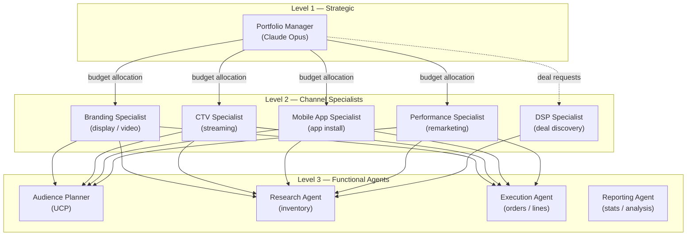
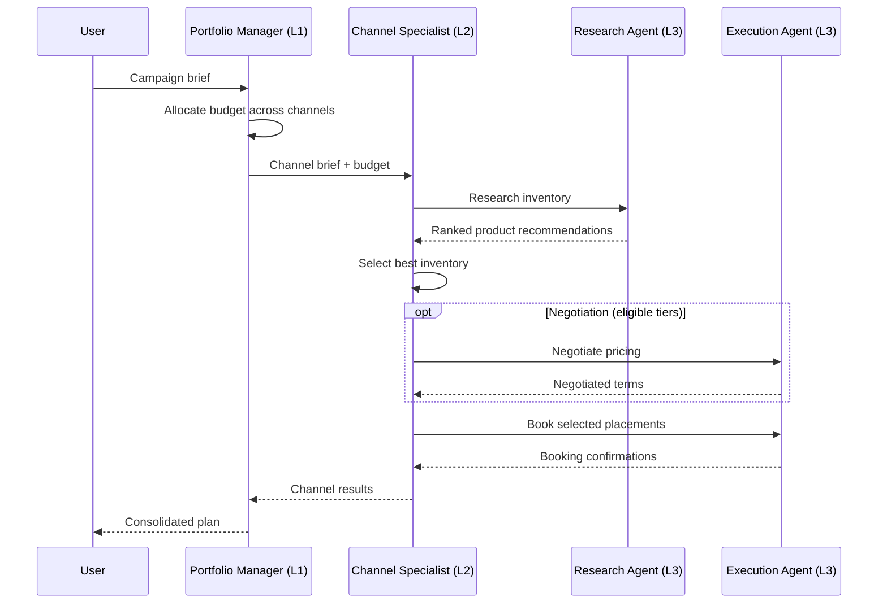

# Agent Hierarchy

The buyer agent uses a three-level agent hierarchy powered by [CrewAI](https://www.crewai.com/). Each level has a distinct responsibility: strategic orchestration, channel-specific expertise, and functional execution.

## Overview



---

## Level 1 --- Portfolio Manager

The Portfolio Manager is the top-level orchestrator. It receives a campaign brief and determines how to allocate budget across channels.

**Key file:** `src/ad_buyer/agents/level1/portfolio_manager.py`

| Attribute | Value |
|-----------|-------|
| Role | Portfolio Manager |
| LLM | `anthropic/claude-opus-4-20250514` (configurable via `MANAGER_LLM_MODEL`) |
| Temperature | 0.3 |
| Delegation | Enabled --- delegates to Level 2 agents |
| Memory | Enabled |

**Responsibilities:**

- Analyze campaign briefs and extract objectives, constraints, and KPIs
- Allocate budget across channels (Branding, CTV, Mobile, Performance)
- Provide channel-specific guidance to specialists
- Monitor overall campaign coherence

```python
from ad_buyer.agents.level1.portfolio_manager import create_portfolio_manager

manager = create_portfolio_manager(
    tools=[],       # Tools added by crews
    verbose=True,
)
```

!!! note "LLM Selection"
    The Portfolio Manager uses Opus (the most capable model) because it handles strategic reasoning across the full campaign. Channel specialists use Sonnet for cost-efficient execution of narrower tasks.

---

## Level 2 --- Channel Specialists

Each Level 2 agent owns a specific advertising channel. They receive budget allocations from the Portfolio Manager and coordinate Level 3 agents to research inventory and execute bookings.

**Key directory:** `src/ad_buyer/agents/level2/`

All channel specialists share these defaults:

| Attribute | Value |
|-----------|-------|
| LLM | `anthropic/claude-sonnet-4-5-20250929` (configurable via `DEFAULT_LLM_MODEL`) |
| Temperature | 0.5 |
| Delegation | Enabled --- delegates to Level 3 agents |
| Memory | Enabled |

### Branding Specialist

**File:** `src/ad_buyer/agents/level2/branding_agent.py`

Focuses on premium display and video placements for upper-funnel brand awareness.

| Area | Focus |
|------|-------|
| Formats | Homepage takeovers, roadblocks, premium video (in-stream, outstream) |
| Metrics | Viewability (70%+ target), brand recall, engagement |
| Safety | Brand safety verification, contextual relevance |
| Reach | Cross-device frequency management |

```python
from ad_buyer.agents.level2 import create_branding_agent

agent = create_branding_agent(tools=[...])
```

### CTV Specialist

**File:** `src/ad_buyer/agents/level2/ctv_agent.py`

Expert in Connected TV and streaming inventory.

| Area | Focus |
|------|-------|
| Platforms | Roku, Fire TV, Apple TV, Samsung TV+ |
| Content | Hulu, Peacock, Paramount+, Max, FAST channels (Pluto, Tubi) |
| Targeting | Household-level, device graphs, cross-screen frequency |
| Standards | VAST/VPAID creative specs, addressable TV |

### Mobile App Specialist

**File:** `src/ad_buyer/agents/level2/mobile_app_agent.py`

Drives efficient app installs and post-install conversions.

| Area | Focus |
|------|-------|
| Attribution | MMP integrations (AppsFlyer, Adjust, Branch, Kochava) |
| Formats | Rewarded video, interstitials, mobile web |
| Fraud | Click injection detection, install farm prevention |
| Privacy | SKAdNetwork, attribution windows |

### Performance Specialist

**File:** `src/ad_buyer/agents/level2/performance_agent.py`

Maximizes conversions and ROAS through lower-funnel tactics.

| Area | Focus |
|------|-------|
| Strategies | Retargeting, remarketing, lookalike modeling |
| Optimization | CPA/ROAS targets, bid optimization, pacing |
| Creative | Dynamic creative optimization, A/B testing |
| Tracking | Pixel implementation, cross-device attribution |

### DSP Deal Discovery Specialist

**File:** `src/ad_buyer/agents/level2/dsp_agent.py`

Discovers inventory and obtains Deal IDs for activation in traditional DSP platforms.

| Area | Focus |
|------|-------|
| Platforms | The Trade Desk, DV360, Amazon DSP, Xandr, Yahoo DSP |
| Deal types | PG (guaranteed), PD (preferred), PA (private auction) |
| Pricing | Identity-based tiered pricing, volume discounts |
| Negotiation | Price negotiation for agency/advertiser tiers |

!!! tip "DSP vs. other specialists"
    The DSP Specialist works alongside the channel specialists, not in place of them. Channel specialists decide *what* inventory to buy; the DSP Specialist handles the mechanics of obtaining Deal IDs for programmatic activation. See [DSP Deal Flow](dsp-deal-flow.md) for the full workflow.

---

## Level 3 --- Functional Agents

Level 3 agents are shared across channels. They do not make strategic decisions --- they execute specific functions on behalf of the Level 2 specialists.

**Key directory:** `src/ad_buyer/agents/level3/`

All functional agents share these defaults:

| Attribute | Value |
|-----------|-------|
| LLM | `anthropic/claude-sonnet-4-5-20250929` |
| Delegation | Disabled --- they are leaf-level executors |
| Memory | Enabled |

### Audience Planner (UCP)

**File:** `src/ad_buyer/agents/level3/audience_planner_agent.py`

Plans and selects audiences using the IAB Tech Lab [User Context Protocol (UCP)](https://iabtechlab.com/ucp) for real-time audience matching with seller inventory.

| Area | Detail |
|------|--------|
| Temperature | 0.3 (balanced for strategic audience recommendations) |
| Signals | Identity (hashed IDs, device graphs), Contextual (page content, keywords), Reinforcement (feedback loops, conversion data) |
| Embeddings | 256--1024 dimension UCP vectors, cosine similarity |
| Threshold | Score > 0.7 = strong match |

**Key capabilities:**

- Signal analysis using UCP protocol
- Audience segment discovery from seller capabilities
- Coverage estimation for targeting combinations
- Audience expansion recommendations
- Gap analysis when requirements cannot be fully met

**Tools used:** `AudienceDiscoveryTool`, `AudienceMatchingTool`, `CoverageEstimationTool`

### Research Agent

**File:** `src/ad_buyer/agents/level3/research_agent.py`

Discovers and evaluates advertising inventory across publishers.

| Area | Detail |
|------|--------|
| Temperature | 0.2 (low creativity, high precision for data analysis) |
| Focus | Product search, availability checks, pricing evaluation, publisher comparison |

**Tools used:** `ProductSearchTool`, `AvailsCheckTool`

### Execution Agent

**File:** `src/ad_buyer/agents/level3/execution_agent.py`

Handles the OpenDirect booking lifecycle.

| Area | Detail |
|------|--------|
| Temperature | 0.1 (minimal creativity, precision execution) |
| Workflow | Draft --> PendingReservation --> Reserved --> PendingBooking --> Booked --> InFlight --> Finished |

**Tools used:** `CreateOrderTool`, `CreateLineTool`, `ReserveLineTool`, `BookLineTool`

### Reporting Agent

**File:** `src/ad_buyer/agents/level3/reporting_agent.py`

Retrieves and analyzes campaign performance data.

| Area | Detail |
|------|--------|
| Temperature | 0.2 (analytical, data-focused) |
| Metrics | Impressions, CPM, CTR, VCR, viewability, pacing, spend |

**Tools used:** `GetStatsTool`

---

## Crew Coordination

Agents are organized into **crews** --- CrewAI constructs that define which agents work together, what tasks they perform, and how authority flows.

### Portfolio Crew

**File:** `src/ad_buyer/crews/portfolio_crew.py`

The top-level crew uses a **hierarchical process** with the Portfolio Manager as the manager agent.

```python
from ad_buyer.crews.portfolio_crew import create_portfolio_crew

crew = create_portfolio_crew(
    client=opendirect_client,
    campaign_brief={
        "name": "Q3 Awareness Campaign",
        "objectives": ["brand_awareness", "reach"],
        "budget": 500_000,
        "start_date": "2026-07-01",
        "end_date": "2026-09-30",
        "target_audience": {"age": "25-54", "interests": ["sports", "news"]},
        "kpis": {"viewability": 0.70, "reach": 2_000_000},
    },
)

result = crew.kickoff()
```

**Structure:**

| Role | Agent | Process |
|------|-------|---------|
| Manager | Portfolio Manager (L1) | Hierarchical --- assigns tasks and reviews output |
| Workers | Branding, CTV, Mobile, Performance (L2) | Receive budget allocation and channel guidance |

**Tasks:**

1. **Budget Allocation** --- Analyze the brief, determine optimal channel split
2. **Channel Coordination** --- Provide targeting and quality guidance per channel

### Channel Crews

**File:** `src/ad_buyer/crews/channel_crews.py`

Each channel has its own crew. The channel specialist acts as the manager, with Research and Execution agents as workers.

```python
from ad_buyer.crews.channel_crews import create_branding_crew

crew = create_branding_crew(
    client=opendirect_client,
    channel_brief={
        "budget": 150_000,
        "start_date": "2026-07-01",
        "end_date": "2026-09-30",
        "target_audience": {"age": "25-54"},
        "objectives": ["brand_awareness"],
    },
    audience_plan={
        "target_demographics": {"age": "25-54", "gender": "all"},
        "target_interests": ["sports", "news", "entertainment"],
    },
)

result = crew.kickoff()
```

Four channel crew factory functions are available:

| Function | Manager Agent | Workers |
|----------|---------------|---------|
| `create_branding_crew()` | Branding Specialist | Research + Execution |
| `create_ctv_crew()` | CTV Specialist | Research + Execution |
| `create_mobile_crew()` | Mobile App Specialist | Research + Execution |
| `create_performance_crew()` | Performance Specialist | Research + Execution |

All channel crews follow the same two-task pattern:

1. **Research Task** --- The Research Agent searches inventory matching the channel brief and audience plan, using both research and audience tools
2. **Recommendation Task** --- The channel specialist reviews findings and selects the best inventory

!!! info "Audience context"
    Channel crews accept an optional `audience_plan` parameter. When provided, the Research Agent incorporates UCP-compatible audience targeting into its inventory search. This plan typically comes from the Audience Planner agent.

---

## Execution Flow

A typical end-to-end campaign follows this pattern:



---

## Related

- [Architecture Overview](overview.md) --- Full system architecture
- [Tools Reference](tools.md) --- All CrewAI tools available to agents
- [DSP Deal Flow](dsp-deal-flow.md) --- DSP-specific deal discovery workflow
- [Booking Flow](booking-flow.md) --- Detailed booking sequence
- [Configuration](../guides/configuration.md) --- LLM and agent settings
