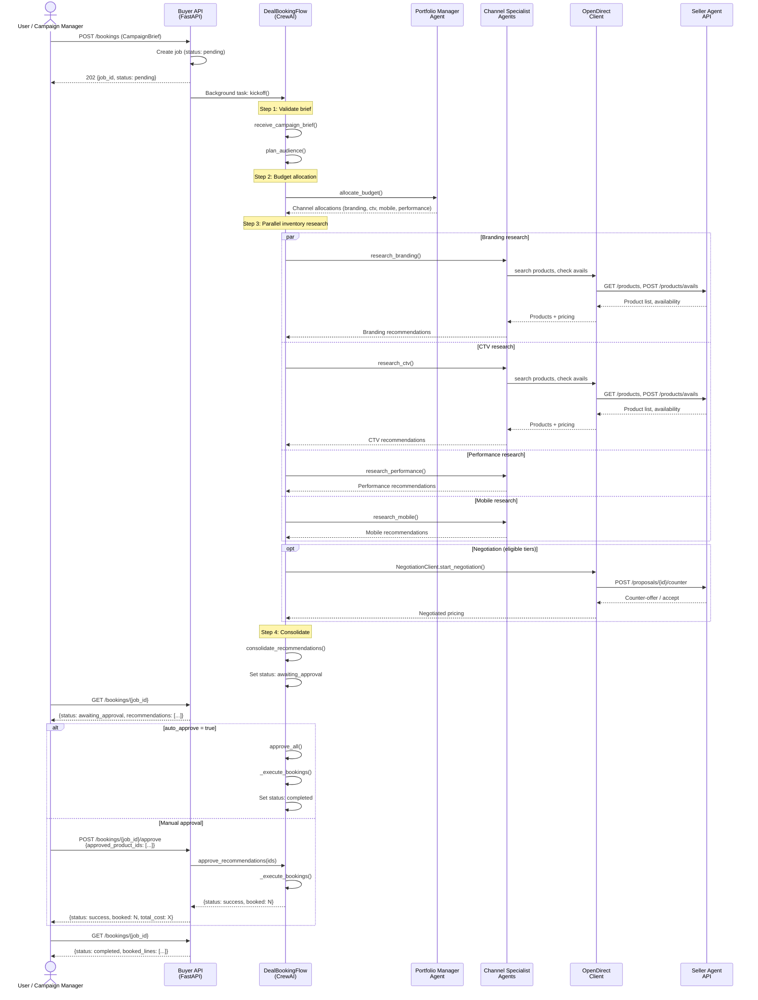
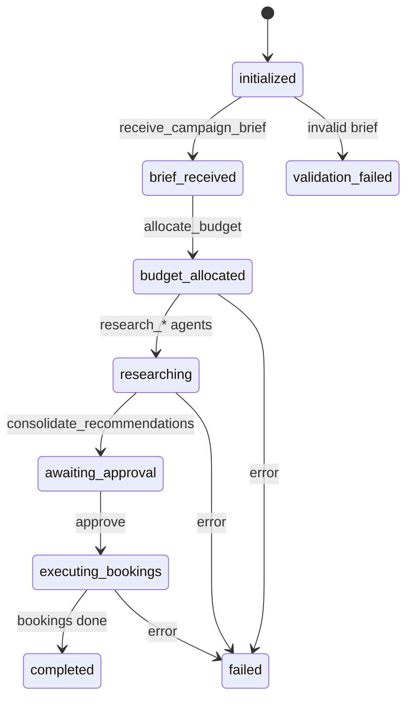

# Booking Flow (DealBookingFlow Internals)

The `DealBookingFlow` is a CrewAI event-driven flow that orchestrates the end-to-end booking process. It is defined in `flows/deal_booking_flow.py` and extends `Flow[BookingState]`. This page documents the internal mechanics of that flow --- if you are looking for a high-level overview of how campaigns move from brief to booked deal, start with the [Buyer Guide Overview](../guides/overview.md).

At a high level, the flow works in four phases. First, it **validates** the incoming campaign brief and builds an audience plan. Second, it **allocates** the total budget across advertising channels (branding, CTV, mobile, performance). Third, it **researches** inventory in parallel across all active channels, optionally negotiating pricing with the seller. Fourth, it **consolidates** recommendations, pauses for human approval (unless auto-approve is enabled), and executes the final bookings against the seller's OpenDirect API.

## Sequence Diagram

## Flow Steps

| Step | Method | Trigger | Description |
|------|--------|---------|-------------|
| 1 | `receive_campaign_brief()` | `@start()` | Validates required fields and budget |
| 2 | `plan_audience()` | Listens to step 1 | Builds audience plan, estimates coverage, identifies gaps |
| 3 | `allocate_budget()` | Listens to step 2 | Portfolio crew splits budget across channels |
| 4a | `research_branding()` | Listens to step 3 | Branding crew searches display/video inventory |
| 4b | `research_ctv()` | Listens to step 3 | CTV crew searches streaming inventory |
| 4c | `research_mobile()` | Listens to step 3 | Mobile crew searches app inventory |
| 4d | `research_performance()` | Listens to step 3 | Performance crew searches remarketing inventory |
| 5 | `consolidate_recommendations()` | Listens to 4a-4d (OR) | Waits for all active channels, flattens recommendations |
| 6 | `approve_recommendations()` / `approve_all()` | External call (API) | Marks recommendations as approved/rejected |
| 7 | `_execute_bookings()` | Called by step 6 | Creates BookedLine entries for approved items |

## Execution Status Transitions

These states are tracked in `BookingState.execution_status` using the `ExecutionStatus` enum.

!!! note "Negotiation Between Research and Booking"
    For Agency and Advertiser tier buyers, a negotiation phase can occur between the research and booking steps. The `NegotiationClient` handles multi-turn price negotiation with the seller agent before orders are placed. See the [Negotiation Guide](../guides/negotiation.md) for details on configuring negotiation strategies.
