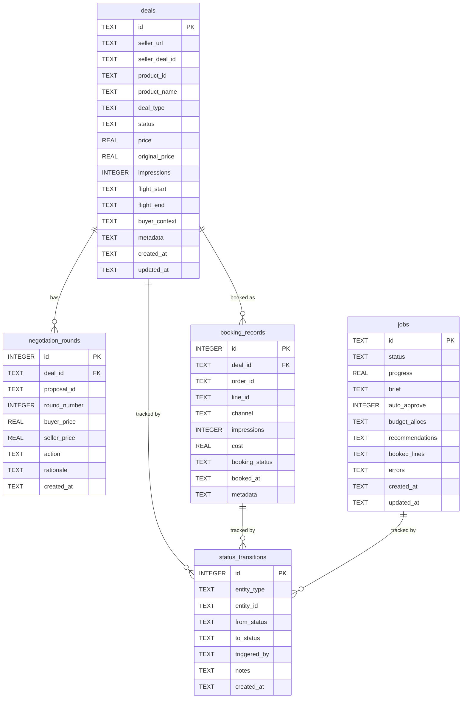
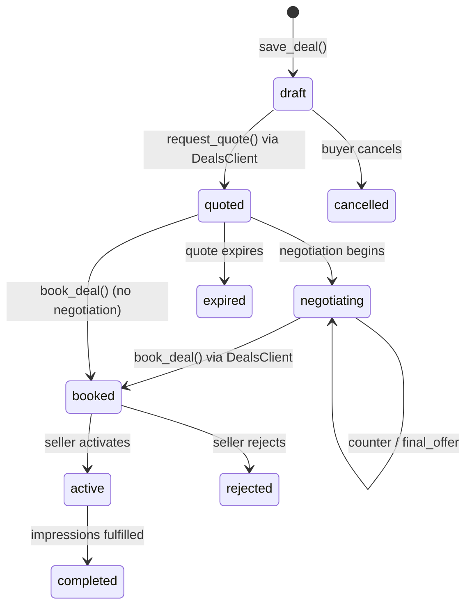
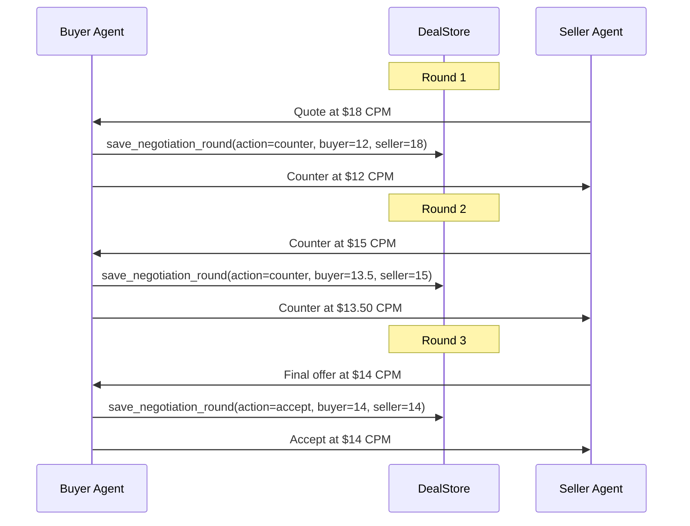
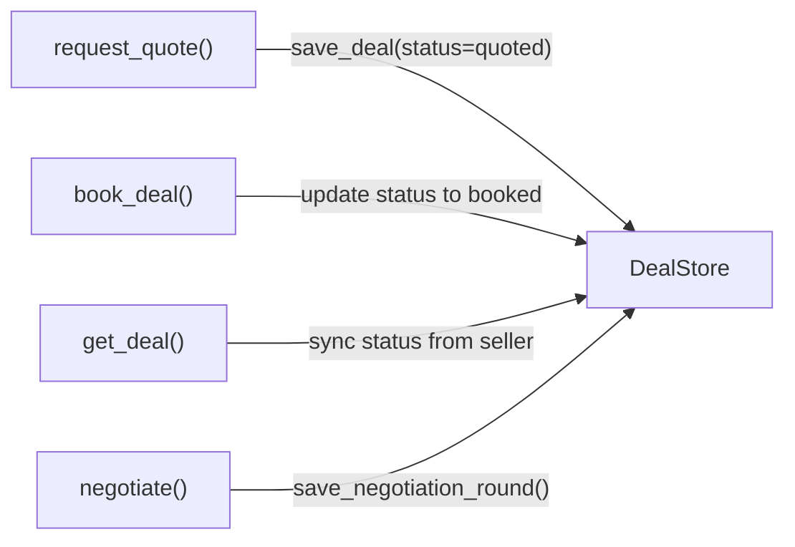

# Deal Store

The `DealStore` is the buyer agent's SQLite-backed persistence layer for deal lifecycle state, negotiation history, booking records, job tracking, and status transitions. It provides crash resilience, a full audit trail, and the foundation for portfolio tracking across sellers.

## Why Persistence?

Without persistent storage, all deal state lives in memory and is lost on process restart. The DealStore solves three problems:

- **Crash resilience** -- A server restart mid-negotiation no longer means lost deals. The buyer can resume from the last known state.
- **Audit trail** -- Every status change and negotiation round is recorded in append-only tables. This supports post-campaign analysis and dispute resolution.
- **Portfolio tracking** -- The buyer can query all active deals across sellers, filter by status, and calculate aggregate spend -- enabling informed budget allocation decisions.

!!! info "Synchronous by design"
    The DealStore uses synchronous `sqlite3` (not `aiosqlite`) because CrewAI runs flows in worker threads that may not have an asyncio event loop. Thread safety is provided by `check_same_thread=False` and a `threading.Lock()`.

---

## SQLite Schema

The schema consists of five relational tables managed by a versioned migration system. All tables use ISO 8601 timestamps and are created automatically on first connection.

### Entity-Relationship Diagram



### Table Descriptions

#### `deals`

The central table tracking every deal the buyer initiates. Each row represents a single deal with a seller for a specific product.

| Column | Type | Description |
|--------|------|-------------|
| `id` | `TEXT PK` | UUID, generated client-side or provided |
| `seller_url` | `TEXT NOT NULL` | Seller endpoint URL |
| `seller_deal_id` | `TEXT` | Seller-assigned deal ID (populated after booking) |
| `product_id` | `TEXT NOT NULL` | Product being purchased |
| `product_name` | `TEXT` | Human-readable product name |
| `deal_type` | `TEXT` | `PG` (guaranteed), `PD` (preferred), or `PA` (auction) |
| `status` | `TEXT` | Current lifecycle status (see [Deal Lifecycle](#deal-lifecycle-tracking)) |
| `price` | `REAL` | Current/final CPM |
| `original_price` | `REAL` | Pre-discount CPM (for savings tracking) |
| `impressions` | `INTEGER` | Contracted impression volume |
| `flight_start` | `TEXT` | Flight start date (ISO 8601) |
| `flight_end` | `TEXT` | Flight end date (ISO 8601) |
| `buyer_context` | `TEXT` | JSON-serialized BuyerContext (seat, agency, advertiser) |
| `metadata` | `TEXT` | Extensible JSON field for additional data |
| `created_at` | `TEXT` | Creation timestamp (UTC) |
| `updated_at` | `TEXT` | Last modification timestamp (UTC) |

**Indexes:** `status`, `seller_url`, `seller_deal_id`, `created_at`, composite `(status, created_at)`.

#### `negotiation_rounds`

Append-only log of every negotiation round for a deal. Each row captures the buyer's offer, the seller's ask, and the action taken.

| Column | Type | Description |
|--------|------|-------------|
| `id` | `INTEGER PK` | Auto-increment row ID |
| `deal_id` | `TEXT FK` | References `deals(id)` with `CASCADE` delete |
| `proposal_id` | `TEXT` | Seller's proposal identifier |
| `round_number` | `INTEGER` | Sequential round (1, 2, 3, ...) |
| `buyer_price` | `REAL` | Buyer's offered CPM |
| `seller_price` | `REAL` | Seller's asking CPM |
| `action` | `TEXT` | `counter`, `accept`, `reject`, or `final_offer` |
| `rationale` | `TEXT` | Explanation for the action taken |
| `created_at` | `TEXT` | Round timestamp (UTC) |

**Constraint:** `UNIQUE(deal_id, round_number)` prevents duplicate rounds.

#### `booking_records`

Tracks booked line items resulting from completed deals. Links deals to OpenDirect orders and lines.

| Column | Type | Description |
|--------|------|-------------|
| `id` | `INTEGER PK` | Auto-increment row ID |
| `deal_id` | `TEXT FK` | References `deals(id)` with `CASCADE` delete |
| `order_id` | `TEXT` | OpenDirect order ID |
| `line_id` | `TEXT` | OpenDirect line ID |
| `channel` | `TEXT` | Channel name (branding, ctv, mobile, performance) |
| `impressions` | `INTEGER` | Contracted impressions for this line |
| `cost` | `REAL` | Line cost |
| `booking_status` | `TEXT` | `pending`, `confirmed`, `cancelled` |
| `booked_at` | `TEXT` | Booking timestamp (UTC) |
| `metadata` | `TEXT` | Extensible JSON field |

**Constraint:** `UNIQUE(deal_id, line_id)` prevents duplicate line bookings.

#### `jobs`

Tracks API-initiated booking jobs. Replaces the in-memory job dictionary used in earlier versions. Each job corresponds to one `POST /bookings` request.

| Column | Type | Description |
|--------|------|-------------|
| `id` | `TEXT PK` | Job UUID |
| `status` | `TEXT` | `pending`, `running`, `awaiting_approval`, `completed`, `failed` |
| `progress` | `REAL` | 0.0 to 1.0 progress indicator |
| `brief` | `TEXT` | JSON-serialized campaign brief |
| `auto_approve` | `INTEGER` | Boolean flag (0 or 1) |
| `budget_allocs` | `TEXT` | JSON budget allocations |
| `recommendations` | `TEXT` | JSON recommendation list |
| `booked_lines` | `TEXT` | JSON booked line items |
| `errors` | `TEXT` | JSON error list |
| `created_at` | `TEXT` | Job creation timestamp (UTC) |
| `updated_at` | `TEXT` | Last update timestamp (UTC) |

The `save_job` method uses `INSERT ... ON CONFLICT DO UPDATE` (upsert) so that job state can be updated incrementally as the flow progresses.

#### `status_transitions`

Append-only audit log for all status changes across deals and bookings. Every call to `update_deal_status` automatically writes a row here.

| Column | Type | Description |
|--------|------|-------------|
| `id` | `INTEGER PK` | Auto-increment row ID |
| `entity_type` | `TEXT` | `deal` or `booking` |
| `entity_id` | `TEXT` | The entity's primary key |
| `from_status` | `TEXT` | Previous status (`NULL` for creation) |
| `to_status` | `TEXT` | New status |
| `triggered_by` | `TEXT` | `system`, `seller_push`, `user`, or `agent` |
| `notes` | `TEXT` | Free-text explanation |
| `created_at` | `TEXT` | Transition timestamp (UTC) |

### Schema Versioning

The `schema_version` table tracks which migrations have been applied. The `initialize_schema()` function runs on every `DealStore.connect()` call:

1. Creates all tables and indexes (idempotent via `IF NOT EXISTS`).
2. Checks the current schema version.
3. Applies any pending migrations sequentially.
4. Records the new version.

This ensures forward-compatible schema evolution without manual migration steps.

---

## DealStore API

All public methods are synchronous and thread-safe. The store is initialized with a SQLite connection string and must be explicitly connected before use.

### Lifecycle

```python
from ad_buyer.storage.deal_store import DealStore

store = DealStore("sqlite:///./ad_buyer.db")
store.connect()   # Opens connection, sets pragmas, initializes schema
# ... use the store ...
store.disconnect() # Closes connection
```

On `connect()`, the store sets three SQLite pragmas:

| Pragma | Value | Purpose |
|--------|-------|---------|
| `journal_mode` | `WAL` | Write-ahead logging for concurrent read/write |
| `foreign_keys` | `ON` | Enforce referential integrity |
| `busy_timeout` | `5000` | Wait up to 5 seconds for locks instead of failing immediately |

### Singleton Factory

For application-wide access, use the `get_deal_store()` factory which returns a module-level singleton:

```python
from ad_buyer.storage import get_deal_store

store = get_deal_store()  # Uses default: sqlite:///./ad_buyer.db
store = get_deal_store("sqlite:///./custom.db")  # Custom path (first call only)
```

!!! warning "First-call semantics"
    The `database_url` parameter is only used on the first call. Subsequent calls return the cached instance regardless of the URL passed.

### Deal Methods

#### `save_deal(**kwargs) -> str`

Insert a new deal record. Returns the deal ID (auto-generated UUID if not provided).

```python
deal_id = store.save_deal(
    seller_url="http://seller.example.com:8001",
    product_id="prod-ctv-sports-001",
    product_name="CTV Sports Premium",
    deal_type="PD",
    status="draft",
    price=14.50,
    original_price=18.00,
    impressions=500_000,
    flight_start="2026-07-01",
    flight_end="2026-09-30",
)
```

Automatically records an initial status transition (`None -> draft`) in the audit log.

#### `get_deal(deal_id) -> dict | None`

Retrieve a single deal by ID, or `None` if not found.

#### `list_deals(*, status, seller_url, created_after, limit) -> list[dict]`

Query deals with optional filters. Results ordered by `created_at` descending.

```python
# All booked deals for a seller
deals = store.list_deals(status="booked", seller_url="http://seller:8001")

# Recent deals (last 24 hours)
deals = store.list_deals(created_after="2026-03-09T00:00:00Z", limit=100)
```

#### `update_deal_status(deal_id, new_status, *, triggered_by, notes) -> bool`

Update a deal's status and automatically record the transition in the audit log.

```python
store.update_deal_status(
    "deal-uuid",
    "booked",
    triggered_by="agent",
    notes="Deal confirmed by seller after negotiation",
)
```

### Negotiation Methods

#### `save_negotiation_round(**kwargs) -> int`

Record a negotiation round. Returns the auto-generated row ID.

```python
store.save_negotiation_round(
    deal_id="deal-uuid",
    proposal_id="prop-001",
    round_number=1,
    buyer_price=10.0,
    seller_price=15.0,
    action="counter",
    rationale="Countered at $10 CPM based on historical rates",
)
```

#### `get_negotiation_history(deal_id) -> list[dict]`

Retrieve all negotiation rounds for a deal, ordered by round number ascending.

### Booking Methods

#### `save_booking_record(**kwargs) -> int`

Record a booked line item linked to a deal. Returns the auto-generated row ID.

```python
store.save_booking_record(
    deal_id="deal-uuid",
    order_id="order-123",
    line_id="line-456",
    channel="ctv",
    impressions=500_000,
    cost=7250.00,
    booking_status="confirmed",
)
```

#### `get_booking_records(deal_id) -> list[dict]`

Retrieve all booking records for a deal.

### Job Methods

#### `save_job(**kwargs) -> str`

Insert or update a job record (upsert). JSON fields (`brief`, `budget_allocs`, `recommendations`, `booked_lines`, `errors`) are stored as serialized strings.

#### `get_job(job_id) -> dict | None`

Retrieve a job by ID. JSON fields are automatically deserialized into Python objects. The `auto_approve` integer is converted to a boolean.

#### `list_jobs(*, status, limit) -> list[dict]`

List jobs with optional status filter, ordered by `created_at` descending.

### Audit Methods

#### `record_status_transition(**kwargs) -> int`

Write a row to the `status_transitions` audit table. Called automatically by `save_deal` and `update_deal_status`, but can also be called directly for booking status changes.

#### `get_status_history(entity_type, entity_id) -> list[dict]`

Retrieve the full status history for a deal or booking, ordered chronologically.

```python
history = store.get_status_history("deal", "deal-uuid")
for t in history:
    print(f"{t['from_status']} -> {t['to_status']} ({t['triggered_by']})")
```

---

## Deal Lifecycle Tracking

The DealStore tracks deals through a well-defined status progression. Every transition is recorded in the `status_transitions` table.

### Status Flow



### Status Descriptions

| Status | Meaning | Triggered By |
|--------|---------|--------------|
| `draft` | Deal created locally, not yet sent to seller | `save_deal()` |
| `quoted` | Price quote received from seller | `DealsClient.request_quote()` |
| `negotiating` | Active price negotiation in progress | Negotiation rounds |
| `booked` | Deal confirmed with seller | `DealsClient.book_deal()` |
| `active` | Deal is live, accepting bids | Seller status push |
| `completed` | Impression target fulfilled | Seller status push |
| `rejected` | Seller rejected the deal | Seller status push |
| `expired` | Quote or deal expired | Seller status push |
| `cancelled` | Buyer cancelled before booking | Buyer action |

### Negotiation Tracking

Each negotiation round captures both sides of the conversation:



The `action` field captures the buyer's decision at each round:

| Action | Meaning |
|--------|---------|
| `counter` | Buyer counters with a different price |
| `accept` | Buyer accepts the seller's price |
| `reject` | Buyer walks away from the deal |
| `final_offer` | Buyer's last offer (take it or leave it) |

---

## Integration with DealsClient and Negotiation

The `DealStore` is an optional dependency of the `DealsClient`. When attached, the client automatically persists deal state at key moments in the quote-then-book flow.

### Automatic Persistence Points



| Client Method | DealStore Action | Notes |
|---------------|-----------------|-------|
| `request_quote()` | `save_deal()` with status `quoted` | Creates the deal record |
| `book_deal()` | `update_deal_status()` to `booked` | Records seller-issued deal ID |
| `get_deal()` | `update_deal_status()` if changed | Syncs status from seller |
| Negotiation flow | `save_negotiation_round()` per round | Records full price history |

!!! tip "Non-fatal persistence"
    DealStore failures are logged but never raised to the caller. The API call succeeds even if local persistence fails. This prevents storage issues from blocking deal execution.

### Wiring in Application Code

The FastAPI application creates the DealStore singleton from the `database_url` setting and injects it into the DealsClient:

```python
# In interfaces/api/main.py
from ad_buyer.storage.deal_store import DealStore

store = DealStore(settings.database_url)
store.connect()

client = DealsClient(
    seller_url=settings.seller_url,
    api_key=settings.api_key,
    deal_store=store,
)
```

---

## Configuration

The DealStore's database path is controlled by the `database_url` setting in the buyer agent's configuration.

### Settings

| Setting | Default | Environment Variable | Description |
|---------|---------|---------------------|-------------|
| `database_url` | `sqlite:///./ad_buyer.db` | `DATABASE_URL` | SQLite connection string |

The `DealStore._parse_url()` method handles the `sqlite:///` prefix:

| Input | Resolved Path |
|-------|--------------|
| `sqlite:///./ad_buyer.db` | `./ad_buyer.db` |
| `sqlite:///:memory:` | `:memory:` (in-memory, for testing) |
| `sqlite:///path/to/db` | `path/to/db` |
| `/absolute/path.db` | `/absolute/path.db` (pass-through) |

### Testing Configuration

Use an in-memory database for tests to avoid file system side effects:

```python
store = DealStore("sqlite:///:memory:")
store.connect()
# Fast, isolated, no cleanup needed
```

---

## Related Pages

- [Deals API Client](../api/deals.md) -- `DealsClient` methods, request/response models, and error handling
- [Booking Flow](booking-flow.md) -- End-to-end sequence diagram for the `DealBookingFlow`
- [Negotiation Guide](../guides/negotiation.md) -- How to negotiate pricing with sellers
- [Models](models.md) -- Pydantic data model reference
- [Seller Quotes API](https://iabtechlab.github.io/seller-agent/api/quotes/) -- Seller-side quote endpoints
- [Seller Orders API](https://iabtechlab.github.io/seller-agent/api/orders/) -- Seller-side deal/order endpoints
