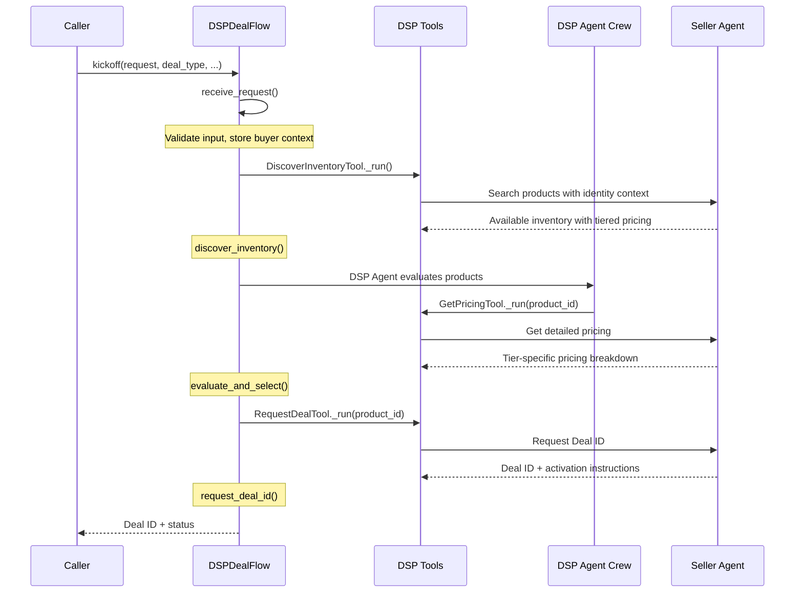

# DSP Deal Flow

The `DSPDealFlow` is a CrewAI event-driven flow that discovers seller inventory, evaluates products, and obtains Deal IDs for activation in traditional DSP platforms. It is distinct from the [`DealBookingFlow`](booking-flow.md), which handles the full campaign booking lifecycle through OpenDirect.

**Key file:** `src/ad_buyer/flows/dsp_deal_flow.py`

## When to Use This Flow

| Scenario | Use |
|----------|-----|
| Obtain a Deal ID for a DSP platform (TTD, DV360, etc.) | DSP Deal Flow |
| Book a full campaign with orders and line items | [DealBookingFlow](booking-flow.md) |
| Negotiate pricing with a seller | [NegotiationClient](../guides/negotiation.md) |

---

## Flow Sequence



---

## Flow Steps

### Step 1: Receive Request

The flow entry point validates the deal request and stores buyer context in the flow state.

```python
@start()
def receive_request(self) -> dict[str, Any]:
```

- Validates that a non-empty request string was provided
- Serializes the buyer context into flow state
- Persists an initial deal record to the `DealStore` (if attached)
- Returns the request text and the buyer's access tier

### Step 2: Discover Inventory

Triggered automatically after `receive_request` completes.

```python
@listen(receive_request)
def discover_inventory(self, request_result) -> dict[str, Any]:
```

- Calls `DiscoverInventoryTool` with the natural language request
- Applies optional filters: `max_cpm`, `min_impressions`
- Returns raw discovery results for evaluation

### Step 3: Evaluate and Select

A CrewAI crew with the DSP Agent intelligently selects the best product.

```python
@listen(discover_inventory)
def evaluate_and_select(self, discovery_result) -> dict[str, Any]:
```

- Creates a `Crew` with the DSP Agent and the `DiscoverInventoryTool` + `GetPricingTool`
- The agent analyzes discovery results against the request criteria (deal type, max CPM, volume)
- Extracts the selected `product_id` from the agent's response
- Fetches detailed pricing for the selected product via `GetPricingTool`
- Persists the evaluation status to the `DealStore`

### Step 4: Request Deal ID

Creates the actual deal with the seller.

```python
@listen(evaluate_and_select)
def request_deal_id(self, selection_result) -> dict[str, Any]:
```

- Calls `RequestDealTool` with the selected product, deal type, volume, and flight dates
- On success, sets status to `DEAL_CREATED` and persists to the store
- On failure, sets status to `FAILED` with error details
- Returns the deal result including the Deal ID and activation instructions

---

## Flow State

The `DSPFlowState` Pydantic model tracks the entire lifecycle:

```python
class DSPFlowState(BaseModel):
    # Input
    request: str                          # Natural language deal request
    deal_type: DealType                   # PG, PD, or PA
    impressions: Optional[int]            # Requested volume
    max_cpm: Optional[float]             # Maximum CPM budget
    flight_start: Optional[str]          # Deal start date
    flight_end: Optional[str]            # Deal end date

    # Buyer context
    buyer_context: Optional[dict]         # Serialized BuyerContext

    # Discovery results
    discovered_products: list[DiscoveredProduct]  # Products found
    selected_product_id: Optional[str]    # Chosen product

    # Pricing
    pricing_details: Optional[dict]       # Pricing for selected product

    # Deal result
    deal_response: Optional[dict]         # Created deal info

    # Execution tracking
    status: DSPFlowStatus                 # Current flow status
    errors: list[str]                     # Error messages
```

### Status Values

| Status | Description |
|--------|-------------|
| `INITIALIZED` | Flow created, not yet started |
| `REQUEST_RECEIVED` | Request validated, buyer context stored |
| `DISCOVERING_INVENTORY` | Querying sellers for available inventory |
| `EVALUATING_PRICING` | DSP Agent selecting product and getting pricing |
| `REQUESTING_DEAL` | Deal ID request sent to seller |
| `DEAL_CREATED` | Deal ID obtained successfully |
| `FAILED` | An error occurred at any step |

---

## Usage

### Direct Flow Instantiation

```python
from ad_buyer.flows.dsp_deal_flow import DSPDealFlow
from ad_buyer.clients.unified_client import UnifiedClient
from ad_buyer.models.buyer_identity import (
    BuyerContext, BuyerIdentity, DealType,
)
from ad_buyer.storage.deal_store import DealStore

# Setup
client = UnifiedClient(base_url="http://seller.example.com:8000")
buyer_context = BuyerContext(
    identity=BuyerIdentity(
        seat_id="ttd-seat-123",
        agency_id="omnicom-456",
        advertiser_id="coca-cola",
    ),
    is_authenticated=True,
    preferred_deal_types=[DealType.PREFERRED_DEAL],
)
store = DealStore("sqlite:///./ad_buyer.db")
store.connect()

# Create and configure flow
flow = DSPDealFlow(
    client=client,
    buyer_context=buyer_context,
    store=store,
)
flow.state.request = "Premium CTV sports inventory for Q3 campaign"
flow.state.deal_type = DealType.PREFERRED_DEAL
flow.state.impressions = 500_000
flow.state.max_cpm = 30.0
flow.state.flight_start = "2026-07-01"
flow.state.flight_end = "2026-09-30"

# Run
result = flow.kickoff()

# Check status
status = flow.get_status()
print(f"Status: {status['status']}")
print(f"Deal: {status['deal_response']}")
```

### Convenience Function

The `run_dsp_deal_flow()` async function handles client setup and flow configuration in a single call:

```python
from ad_buyer.flows.dsp_deal_flow import run_dsp_deal_flow
from ad_buyer.models.buyer_identity import BuyerIdentity, DealType

result = await run_dsp_deal_flow(
    request="Premium CTV sports inventory for Q3",
    buyer_identity=BuyerIdentity(
        seat_id="ttd-seat-123",
        agency_id="omnicom-456",
    ),
    deal_type=DealType.PREFERRED_DEAL,
    impressions=500_000,
    max_cpm=30.0,
    flight_start="2026-07-01",
    flight_end="2026-09-30",
    base_url="http://seller.example.com:8000",  # defaults to settings.iab_server_url
)

print(result["status"])
```

### Convenience Function Parameters

| Parameter | Type | Required | Default | Description |
|-----------|------|----------|---------|-------------|
| `request` | `str` | yes | -- | Natural language deal request |
| `buyer_identity` | `BuyerIdentity` | yes | -- | Buyer identity for tiered pricing |
| `deal_type` | `DealType` | no | `PREFERRED_DEAL` | PG, PD, or PA |
| `impressions` | `int` | no | `None` | Requested impression volume |
| `max_cpm` | `float` | no | `None` | Maximum CPM budget |
| `flight_start` | `str` | no | `None` | Deal start date (YYYY-MM-DD) |
| `flight_end` | `str` | no | `None` | Deal end date (YYYY-MM-DD) |
| `base_url` | `str` | no | `settings.iab_server_url` | Seller server URL |
| `store` | `DealStore` | no | `None` | Optional persistence store |

---

## Persistence

When a `DealStore` is provided, the flow persists deal state at three points:

| Step | Action | Status |
|------|--------|--------|
| `receive_request` | Creates initial deal record | `draft` |
| `evaluate_and_select` | Updates status after product selection | `evaluating_pricing` |
| `request_deal_id` | Updates with final status | `deal_created` or `failed` |

Persistence is best-effort -- failures are logged but never raise exceptions, so the flow continues even if the store is unavailable.

---

## Error Handling

Each step catches exceptions and records them in `state.errors`. When a step fails:

1. The error message is appended to `state.errors`
2. The status is set to `FAILED`
3. Subsequent steps receive the failure result and short-circuit

Check for errors after flow completion:

```python
status = flow.get_status()
if status["status"] == "failed":
    for error in status["errors"]:
        print(f"Error: {error}")
```

---

## Related

- [Agent Hierarchy](agent-hierarchy.md) -- DSP Specialist role in the hierarchy
- [Tools Reference](tools.md) -- DSP tools used by this flow
- [Deals API](../api/deals.md) -- REST API for quote-then-book deals
- [Booking Flow](booking-flow.md) -- Alternative flow for full campaign booking
- [Identity Strategy](../guides/identity.md) -- How buyer identity affects pricing tiers
