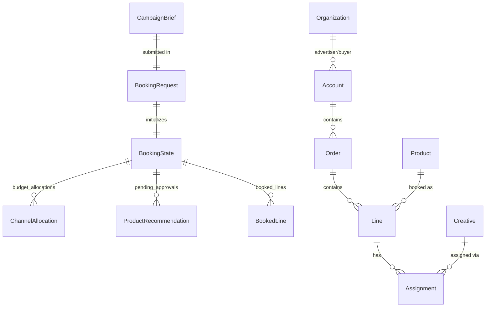

# Data Models

All models are Pydantic v2 classes. The buyer agent uses two model families: API request/response models defined in `interfaces/api/main.py`, and domain models defined in `models/flow_state.py` and `models/opendirect.py`.

## API Models

Defined in `interfaces/api/main.py`:

### CampaignBrief

| Field | Type | Required | Notes |
|-------|------|----------|-------|
| `name` | `str` | yes | 1-100 characters |
| `objectives` | `list[str]` | yes | At least one objective |
| `budget` | `float` | yes | Must be > 0 |
| `start_date` | `str` | yes | Format: YYYY-MM-DD |
| `end_date` | `str` | yes | Format: YYYY-MM-DD |
| `target_audience` | `dict[str, Any]` | yes | Audience specification |
| `kpis` | `dict[str, Any]` | no | Key performance indicators |
| `channels` | `list[str] \| None` | no | Preferred channels |

### BookingRequest

| Field | Type | Default | Notes |
|-------|------|---------|-------|
| `brief` | `CampaignBrief` | -- | Required |
| `auto_approve` | `bool` | `false` | Skip approval step |

### BookingResponse

| Field | Type |
|-------|------|
| `job_id` | `str` |
| `status` | `str` |
| `message` | `str` |

### BookingStatus

| Field | Type |
|-------|------|
| `job_id` | `str` |
| `status` | `str` |
| `progress` | `float` |
| `budget_allocations` | `dict \| None` |
| `recommendations` | `list[dict] \| None` |
| `booked_lines` | `list[dict] \| None` |
| `errors` | `list[str] \| None` |
| `created_at` | `str` |
| `updated_at` | `str` |

### ApprovalRequest

| Field | Type |
|-------|------|
| `approved_product_ids` | `list[str]` |

### ProductSearchRequest

| Field | Type | Default |
|-------|------|---------|
| `channel` | `str \| None` | `null` |
| `format` | `str \| None` | `null` |
| `min_price` | `float \| None` | `null` |
| `max_price` | `float \| None` | `null` |
| `limit` | `int` | `10` (range 1-50) |

---

## Flow State Models

Defined in `models/flow_state.py`:

### BookingState

The central state object carried through the entire `DealBookingFlow`.

| Field | Type | Description |
|-------|------|-------------|
| `campaign_brief` | `dict[str, Any]` | Raw campaign brief input |
| `audience_plan` | `dict \| None` | Audience plan from planning step |
| `audience_coverage_estimates` | `dict[str, float]` | Coverage estimates per channel (0-100%) |
| `audience_gaps` | `list[str]` | Audience requirements that cannot be fulfilled |
| `budget_allocations` | `dict[str, ChannelAllocation]` | Channel-level budget splits |
| `channel_recommendations` | `dict[str, list[ProductRecommendation]]` | Recommendations grouped by channel |
| `pending_approvals` | `list[ProductRecommendation]` | Flattened recommendations awaiting approval |
| `booked_lines` | `list[BookedLine]` | Successfully booked line items |
| `execution_status` | `ExecutionStatus` | Current flow status |
| `errors` | `list[str]` | Error messages |
| `created_at` | `datetime` | Flow creation time |
| `updated_at` | `datetime` | Last update time |

### ExecutionStatus (enum)

`initialized` | `brief_received` | `validation_failed` | `budget_allocated` | `researching` | `awaiting_approval` | `executing_bookings` | `completed` | `failed`

### ChannelAllocation

| Field | Type | Description |
|-------|------|-------------|
| `channel` | `str` | Channel name |
| `budget` | `float` | Allocated budget |
| `percentage` | `float` | Percentage of total (0-100) |
| `rationale` | `str` | Reason for allocation |

### ProductRecommendation

| Field | Type | Description |
|-------|------|-------------|
| `product_id` | `str` | Seller product ID |
| `product_name` | `str` | Product display name |
| `publisher` | `str` | Publisher name |
| `channel` | `str` | Channel (branding, ctv, etc.) |
| `format` | `str \| None` | Ad format |
| `impressions` | `int` | Target impressions |
| `cpm` | `float` | Cost per mille |
| `cost` | `float` | Total estimated cost |
| `targeting` | `dict \| None` | Targeting parameters |
| `priority` | `int` | Recommendation priority |
| `status` | `str` | `pending`, `pending_approval`, `approved`, `rejected` |
| `rationale` | `str \| None` | Why this product was recommended |

### BookedLine

| Field | Type | Description |
|-------|------|-------------|
| `line_id` | `str` | Line item ID |
| `order_id` | `str` | Parent order ID |
| `product_id` | `str` | Seller product ID |
| `product_name` | `str` | Product name |
| `channel` | `str` | Channel |
| `impressions` | `int` | Booked impressions |
| `cost` | `float` | Booked cost |
| `booking_status` | `str` | Booking status |
| `booked_at` | `datetime` | Booking timestamp |

### ChannelBrief

| Field | Type | Description |
|-------|------|-------------|
| `channel` | `str` | Channel name |
| `budget` | `float` | Channel budget |
| `start_date` | `str` | Start date |
| `end_date` | `str` | End date |
| `target_audience` | `dict` | Audience spec |
| `objectives` | `list[str]` | Campaign objectives |
| `kpis` | `dict` | KPIs |

---

## OpenDirect Models

Defined in `models/opendirect.py`, these represent IAB OpenDirect 2.1 resources used by the `OpenDirectClient`.

### Organization

Represents advertisers, agencies, and publishers. Fields: `id`, `name`, `type`, `address`, `contacts`, `ext`.

### Account

Buyer-advertiser relationship. Fields: `id`, `advertiser_id`, `buyer_id`, `name`, `ext`.

### Product

Publisher inventory item. Key fields: `id`, `publisher_id`, `name`, `description`, `currency`, `base_price`, `rate_type`, `delivery_type`, `domain`, `ad_unit`, `targeting`, `available_impressions`.

### Order

Campaign container (insertion order). Key fields: `id`, `name`, `account_id`, `publisher_id`, `currency`, `budget`, `start_date`, `end_date`, `order_status`.

### Line

Individual product booking. Key fields: `id`, `order_id`, `product_id`, `name`, `start_date`, `end_date`, `rate_type`, `rate`, `quantity`, `cost`, `booking_status`, `targeting`.

### Creative

Ad creative asset. Fields: `id`, `account_id`, `name`, `language`, `click_url`, `creative_asset`, `creative_approvals`.

### Assignment

Creative-to-line binding. Fields: `id`, `creative_id`, `line_id`, `status`.

### AvailsRequest / AvailsResponse

Used for availability and pricing checks. Request fields: `product_id`, `start_date`, `end_date`, `requested_impressions`, `budget`, `targeting`. Response fields: `product_id`, `available_impressions`, `guaranteed_impressions`, `estimated_cpm`, `total_cost`, `delivery_confidence`, `available_targeting`.

### LineStats

Performance metrics for a line item. Fields: `line_id`, `impressions_delivered`, `target_impressions`, `delivery_rate`, `pacing_status`, `amount_spent`, `budget`, `budget_utilization`, `effective_cpm`, `vcr`, `viewability`, `ctr`, `last_updated`.

### Enums

| Enum | Values |
|------|--------|
| `RateType` | `CPM`, `CPMV`, `CPC`, `CPD`, `FlatRate` |
| `DeliveryType` | `Exclusive`, `Guaranteed`, `PMP` |
| `OrderStatus` | `PENDING`, `APPROVED`, `REJECTED` |
| `LineBookingStatus` | `Draft`, `PendingReservation`, `Reserved`, `PendingBooking`, `Booked`, `InFlight`, `Finished`, `Stopped`, `Cancelled`, `Expired` |

## Negotiation Models

The negotiation module defines its own set of models for managing multi-turn price negotiations with seller agents. These include negotiation state, offer history, and strategy configuration. See the [Negotiation Guide](../guides/negotiation.md) for the full model reference and usage examples.

---

## Model Relationships

