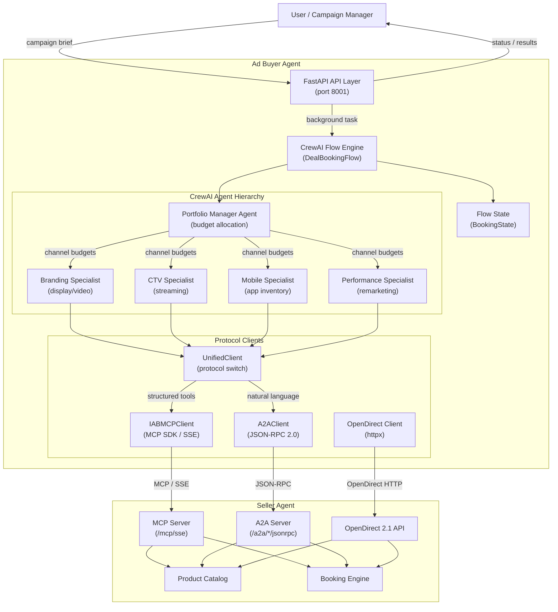
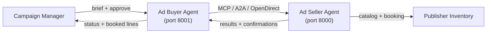

# Architecture Overview

The buyer agent is a multi-layer system that combines a FastAPI service layer with CrewAI agent orchestration and an OpenDirect protocol client.

## System Architecture



## Component Summary

| Component | Role | Key File |
|-----------|------|----------|
| **FastAPI API** | HTTP endpoints, authentication, job management | `interfaces/api/main.py` |
| **DealBookingFlow** | Event-driven CrewAI flow orchestrating the full booking lifecycle | `flows/deal_booking_flow.py` |
| **Portfolio Manager Agent** | Allocates budget across channels based on objectives | `crews/portfolio_crew.py` |
| **Channel Specialist Agents** | Research inventory and build recommendations per channel | `crews/channel_crews.py` |
| **UnifiedClient** | Protocol-switching client for MCP and A2A seller communication | `clients/unified_client.py` |
| **IABMCPClient** | MCP SDK client with Streamable HTTP transport | `clients/mcp_client.py` |
| **A2AClient** | JSON-RPC 2.0 client for conversational agent-to-agent requests | `clients/a2a_client.py` |
| **OpenDirectClient** | Async HTTP client for IAB OpenDirect 2.1 seller APIs | `clients/opendirect_client.py` |
| **NegotiationClient** | Multi-turn price negotiation with seller agents via A2A/proposals | `clients/negotiation_client.py` |
| **BookingState** | Pydantic state model tracking the full flow lifecycle | `models/flow_state.py` |
| **Settings** | Environment-based configuration via pydantic-settings | `config/settings.py` |

## Seller Communication Protocols

The buyer communicates with seller agents through three protocols, managed by the `UnifiedClient`:

```
CrewAI Tools --> UnifiedClient --> IABMCPClient --> Seller MCP Server (/mcp/sse) --> Seller Tools
CrewAI Tools --> UnifiedClient --> A2AClient   --> Seller A2A Server (/a2a/*/jsonrpc) --> NL Processing --> Seller Tools
Human        --> REST API      --> Buyer Agent  --> (MCP or A2A) --> Seller Agent
```

| Protocol | Transport | Use Case |
|----------|-----------|----------|
| **MCP** | Streamable HTTP (SSE) | Automated workflows --- structured tool calls, deterministic |
| **A2A** | JSON-RPC 2.0 | Discovery and negotiation --- natural language, multi-turn |
| **REST** | Standard HTTP | Operator dashboards and legacy integration |

MCP is the default. The `UnifiedClient` can switch protocols per-request or operate in dual-protocol mode via `connect_both()`.

See [Protocol Overview](../api/protocols.md) for full details.

## Full Ecosystem



The buyer agent acts as an automated media buyer. It receives campaign requirements from a user or campaign manager, uses AI agents to plan and research, negotiates pricing for eligible buyer tiers, and executes deals against one or more seller agents using MCP (primary), A2A (conversational), or OpenDirect 2.1 REST (legacy).

See also: [Seller Agent Architecture](https://iabtechlab.github.io/seller-agent/architecture/overview/)

## Related

- [Booking Flow](booking-flow.md) --- detailed sequence diagram
- [Models](models.md) --- data model reference
- [Seller Agent Integration](../integration/seller-agent.md)
