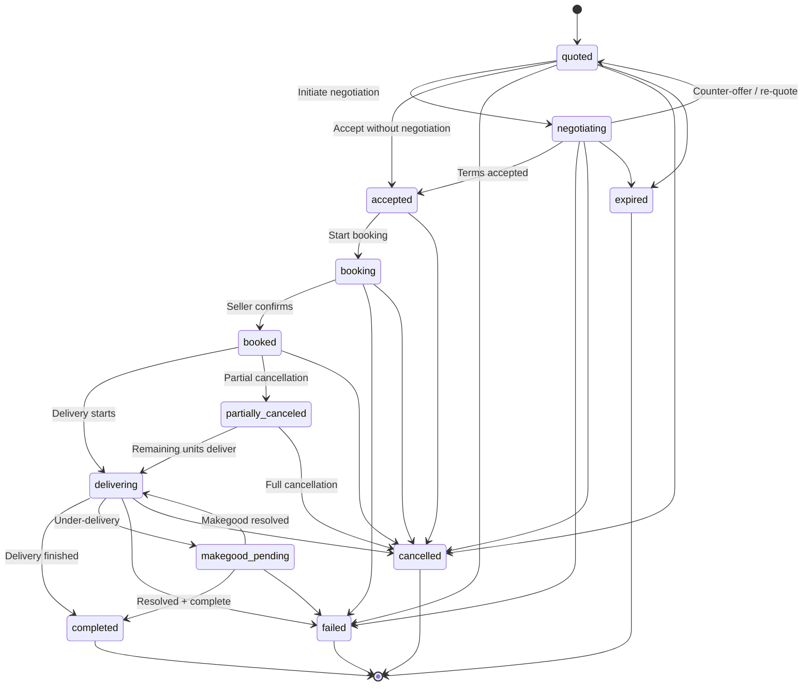
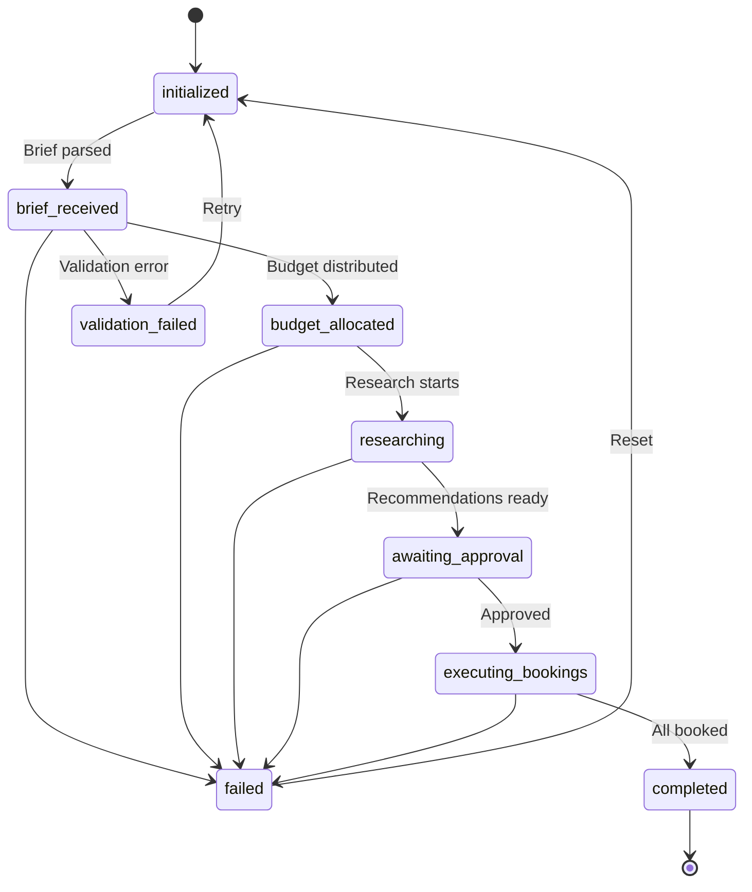

# Order State Machine

The buyer agent enforces deal and campaign lifecycle transitions through a formal state machine. Every status change is validated against declared transition rules, optionally gated by guard conditions, and recorded in an immutable audit trail. Invalid transitions are rejected before they reach the database.

## Why a State Machine

Without transition enforcement, any code path can set a deal to any status --- a completed deal could accidentally revert to "quoted," or a cancelled deal could resume delivery. The state machine prevents this class of bugs at the model layer:

- **Transition validation** --- Only declared `(from, to)` pairs are allowed. Everything else raises `InvalidTransitionError`.
- **Guard conditions** --- A transition rule can attach an arbitrary predicate. The transition is blocked if the guard returns `False`.
- **Audit trail** --- Every successful transition is appended to an `OrderAuditLog` with timestamp, actor, reason, and metadata.
- **DealStore enforcement** --- `update_deal_status()` instantiates a throwaway `DealStateMachine` to validate the transition before writing to SQLite.

!!! info "Pure Pydantic + stdlib"
    The state machine has zero external dependencies beyond Pydantic. No workflow engine or state chart library is required.

---

## Deal Lifecycle



### BuyerDealStatus

The `BuyerDealStatus` enum defines 12 states for the buyer-side deal lifecycle.

| Status | Category | Description |
|--------|----------|-------------|
| `quoted` | Entry | Initial quote received from seller |
| `negotiating` | Negotiation | Active price negotiation in progress |
| `accepted` | Acceptance | Deal terms accepted by buyer |
| `booking` | Booking | Booking request sent to seller |
| `booked` | Booking | Booking confirmed by seller |
| `delivering` | Delivery | Campaign delivery in progress |
| `completed` | Terminal | Campaign delivery finished successfully |
| `failed` | Terminal | Unrecoverable error at any active stage |
| `cancelled` | Terminal | Deal cancelled by buyer or seller |
| `expired` | Terminal | Quote or negotiation timed out |
| `makegood_pending` | Linear TV | Under-delivery detected, makegood requested |
| `partially_canceled` | Linear TV | Some booked units cancelled, remainder proceeds |

### Happy Path

```
quoted -> negotiating -> accepted -> booking -> booked -> delivering -> completed
```

A deal can also skip negotiation entirely:

```
quoted -> accepted -> booking -> booked -> delivering -> completed
```

### Terminal States

`completed`, `failed`, `cancelled`, and `expired` are terminal --- no transitions leave them.

### Linear TV Extensions

Two additional states handle scenarios specific to linear television buying:

- **`makegood_pending`** --- Entered from `delivering` when the seller under-delivers against guaranteed impressions. Resolves back to `delivering`, or directly to `completed` or `failed`.
- **`partially_canceled`** --- Entered from `booked` when the buyer cancels some (but not all) units. The remaining units can proceed to `delivering`, or the deal can be fully `cancelled`.

### Deal Transition Rules

Every permitted transition is declared as a `TransitionRule` with a `(from_status, to_status)` pair and an optional guard function. The default rule sets are built by `_build_deal_rules()` and `_build_campaign_rules()`.

| From | To | Description |
|------|----|-------------|
| `quoted` | `negotiating` | Buyer initiates negotiation |
| `quoted` | `accepted` | Quote accepted without negotiation |
| `negotiating` | `accepted` | Deal terms accepted |
| `negotiating` | `quoted` | Counter-offer received, re-quoting |
| `accepted` | `booking` | Booking process started |
| `booking` | `booked` | Booking confirmed by seller |
| `booked` | `delivering` | Campaign delivery started |
| `delivering` | `completed` | Campaign delivery completed |
| `quoted` | `failed` | Quote processing failed |
| `negotiating` | `failed` | Negotiation failed |
| `booking` | `failed` | Booking failed |
| `delivering` | `failed` | Delivery failed |
| `quoted` | `cancelled` | Deal cancelled |
| `negotiating` | `cancelled` | Deal cancelled during negotiation |
| `accepted` | `cancelled` | Deal cancelled after acceptance |
| `booking` | `cancelled` | Deal cancelled during booking |
| `booked` | `cancelled` | Booked deal cancelled |
| `delivering` | `cancelled` | Delivery cancelled |
| `quoted` | `expired` | Quote expired |
| `negotiating` | `expired` | Negotiation expired |
| `delivering` | `makegood_pending` | Makegood requested for under-delivery |
| `makegood_pending` | `delivering` | Makegood resolved, delivery resumed |
| `makegood_pending` | `completed` | Makegood resolved, campaign complete |
| `makegood_pending` | `failed` | Makegood could not be fulfilled |
| `booked` | `partially_canceled` | Partial cancellation of booked units |
| `partially_canceled` | `delivering` | Partially canceled deal begins delivery |
| `partially_canceled` | `cancelled` | Remaining units cancelled |

---

## Campaign Lifecycle



### BuyerCampaignStatus

The `BuyerCampaignStatus` enum defines 9 states for the campaign/booking workflow. It maps to the existing `ExecutionStatus` enum used by `DealBookingFlow`.

| Status | Description |
|--------|-------------|
| `initialized` | Campaign object created |
| `brief_received` | Campaign brief parsed and validated |
| `validation_failed` | Brief validation failed (recoverable) |
| `budget_allocated` | Budget distributed across channels |
| `researching` | Channel research and inventory discovery in progress |
| `awaiting_approval` | Recommendations ready, waiting for human approval |
| `executing_bookings` | Booking requests being submitted to sellers |
| `completed` | All bookings executed successfully |
| `failed` | Unrecoverable error (recoverable via reset to `initialized`) |

### Campaign Happy Path

```
initialized -> brief_received -> budget_allocated -> researching ->
awaiting_approval -> executing_bookings -> completed
```

### Recovery Paths

Both `validation_failed` and `failed` can transition back to `initialized`, allowing the campaign to be retried from scratch.

### Campaign Transition Rules

| From | To | Description |
|------|----|-------------|
| `initialized` | `brief_received` | Campaign brief received |
| `brief_received` | `budget_allocated` | Budget allocated across channels |
| `brief_received` | `validation_failed` | Brief validation failed |
| `budget_allocated` | `researching` | Channel research started |
| `researching` | `awaiting_approval` | Recommendations ready for approval |
| `awaiting_approval` | `executing_bookings` | Approvals granted, executing |
| `executing_bookings` | `completed` | All bookings executed |
| `brief_received` | `failed` | Brief processing failed |
| `budget_allocated` | `failed` | Budget allocation failed |
| `researching` | `failed` | Research failed |
| `awaiting_approval` | `failed` | Approval process failed |
| `executing_bookings` | `failed` | Booking execution failed |
| `validation_failed` | `initialized` | Reset after validation failure |
| `failed` | `initialized` | Reset after failure |

---

## Guard Conditions

A `TransitionRule` can include an optional `guard` function. The guard receives four arguments and must return a boolean:

```python
def my_guard(
    order_id: str,
    from_status: BuyerDealStatus,
    to_status: BuyerDealStatus,
    context: dict[str, Any],
) -> bool:
    """Return True to allow the transition, False to block it."""
    return context.get("budget_approved", False)
```

If the guard returns `False`, the state machine raises `InvalidTransitionError` with the reason `"guard condition failed"`.

!!! tip "Default rules have no guards"
    The built-in deal and campaign transition rules ship without guard functions. Add guards when your application needs business-rule enforcement (e.g., "cannot move to `booking` without a confirmed budget").

---

## Audit Trail

Every successful transition appends a `StateTransition` record to the machine's `OrderAuditLog`.

### StateTransition Fields

| Field | Type | Description |
|-------|------|-------------|
| `transition_id` | `str` | UUID, auto-generated |
| `from_status` | `str` | Previous status value |
| `to_status` | `str` | New status value |
| `timestamp` | `datetime` | UTC timestamp of the transition |
| `actor` | `str` | Who triggered it: `"system"`, `"human:<user_id>"`, or `"agent:<agent_id>"` |
| `reason` | `str` | Explanation (defaults to the rule's description) |
| `metadata` | `dict` | Arbitrary key-value pairs for context |

### OrderAuditLog

The `OrderAuditLog` is an append-only container tied to one entity:

| Property / Method | Description |
|-------------------|-------------|
| `order_id` | The entity's identifier |
| `transitions` | List of `StateTransition` records |
| `current_status` | The `to_status` of the most recent transition (or `None`) |
| `append(transition)` | Add a transition record |

---

## Integration with DealStore

The `DealStore.update_deal_status()` method enforces the state machine automatically. On every status update:

1. The current status is read from SQLite.
2. A throwaway `DealStateMachine` is created at the current status.
3. `can_transition()` checks whether the requested transition is permitted.
4. If not permitted, the update is rejected and the method returns `False`.
5. If permitted, the status is written to the `deals` table and a row is appended to `status_transitions`.

```python
from ad_buyer.storage.deal_store import DealStore

store = DealStore("sqlite:///./ad_buyer.db")
store.connect()

# This succeeds: quoted -> negotiating is a valid transition
store.update_deal_status(
    "deal-123",
    "negotiating",
    triggered_by="agent",
    notes="Starting negotiation",
)

# This fails silently (returns False): completed -> quoted is not valid
result = store.update_deal_status(
    "deal-123",
    "quoted",
    triggered_by="agent",
    notes="Trying to revert a completed deal",
)
assert result is False
```

!!! warning "Backward compatibility"
    If either the old or new status is not a valid `BuyerDealStatus` member, the state machine validation is skipped. This preserves compatibility with legacy status strings that predate the formal enum.

---

## Using the State Machine Directly

For workflows that need fine-grained control, use `DealStateMachine` or `CampaignStateMachine` directly.

### Creating a Machine

```python
from ad_buyer.models.state_machine import (
    BuyerDealStatus,
    DealStateMachine,
    InvalidTransitionError,
)

# New deal starts at "quoted" by default
machine = DealStateMachine(order_id="deal-abc")
print(machine.status)  # BuyerDealStatus.QUOTED
```

### Executing Transitions

```python
# Move through the happy path
record = machine.transition(
    BuyerDealStatus.NEGOTIATING,
    actor="agent:buyer-01",
    reason="Opening negotiation with seller",
)
print(record.transition_id)  # UUID of this transition
print(machine.status)        # BuyerDealStatus.NEGOTIATING
```

### Querying Allowed Transitions

```python
# What states can we reach from here?
allowed = machine.allowed_transitions()
# [BuyerDealStatus.ACCEPTED, BuyerDealStatus.QUOTED,
#  BuyerDealStatus.FAILED, BuyerDealStatus.CANCELLED,
#  BuyerDealStatus.EXPIRED]

# Check a specific transition
can_book = machine.can_transition(BuyerDealStatus.BOOKING)  # False
can_accept = machine.can_transition(BuyerDealStatus.ACCEPTED)  # True
```

### Handling Invalid Transitions

```python
try:
    machine.transition(BuyerDealStatus.COMPLETED)
except InvalidTransitionError as e:
    print(e)
    # "Cannot transition order deal-abc from negotiating to completed:
    #  no matching transition rule"
```

### Adding Custom Rules with Guards

```python
from ad_buyer.models.state_machine import TransitionRule

def require_budget(order_id, from_s, to_s, context):
    return context.get("budget_confirmed", False)

machine.add_rule(TransitionRule(
    from_status=BuyerDealStatus.ACCEPTED,
    to_status=BuyerDealStatus.BOOKING,
    guard=require_budget,
    description="Booking requires confirmed budget",
))

# Transition with context
machine.transition(
    BuyerDealStatus.ACCEPTED,
    actor="agent:buyer-01",
)
machine.transition(
    BuyerDealStatus.BOOKING,
    context={"budget_confirmed": True},
    actor="agent:buyer-01",
)
```

### Inspecting the Audit Log

```python
for t in machine.history:
    print(f"{t.from_status} -> {t.to_status} by {t.actor} at {t.timestamp}")
```

### Serialization and Restoration

```python
# Save state for persistence
data = machine.to_dict()
# {"order_id": "deal-abc", "status": "booking", "audit_log": {...}}

# Restore later
restored = DealStateMachine.from_dict(data)
print(restored.status)  # BuyerDealStatus.BOOKING
```

---

## Legacy Status Mapping

Two helper functions bridge the old enum values to the new `BuyerDealStatus` and `BuyerCampaignStatus` enums:

### `from_dsp_flow_status(value) -> BuyerDealStatus`

Maps legacy `DSPFlowStatus` values used in `DSPDealFlow`:

| Legacy Value | Maps To |
|-------------|---------|
| `initialized` | `quoted` |
| `request_received` | `quoted` |
| `discovering_inventory` | `quoted` |
| `evaluating_pricing` | `negotiating` |
| `requesting_deal` | `booking` |
| `deal_created` | `booked` |
| `failed` | `failed` |

### `from_execution_status(value) -> BuyerCampaignStatus`

Maps legacy `ExecutionStatus` values used in `DealBookingFlow`. The mapping is one-to-one since `BuyerCampaignStatus` was designed to mirror `ExecutionStatus`.

---

## Related

- [Deal Store](deal-store.md) --- Persistence layer; enforces state machine on `update_deal_status()`
- [Event Bus](event-bus.md) --- State transitions emit events for observability
- [Booking Flow](booking-flow.md) --- End-to-end campaign workflow using the state machine
- [Deals API](../api/deals.md) --- Deal lifecycle statuses exposed via REST
- [Seller Order Lifecycle](https://iabtechlab.github.io/seller-agent/state-machines/order-lifecycle/) --- Seller-side state machine (buyer states complement these)
