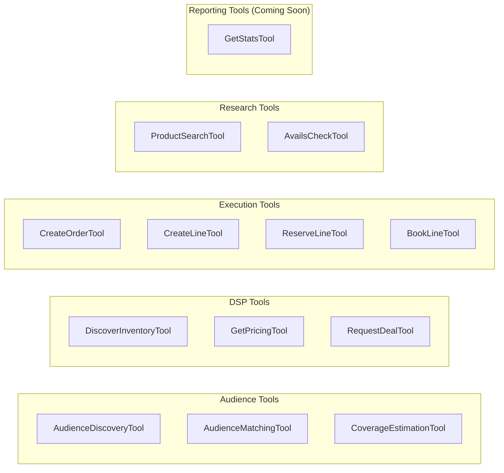

# CrewAI Tools Reference

The buyer agent provides 13 tools that agents use to interact with sellers, plan audiences, execute bookings, and retrieve performance data. All tools extend CrewAI's `BaseTool` and expose both synchronous (`_run`) and asynchronous (`_arun`) interfaces.

## Tool Categories



| Category | Tools | Used By |
|----------|-------|---------|
| **Audience** | AudienceDiscovery, AudienceMatching, CoverageEstimation | Audience Planner, Research Agent |
| **DSP** | DiscoverInventory, GetPricing, RequestDeal | DSP Specialist |
| **Execution** | CreateOrder, CreateLine, ReserveLine, BookLine | Execution Agent |
| **Research** | ProductSearch, AvailsCheck | Research Agent |
| **Reporting** | GetStats | Reporting Agent (Coming Soon) |

---

## Audience Tools

Audience tools use the IAB Tech Lab [User Context Protocol (UCP)](https://iabtechlab.com/ucp) to discover, match, and estimate audience coverage across seller inventory.

**Package:** `src/ad_buyer/tools/audience/`

### AudienceDiscoveryTool

Discovers available audience signals from a seller endpoint via UCP.

**CrewAI name:** `discover_audience_capabilities`

| Parameter | Type | Required | Description |
|-----------|------|----------|-------------|
| `seller_endpoint` | `str` | yes | Seller's capability discovery endpoint URL |
| `signal_types` | `list[str]` | no | Filter by signal type: `identity`, `contextual`, `reinforcement` |
| `min_coverage` | `float` | no | Minimum coverage percentage (0--100) |

**Returns:** Capabilities grouped by signal type, each with coverage percentage, available segments, and UCP compatibility status.

```python
from ad_buyer.tools.audience import AudienceDiscoveryTool

tool = AudienceDiscoveryTool()
result = tool._run(
    seller_endpoint="http://seller.example.com:8000/ucp/capabilities",
    signal_types=["contextual", "identity"],
    min_coverage=50.0,
)
```

??? note "Signal types explained"
    - **Identity**: Hashed user IDs, device graphs, demographic models
    - **Contextual**: Page content categories, keywords, IAB taxonomy
    - **Reinforcement**: Purchase intent, past converters, feedback loops

---

### AudienceMatchingTool

Computes a UCP similarity score between the campaign's target audience and a seller's inventory audience characteristics.

**CrewAI name:** `match_audience_to_inventory`

| Parameter | Type | Required | Description |
|-----------|------|----------|-------------|
| `seller_endpoint` | `str` | yes | Seller's UCP exchange endpoint URL |
| `demographics` | `dict` | no | Age, gender, income targeting |
| `interests` | `list[str]` | no | Interest-based categories |
| `behaviors` | `list[str]` | no | Behavioral targeting segments |
| `geography` | `str` | no | Country code for geo targeting |
| `exclusions` | `list[str]` | no | Segments to exclude |

**Returns:** Match quality (STRONG/MODERATE/WEAK/POOR), UCP similarity score (0--1), matched capabilities, gaps, and suggested alternatives.

```python
from ad_buyer.tools.audience import AudienceMatchingTool

tool = AudienceMatchingTool()
result = tool._run(
    seller_endpoint="http://seller.example.com:8000/ucp/exchange",
    demographics={"age": "25-54", "gender": "all"},
    interests=["sports", "news"],
    geography="US",
)
```

!!! tip "Score thresholds"
    - **>= 0.7**: Strong match --- proceed with targeting
    - **0.5 --- 0.7**: Moderate --- proceed with caution, may limit reach
    - **< 0.5**: Weak --- consider broadening targeting or reviewing alternatives

---

### CoverageEstimationTool

Estimates audience reach for a targeting specification across channels.

**CrewAI name:** `estimate_audience_coverage`

| Parameter | Type | Required | Description |
|-----------|------|----------|-------------|
| `targeting` | `dict` | yes | Targeting spec with demographics, interests, behaviors, etc. |
| `channel` | `str` | no | Specific channel: `display`, `video`, `ctv`, `mobile_app` |
| `total_impressions` | `int` | no | Total available impressions to estimate against (default: 10M) |

**Returns:** Per-channel coverage estimates with impression counts, coverage percentages, confidence levels, and limiting factors.

```python
from ad_buyer.tools.audience import CoverageEstimationTool

tool = CoverageEstimationTool()
result = tool._run(
    targeting={
        "demographics": {"age": "25-54"},
        "interests": ["sports"],
        "geography": "US",
    },
    channel="ctv",
    total_impressions=5_000_000,
)
```

**Coverage factors by targeting type:**

| Targeting Type | Base Coverage | Notes |
|----------------|--------------|-------|
| Geography | 95% | Nearly all inventory has geo data |
| Device | 98% | Device data is standard |
| Interests (contextual) | 90% | Most inventory supports contextual signals |
| Demographics | 75% | Modeled demographic data |
| Behaviors | 40% | Limited behavioral data availability |

**Channel modifiers:**

| Channel | Modifier | Notes |
|---------|----------|-------|
| Display | 1.0x | Largest inventory pool |
| Video | 0.85x | Less video inventory available |
| Mobile App | 0.70x | App inventory varies |
| CTV | 0.60x | Most limited but growing |

---

## DSP Tools

DSP tools enable programmatic deal workflows where Deal IDs are obtained from sellers and activated in traditional DSP platforms. All three tools require a `UnifiedClient` and `BuyerContext` at initialization.

**Package:** `src/ad_buyer/tools/dsp/`

### DiscoverInventoryTool

Queries sellers for available inventory with identity-based access and tiered pricing.

**CrewAI name:** `discover_inventory`

| Parameter | Type | Required | Description |
|-----------|------|----------|-------------|
| `query` | `str` | no | Natural language query (e.g., "CTV inventory under $25 CPM") |
| `channel` | `str` | no | Channel filter: `ctv`, `display`, `video`, `mobile` |
| `max_cpm` | `float` | no | Maximum CPM price |
| `min_impressions` | `int` | no | Minimum available impressions |
| `targeting` | `list[str]` | no | Required targeting capabilities |
| `publisher` | `str` | no | Specific publisher to search |

**Returns:** List of products with tiered pricing based on buyer identity, availability, and targeting capabilities.

```python
from ad_buyer.tools.dsp import DiscoverInventoryTool
from ad_buyer.clients.unified_client import UnifiedClient
from ad_buyer.models.buyer_identity import BuyerContext, BuyerIdentity

client = UnifiedClient(base_url="http://seller.example.com:8000")
buyer_context = BuyerContext(
    identity=BuyerIdentity(seat_id="ttd-123", agency_id="omnicom-456"),
    is_authenticated=True,
)

tool = DiscoverInventoryTool(client=client, buyer_context=buyer_context)
result = tool._run(query="premium CTV sports inventory", max_cpm=30.0)
```

!!! info "Access tiers"
    The buyer's identity determines which inventory and pricing they see:

    | Tier | Discount | Access |
    |------|----------|--------|
    | Public | 0% | Price ranges, standard catalog |
    | Seat | 5% | Fixed prices |
    | Agency | 10% | Premium inventory, negotiation |
    | Advertiser | 15% | Volume discounts, full negotiation |

---

### GetPricingTool

Retrieves tier-specific pricing for a product, including volume discounts and deal type options.

**CrewAI name:** `get_pricing`

| Parameter | Type | Required | Description |
|-----------|------|----------|-------------|
| `product_id` | `str` | yes | Product ID to price |
| `volume` | `int` | no | Requested impressions (may unlock volume discounts) |
| `deal_type` | `str` | no | `PG`, `PD`, or `PA` |
| `flight_start` | `str` | no | Start date (YYYY-MM-DD) |
| `flight_end` | `str` | no | End date (YYYY-MM-DD) |

**Returns:** Full pricing breakdown with base CPM, tier discount, volume discount, final CPM, cost projection, and available deal types.

```python
from ad_buyer.tools.dsp import GetPricingTool

tool = GetPricingTool(client=client, buyer_context=buyer_context)
result = tool._run(
    product_id="prod-ctv-sports-001",
    volume=10_000_000,
    deal_type="PD",
    flight_start="2026-07-01",
    flight_end="2026-09-30",
)
```

**Volume discounts** (agency/advertiser tiers only):

| Volume | Discount |
|--------|----------|
| 5M+ impressions | 5% |
| 10M+ impressions | 10% |

---

### RequestDealTool

Requests a Deal ID from a seller for programmatic activation in a DSP platform.

**CrewAI name:** `request_deal`

| Parameter | Type | Required | Description |
|-----------|------|----------|-------------|
| `product_id` | `str` | yes | Product ID to create deal for |
| `deal_type` | `str` | no | `PG`, `PD` (default), or `PA` |
| `impressions` | `int` | no | Volume (required for PG deals) |
| `flight_start` | `str` | no | Start date (YYYY-MM-DD) |
| `flight_end` | `str` | no | End date (YYYY-MM-DD) |
| `target_cpm` | `float` | no | Target price for negotiation (agency/advertiser only) |

**Returns:** Deal ID, pricing details, and platform-specific activation instructions for The Trade Desk, DV360, Amazon DSP, Xandr, and Yahoo DSP.

```python
from ad_buyer.tools.dsp import RequestDealTool

tool = RequestDealTool(client=client, buyer_context=buyer_context)
result = tool._run(
    product_id="prod-ctv-sports-001",
    deal_type="PD",
    impressions=500_000,
    flight_start="2026-07-01",
    flight_end="2026-09-30",
    target_cpm=22.0,
)
```

!!! warning "PG requirements"
    Programmatic Guaranteed (PG) deals require an `impressions` value. The tool will return an error if you request PG without specifying volume.

!!! warning "Negotiation requirements"
    Setting `target_cpm` requires Agency or Advertiser tier access **and** the product must have `negotiation_enabled=True`. If either condition is not met, the tool will reject the negotiation attempt.

---

## Execution Tools

Execution tools manage the OpenDirect booking lifecycle: creating orders, adding line items, reserving inventory, and confirming bookings. All require an `OpenDirectClient` at initialization.

**Package:** `src/ad_buyer/tools/execution/`

### CreateOrderTool

Creates a new advertising order (IO) in OpenDirect.

**CrewAI name:** `create_advertising_order`

| Parameter | Type | Required | Description |
|-----------|------|----------|-------------|
| `account_id` | `str` | yes | Account ID |
| `order_name` | `str` | yes | Name/title for the order |
| `brand_id` | `str` | yes | Advertiser brand identifier |
| `start_date` | `str` | yes | Order start date (YYYY-MM-DD) |
| `end_date` | `str` | yes | Order end date (YYYY-MM-DD) |
| `budget` | `float` | yes | Total budget in USD |
| `currency` | `str` | no | ISO 4217 currency code (default: `USD`) |
| `publisher_id` | `str` | no | Target publisher ID |

**Returns:** Order ID and status confirmation.

---

### CreateLineTool

Creates a line item within an order, defining the actual media purchase.

**CrewAI name:** `create_line_item`

| Parameter | Type | Required | Description |
|-----------|------|----------|-------------|
| `account_id` | `str` | yes | Account ID |
| `order_id` | `str` | yes | Order to add line to |
| `product_id` | `str` | yes | Product ID to book |
| `line_name` | `str` | yes | Name for the line item |
| `start_date` | `str` | yes | Start date (YYYY-MM-DD) |
| `end_date` | `str` | yes | End date (YYYY-MM-DD) |
| `rate_type` | `str` | no | `CPM`, `CPMV`, `CPC`, `CPD`, `FlatRate` (default: `CPM`) |
| `rate` | `float` | yes | Rate/price for the line |
| `quantity` | `int` | yes | Target impressions or units |
| `targeting` | `dict` | no | Targeting parameters (geo, demographic, etc.) |

**Returns:** Line ID, status, and estimated cost.

---

### ReserveLineTool

Reserves inventory for a line item, transitioning it from Draft to Reserved status.

**CrewAI name:** `reserve_line_item`

| Parameter | Type | Required | Description |
|-----------|------|----------|-------------|
| `account_id` | `str` | yes | Account ID |
| `order_id` | `str` | yes | Order ID |
| `line_id` | `str` | yes | Line ID to reserve |

**Returns:** Updated line status confirmation. The inventory is temporarily held without final commitment.

---

### BookLineTool

Confirms booking for a line item, transitioning from Reserved to Booked.

**CrewAI name:** `book_line_item`

| Parameter | Type | Required | Description |
|-----------|------|----------|-------------|
| `account_id` | `str` | yes | Account ID |
| `order_id` | `str` | yes | Order ID |
| `line_id` | `str` | yes | Line ID to book |

**Returns:** Booking confirmation with guaranteed impressions and total cost.

---

### Booking Lifecycle

The four execution tools move line items through the OpenDirect booking states:

```
CreateOrder → CreateLine → ReserveLine → BookLine
                  ↓             ↓            ↓
                Draft    →  Reserved   →  Booked  →  InFlight  →  Finished
```

---

## Research Tools

Research tools discover and evaluate advertising inventory via OpenDirect APIs. Both require an `OpenDirectClient` at initialization.

**Package:** `src/ad_buyer/tools/research/`

### ProductSearchTool

Searches for advertising products across publishers.

**CrewAI name:** `search_advertising_products`

| Parameter | Type | Required | Description |
|-----------|------|----------|-------------|
| `channel` | `str` | no | `display`, `video`, `mobile`, `ctv`, `native` |
| `format` | `str` | no | `banner`, `video`, `interstitial`, `rewarded` |
| `min_price` | `float` | no | Minimum CPM in USD |
| `max_price` | `float` | no | Maximum CPM in USD |
| `publisher_ids` | `list[str]` | no | Specific publishers to search |
| `targeting_capabilities` | `list[str]` | no | Required targeting: `geo`, `demographic`, `behavioral`, `contextual` |
| `delivery_type` | `str` | no | `Exclusive`, `Guaranteed`, `PMP` |
| `limit` | `int` | no | Max results (default: 10, max: 50) |

**Returns:** Formatted list of matching products with pricing, reach estimates, and targeting capabilities.

---

### AvailsCheckTool

Checks real-time availability and pricing for a specific product during a flight window.

**CrewAI name:** `check_inventory_availability`

| Parameter | Type | Required | Description |
|-----------|------|----------|-------------|
| `product_id` | `str` | yes | Product ID to check |
| `start_date` | `str` | yes | Campaign start date (YYYY-MM-DD) |
| `end_date` | `str` | yes | Campaign end date (YYYY-MM-DD) |
| `impressions` | `int` | no | Desired impression volume |
| `budget` | `float` | no | Total budget in USD |

**Returns:** Available impressions, guaranteed delivery, delivery confidence, estimated CPM, and total cost.

---

## Reporting Tools

!!! info "Coming Soon"
    The Reporting Agent and its tools (buyer-brn) are planned for a future phase. This section describes the planned reporting functionality.

**Package:** `src/ad_buyer/tools/reporting/`

### GetStatsTool

Retrieves performance statistics for a line item.

**CrewAI name:** `get_line_statistics`

| Parameter | Type | Required | Description |
|-----------|------|----------|-------------|
| `account_id` | `str` | yes | Account ID |
| `order_id` | `str` | yes | Order ID |
| `line_id` | `str` | yes | Line ID to get stats for |

**Returns:** Delivery metrics (impressions, pacing, delivery rate), spend data (amount spent, budget utilization), and performance indicators (effective CPM, VCR, viewability, CTR).

---

## Tool Initialization Patterns

Tools are typically initialized within crew factory functions, not directly by application code. Here is how each crew creates its tool sets:

```python
# Research tools -- require OpenDirectClient
from ad_buyer.tools.research import ProductSearchTool, AvailsCheckTool

research_tools = [
    ProductSearchTool(client),
    AvailsCheckTool(client),
]

# Execution tools -- require OpenDirectClient
from ad_buyer.tools.execution import (
    CreateOrderTool, CreateLineTool, ReserveLineTool, BookLineTool,
)

execution_tools = [
    CreateOrderTool(client),
    CreateLineTool(client),
    ReserveLineTool(client),
    BookLineTool(client),
]

# Audience tools -- no client required
from ad_buyer.tools.audience import (
    AudienceDiscoveryTool, AudienceMatchingTool, CoverageEstimationTool,
)

audience_tools = [
    AudienceDiscoveryTool(),
    AudienceMatchingTool(),
    CoverageEstimationTool(),
]

# DSP tools -- require UnifiedClient + BuyerContext
from ad_buyer.tools.dsp import (
    DiscoverInventoryTool, GetPricingTool, RequestDealTool,
)

dsp_tools = [
    DiscoverInventoryTool(client=unified_client, buyer_context=buyer_ctx),
    GetPricingTool(client=unified_client, buyer_context=buyer_ctx),
    RequestDealTool(client=unified_client, buyer_context=buyer_ctx),
]
```

---

## Related

- [Agent Hierarchy](agent-hierarchy.md) --- Which agents use which tools
- [DSP Deal Flow](dsp-deal-flow.md) --- How DSP tools work together in a flow
- [Booking Flow](booking-flow.md) --- How execution tools drive the booking lifecycle
- [Configuration](../guides/configuration.md) --- Tool-related settings
