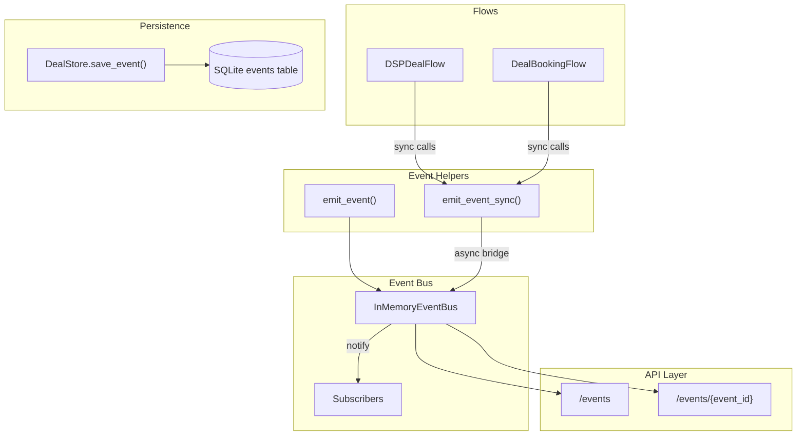
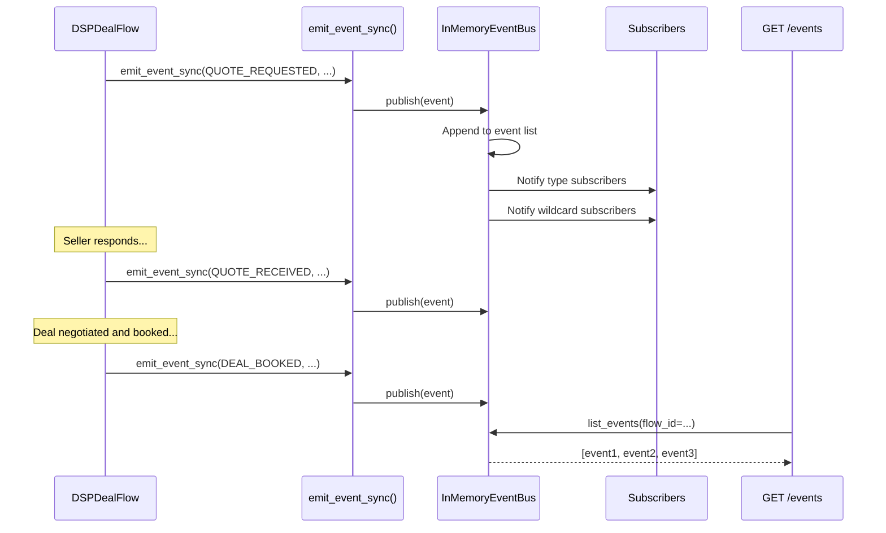

# Event Bus

The event bus provides structured, append-only event logging for all significant actions in the buyer agent. Every quote request, negotiation round, deal booking, and budget allocation is recorded as a typed event --- giving operators full observability into what the buyer did, when, and why.

## Why an Event Bus

Standard Python logging captures text messages. The event bus captures structured records that can be filtered, queried, and subscribed to programmatically:

- **Auditability** --- Regulators, advertisers, and agency partners can trace every action the buyer agent took on their behalf.
- **Debugging** --- Reconstruct the exact sequence of events that led to a deal outcome by querying `flow_id` or `deal_id`.
- **Analytics** --- Query historical events for reporting (e.g., average negotiation rounds, win rates by seller, time-to-book).
- **Integration** --- External systems can subscribe to events for real-time dashboards, alerting, or downstream processing.

!!! info "Fail-open by design"
    Event emission never blocks or breaks the calling flow. If the bus is unavailable, the helpers log a warning and return `None`. Deal execution always takes priority over observability.

---

## Architecture

The diagram below shows how events flow from the buyer's deal and campaign flows through helper functions into the event bus, and from there to subscribers and the persistence layer. Flows emit events via sync or async helpers; the bus dispatches to subscribers and the API layer exposes events for external queries.



---

## Event Model

Every event is a Pydantic `Event` instance with the following fields:

| Field | Type | Default | Description |
|-------|------|---------|-------------|
| `event_id` | `str` | Auto-generated UUID | Unique identifier for this event |
| `event_type` | `EventType` | *(required)* | Enum value identifying what happened |
| `timestamp` | `datetime` | `datetime.utcnow()` | When the event was created |
| `flow_id` | `str` | `""` | ID of the flow instance that produced this event |
| `flow_type` | `str` | `""` | Type of flow (e.g., `"dsp_deal"`, `"deal_booking"`) |
| `deal_id` | `str` | `""` | Associated deal ID, if applicable |
| `session_id` | `str` | `""` | Associated session ID, if applicable |
| `payload` | `dict[str, Any]` | `{}` | Event-specific data (see per-type examples below) |
| `metadata` | `dict[str, Any]` | `{}` | Additional context passed via `**kwargs` to helpers |

### Correlation

Events can be correlated across a workflow using three keys:

- **`flow_id`** --- Groups all events from a single flow execution.
- **`deal_id`** --- Groups all events related to a specific deal across multiple flows.
- **`session_id`** --- Groups all events within a user session.

---

## Event Types

The `EventType` enum defines 13 event types organized by domain.

### Quote Lifecycle

| Event Type | Value | Emitted When | Example Payload |
|------------|-------|--------------|-----------------|
| `QUOTE_REQUESTED` | `quote.requested` | Quote request sent to seller | `{"request": "...", "deal_type": "PD"}` |
| `QUOTE_RECEIVED` | `quote.received` | Pricing response received | `{"product_id": "prod-ctv-001"}` |

### Deal Lifecycle

| Event Type | Value | Emitted When | Example Payload |
|------------|-------|--------------|-----------------|
| `DEAL_BOOKED` | `deal.booked` | Deal booking confirmed | `{"product_id": "prod-001", "deal_id": "..."}` |
| `DEAL_CANCELLED` | `deal.cancelled` | Deal cancelled | `{"deal_id": "...", "reason": "..."}` |

### Campaign Lifecycle

| Event Type | Value | Emitted When | Example Payload |
|------------|-------|--------------|-----------------|
| `CAMPAIGN_CREATED` | `campaign.created` | Campaign brief parsed | `{"name": "Q3 CTV", "budget": 50000}` |

### Budget Lifecycle

| Event Type | Value | Emitted When | Example Payload |
|------------|-------|--------------|-----------------|
| `BUDGET_ALLOCATED` | `budget.allocated` | Budget distributed across channels | `{"channels": ["ctv", "mobile"], "total_budget": 50000}` |

### Booking Lifecycle

| Event Type | Value | Emitted When | Example Payload |
|------------|-------|--------------|-----------------|
| `BOOKING_SUBMITTED` | `booking.submitted` | Booking request sent to seller | `{"order_id": "...", "line_id": "..."}` |

### Inventory Lifecycle

| Event Type | Value | Emitted When | Example Payload |
|------------|-------|--------------|-----------------|
| `INVENTORY_DISCOVERED` | `inventory.discovered` | Seller inventory query returned results | `{"query": "..."}` |

### Negotiation Lifecycle

| Event Type | Value | Emitted When | Example Payload |
|------------|-------|--------------|-----------------|
| `NEGOTIATION_STARTED` | `negotiation.started` | Negotiation session opened | `{"proposal_id": "...", "strategy": "anchor_high"}` |
| `NEGOTIATION_ROUND` | `negotiation.round` | A negotiation round completed | `{"round": 2, "buyer_price": 12.0, "seller_price": 15.0}` |
| `NEGOTIATION_CONCLUDED` | `negotiation.concluded` | Negotiation session ended | `{"outcome": "accepted", "final_price": 14.0}` |

### Session Lifecycle

| Event Type | Value | Emitted When | Example Payload |
|------------|-------|--------------|-----------------|
| `SESSION_CREATED` | `session.created` | New buyer session started | `{"session_id": "..."}` |
| `SESSION_CLOSED` | `session.closed` | Buyer session ended | `{"session_id": "...", "deals_count": 3}` |

---

## InMemoryEventBus

The `InMemoryEventBus` is the default (and currently only) backend. It stores events in a Python list and dispatches to subscribers synchronously during `publish()`.

### Methods

| Method | Signature | Description |
|--------|-----------|-------------|
| `publish` | `async (event: Event) -> None` | Append event to store, notify subscribers |
| `subscribe` | `async (event_type: str, callback: Subscriber) -> None` | Register a callback for a specific event type or `"*"` for all |
| `get_event` | `async (event_id: str) -> Event \| None` | Look up a single event by ID |
| `list_events` | `async (flow_id?, event_type?, session_id?, limit=50) -> list[Event]` | Query events with optional filters |

### Subscriber Dispatch

When `publish()` is called:

1. The event is appended to the internal list.
2. All callbacks registered for the event's type are invoked.
3. All callbacks registered for `"*"` (wildcard) are invoked.
4. If a subscriber raises an exception, it is logged and the next subscriber is called. One failing subscriber never blocks others.

```python
from ad_buyer.events import get_event_bus, EventType, Event

bus = await get_event_bus()

# Subscribe to all deal.booked events
async def on_deal_booked(event: Event):
    print(f"Deal booked: {event.deal_id}")

await bus.subscribe("deal.booked", on_deal_booked)

# Subscribe to ALL events
async def audit_logger(event: Event):
    print(f"[AUDIT] {event.event_type}: {event.payload}")

await bus.subscribe("*", audit_logger)
```

### Singleton Access

The module provides a singleton factory:

```python
from ad_buyer.events.bus import get_event_bus, close_event_bus

bus = await get_event_bus()   # Creates InMemoryEventBus on first call
bus2 = await get_event_bus()  # Returns same instance
assert bus is bus2

await close_event_bus()       # Resets the singleton (for testing)
```

!!! warning "No persistence across restarts"
    `InMemoryEventBus` stores events in a Python list. Events are lost when the process exits. For durable storage, events are separately persisted to the SQLite `events` table via `DealStore.save_event()`.

---

## Emitting Events

Two helper functions make it easy to emit events from any code path. Both follow the fail-open pattern: they catch all exceptions, log a warning, and return `None`.

### `emit_event()` --- Async

Use in async code (FastAPI endpoints, async handlers):

```python
from ad_buyer.events.helpers import emit_event
from ad_buyer.events.models import EventType

event = await emit_event(
    EventType.DEAL_BOOKED,
    flow_id="flow-abc-123",
    flow_type="dsp_deal",
    deal_id="deal-456",
    payload={
        "product_id": "prod-ctv-sports-001",
        "final_cpm": 14.50,
    },
)
# event is an Event instance, or None if the bus was unavailable
```

### `emit_event_sync()` --- Synchronous

Use in synchronous code, particularly CrewAI flow methods that run in worker threads without an asyncio event loop:

```python
from ad_buyer.events.helpers import emit_event_sync
from ad_buyer.events.models import EventType

event = emit_event_sync(
    EventType.CAMPAIGN_CREATED,
    flow_type="deal_booking",
    payload={"name": "Q3 CTV Campaign", "budget": 50000},
)
```

!!! tip "When to use which"
    Use `emit_event_sync()` in CrewAI flow methods (`@listen`, `@start`, `@router` decorated methods). Use `emit_event()` in FastAPI endpoints and other async contexts. When in doubt, `emit_event_sync()` works everywhere.

### How `emit_event_sync()` Works

CrewAI runs flow steps in worker threads that may not have an asyncio event loop. The sync helper handles three scenarios:

1. **Running event loop detected** --- Schedules the publish as a future on the existing loop.
2. **Event loop exists but is not running** --- Calls `loop.run_until_complete()`.
3. **No event loop at all** --- Creates a new loop via `asyncio.run()`.

If the singleton bus does not exist yet, `emit_event_sync()` creates an `InMemoryEventBus` directly (bypassing the async `get_event_bus()` factory).

### Helper Parameters

Both `emit_event()` and `emit_event_sync()` accept the same parameters:

| Parameter | Type | Default | Description |
|-----------|------|---------|-------------|
| `event_type` | `EventType` | *(required)* | The type of event to emit |
| `flow_id` | `str` | `""` | Flow instance identifier |
| `flow_type` | `str` | `""` | Flow type name |
| `deal_id` | `str` | `""` | Associated deal ID |
| `session_id` | `str` | `""` | Associated session ID |
| `payload` | `dict` | `None` | Event-specific data |
| `**kwargs` | `Any` | --- | Extra key-value pairs stored in `metadata` |

---

## SQLite Persistence

Events are persisted to a SQLite `events` table managed by the [DealStore](deal-store.md). This provides durability across process restarts, independent of the in-memory bus.

### Events Table Schema

```sql
CREATE TABLE IF NOT EXISTS events (
    id              TEXT PRIMARY KEY,
    event_type      TEXT NOT NULL,
    flow_id         TEXT NOT NULL DEFAULT '',
    flow_type       TEXT NOT NULL DEFAULT '',
    deal_id         TEXT NOT NULL DEFAULT '',
    session_id      TEXT NOT NULL DEFAULT '',
    payload         TEXT DEFAULT '{}',
    metadata        TEXT DEFAULT '{}',
    created_at      TEXT NOT NULL DEFAULT (strftime('%Y-%m-%dT%H:%M:%fZ', 'now'))
);
```

### Indexes

| Index | Column(s) | Purpose |
|-------|-----------|---------|
| `idx_events_type` | `event_type` | Filter by event type |
| `idx_events_flow_id` | `flow_id` | Correlate events within a flow |
| `idx_events_deal_id` | `deal_id` | Find all events for a deal |
| `idx_events_session_id` | `session_id` | Find all events in a session |
| `idx_events_created_at` | `created_at` | Time-range queries |

### DealStore Event Methods

| Method | Signature | Description |
|--------|-----------|-------------|
| `save_event` | `(**kwargs) -> str` | Insert an event row. Returns the event ID (auto-generated if not provided). |
| `get_event` | `(event_id: str) -> dict \| None` | Retrieve a single event by ID. |
| `list_events` | `(event_type?, flow_id?, session_id?, limit=50) -> list[dict]` | Query events with optional filters, ordered by `created_at` descending. |

```python
from ad_buyer.storage.deal_store import DealStore
import json

store = DealStore("sqlite:///./ad_buyer.db")
store.connect()

# Persist an event
event_id = store.save_event(
    event_type="deal.booked",
    flow_id="flow-abc",
    deal_id="deal-456",
    payload=json.dumps({"product_id": "prod-001", "cpm": 14.50}),
)

# Query events for a deal
events = store.list_events(flow_id="flow-abc")
```

---

## API Endpoints

Two REST endpoints expose events from the in-memory bus.

### `GET /events`

List events with optional filters.

**Query Parameters:**

| Parameter | Type | Default | Description |
|-----------|------|---------|-------------|
| `event_type` | `str` | `None` | Filter by event type value (e.g., `"deal.booked"`) |
| `flow_id` | `str` | `None` | Filter by flow ID |
| `session_id` | `str` | `None` | Filter by session ID |
| `limit` | `int` | `50` | Maximum number of events to return |

**Response:**

```json
{
  "events": [
    {
      "event_id": "a1b2c3d4-...",
      "event_type": "deal.booked",
      "timestamp": "2026-03-11T14:30:00Z",
      "flow_id": "flow-abc-123",
      "flow_type": "dsp_deal",
      "deal_id": "deal-456",
      "session_id": "",
      "payload": {"product_id": "prod-001", "final_cpm": 14.50},
      "metadata": {}
    }
  ],
  "total": 1
}
```

### `GET /events/{event_id}`

Retrieve a single event by ID.

**Path Parameters:**

| Parameter | Type | Description |
|-----------|------|-------------|
| `event_id` | `str` | The event's UUID |

**Response:** The event object (same shape as array elements above).

**Errors:** Returns `404` if the event ID is not found.

!!! note "In-memory only"
    These endpoints query the `InMemoryEventBus`, not the SQLite `events` table. Events are available only for the lifetime of the current process. For historical queries across restarts, query the DealStore directly.

---

## Event Flow Diagram

This sequence diagram shows how events flow through the system during a typical DSP deal:



---

## Usage Examples

### Emitting Events from a Flow

```python
from ad_buyer.events.helpers import emit_event_sync
from ad_buyer.events.models import EventType

# In a CrewAI flow method
def negotiate_price(self):
    # ... negotiation logic ...

    emit_event_sync(
        EventType.NEGOTIATION_ROUND,
        flow_id=self.state.flow_id,
        flow_type="dsp_deal",
        deal_id=self.state.deal_id,
        payload={
            "round": round_number,
            "buyer_price": our_offer,
            "seller_price": their_ask,
            "action": "counter",
        },
    )
```

### Subscribing to Events

```python
from ad_buyer.events import get_event_bus, Event

bus = await get_event_bus()

def on_deal_booked(event: Event):
    """React to deal bookings (e.g., update a dashboard)."""
    print(f"New deal: {event.deal_id} at {event.payload.get('final_cpm')}")

await bus.subscribe("deal.booked", on_deal_booked)
```

### Querying Events via API

```bash
# All events for a specific flow
curl "http://localhost:8002/events?flow_id=flow-abc-123"

# All deal.booked events
curl "http://localhost:8002/events?event_type=deal.booked"

# A specific event
curl "http://localhost:8002/events/a1b2c3d4-5678-..."
```

---

## Related

- [Deal Store](deal-store.md) --- SQLite persistence layer including the `events` table
- [Order State Machine](state-machine.md) --- State transitions emit events for observability
- [Architecture Overview](overview.md) --- System architecture context
- [Booking Flow](booking-flow.md) --- End-to-end workflow that emits campaign and deal events
- [Seller Event Bus](https://iabtechlab.github.io/seller-agent/event-bus/overview/) --- Seller-side event bus implementation
