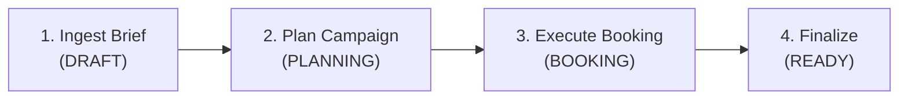
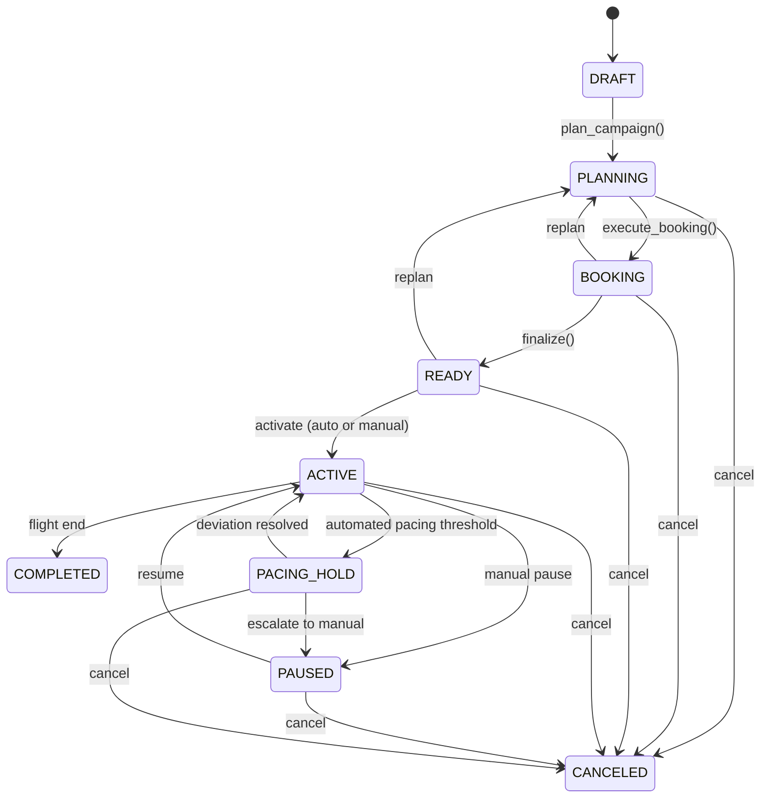

# Campaign Brief to Deal Pipeline

The campaign pipeline transforms a structured **campaign brief** into **booked deals** --- automating the entire workflow from brief ingestion through channel planning, multi-seller deal orchestration, and campaign finalization. Hand the buyer agent a brief describing what you want to achieve, and it returns a portfolio of booked deals that satisfy the brief's objectives.

The pipeline is implemented by `CampaignPipeline` in `ad_buyer.pipelines.campaign_pipeline`. It coordinates the campaign brief parser, campaign store (state persistence), multi-seller orchestrator (deal booking), and event bus (lifecycle events) across four stages.

---

## Pipeline Stages



Each stage transitions the campaign through the [campaign automation state machine](../state-machines/order-lifecycle.md):

| Stage | Method | Status Transition | What Happens |
|-------|--------|-------------------|-------------|
| **Ingest** | `ingest_brief()` | &rarr; DRAFT | Parse and validate the brief, create campaign record |
| **Plan** | `plan_campaign()` | DRAFT &rarr; PLANNING | Compute per-channel budget allocations and deal types |
| **Book** | `execute_booking()` | PLANNING &rarr; BOOKING | Run multi-seller orchestration for each channel |
| **Finalize** | `finalize()` | BOOKING &rarr; READY | Mark campaign ready for activation |

You can call each stage independently or use `pipeline.run(brief)` to execute all four in sequence.

---

## The Campaign Brief

The campaign brief is a structured JSON document that describes what an advertiser wants to achieve. It is validated against a Pydantic schema (`CampaignBrief`) before the pipeline accepts it.

### Required Fields

| Field | Type | Description |
|-------|------|-------------|
| `advertiser_id` | `str` | Advertiser identifier |
| `campaign_name` | `str` | Human-readable campaign name |
| `objective` | `str` | `AWARENESS`, `CONSIDERATION`, `CONVERSION`, or `REACH` |
| `total_budget` | `float` | Total campaign budget (must be > 0) |
| `currency` | `str` | ISO 4217 currency code (e.g. `USD`) |
| `flight_start` | `date` | Campaign start date (`YYYY-MM-DD`) |
| `flight_end` | `date` | Campaign end date (must be after start) |
| `channels` | `list` | Channel allocations (at least one; budget percentages must sum to 100) |
| `target_audience` | `list[str]` | IAB Audience Taxonomy segment IDs |

### Optional Fields

| Field | Type | Description |
|-------|------|-------------|
| `agency_id` | `str` | Agency identifier |
| `description` | `str` | Campaign objective/notes |
| `target_geo` | `list` | Geographic targeting (country, state, DMA, metro, zip) |
| `kpis` | `list` | Performance targets (CPM, CPC, CPCV, CTR, VCR, ROAS, GRP) |
| `brand_safety` | `object` | Content exclusions (categories, keywords) |
| `frequency_cap` | `object` | Cross-channel frequency cap (max impressions per period) |
| `pacing_model` | `str` | `EVEN` (default), `FRONT_LOADED`, `BACK_LOADED`, or `CUSTOM` |
| `preferred_sellers` | `list[str]` | Seller IDs to prioritize |
| `excluded_sellers` | `list[str]` | Seller IDs to avoid |
| `creative_ids` | `list[str]` | Pre-uploaded creative asset IDs |
| `approval_config` | `object` | Human approval gates per stage |
| `deal_preferences` | `object` | Preferred deal types and max CPM |
| `exclusion_list` | `list[str]` | Domains/brands to exclude |
| `notes` | `str` | Free-text notes |

### Channel Allocations

Each entry in the `channels` array specifies a channel and its share of the total budget:

```json
{
  "channels": [
    {"channel": "CTV", "budget_pct": 50, "format_prefs": ["pre-roll", "mid-roll"]},
    {"channel": "DISPLAY", "budget_pct": 30, "format_prefs": ["300x250", "728x90"]},
    {"channel": "AUDIO", "budget_pct": 20, "format_prefs": ["30s"]}
  ]
}
```

Supported channel types: `CTV`, `DISPLAY`, `AUDIO`, `NATIVE`, `DOOH`, `LINEAR_TV`.

!!! warning "Budget percentages must sum to 100"
    The brief validator rejects briefs where channel `budget_pct` values do not sum to exactly 100. Duplicate channel types are also rejected.

### Example Brief

```json
{
  "advertiser_id": "acme-corp",
  "campaign_name": "Q3 Brand Awareness",
  "objective": "AWARENESS",
  "total_budget": 150000,
  "currency": "USD",
  "flight_start": "2026-07-01",
  "flight_end": "2026-09-30",
  "channels": [
    {"channel": "CTV", "budget_pct": 50, "format_prefs": ["pre-roll"]},
    {"channel": "DISPLAY", "budget_pct": 30},
    {"channel": "AUDIO", "budget_pct": 20}
  ],
  "target_audience": ["IAB-AUD-1234", "IAB-AUD-5678"],
  "target_geo": [
    {"geo_type": "COUNTRY", "geo_value": "US"}
  ],
  "kpis": [
    {"metric": "CPM", "target_value": 15.0},
    {"metric": "VCR", "target_value": 75.0}
  ],
  "brand_safety": {
    "excluded_categories": ["IAB25", "IAB26"],
    "excluded_keywords": ["gambling", "tobacco"]
  },
  "pacing_model": "EVEN",
  "excluded_sellers": ["seller-block-123"],
  "deal_preferences": {
    "preferred_deal_types": ["PG", "PD"],
    "max_cpm": 35.0
  },
  "approval_config": {
    "plan_review": true,
    "booking": true,
    "creative": false,
    "pacing_adjustment": false
  }
}
```

---

## Quick Example

### End-to-End (All Stages)

```python
from ad_buyer.pipelines.campaign_pipeline import CampaignPipeline
from ad_buyer.orchestration.multi_seller import MultiSellerOrchestrator
from ad_buyer.storage.campaign_store import CampaignStore
from ad_buyer.events.bus import InMemoryEventBus

# Setup
store = CampaignStore("sqlite:///./ad_buyer.db")
store.connect()
bus = InMemoryEventBus()

orchestrator = MultiSellerOrchestrator(
    registry_client=registry,
    deals_client_factory=deals_factory,
    event_bus=bus,
)

pipeline = CampaignPipeline(
    store=store,
    orchestrator=orchestrator,
    event_bus=bus,
)

# Run the full pipeline
summary = await pipeline.run({
    "advertiser_id": "acme-corp",
    "campaign_name": "Q3 Brand Awareness",
    "objective": "AWARENESS",
    "total_budget": 150000,
    "currency": "USD",
    "flight_start": "2026-07-01",
    "flight_end": "2026-09-30",
    "channels": [
        {"channel": "CTV", "budget_pct": 50},
        {"channel": "DISPLAY", "budget_pct": 30},
        {"channel": "AUDIO", "budget_pct": 20},
    ],
    "target_audience": ["IAB-AUD-1234"],
})

print(f"Campaign: {summary['campaign_id']}")
print(f"Status: {summary['status']}")  # "ready"
for ch, info in summary["channels"].items():
    print(f"  {ch}: {info['deals_booked']} deals, ${info['total_spend']:,.2f} spend")
```

### Stage-by-Stage

For more control, call each stage independently:

```python
# Stage 1: Ingest brief
campaign_id = await pipeline.ingest_brief(brief_json)

# Stage 2: Plan (creates per-channel allocations)
plan = await pipeline.plan_campaign(campaign_id)
for cp in plan.channel_plans:
    print(f"  {cp.channel.value}: ${cp.budget:,.2f} ({cp.budget_pct}%)")

# Stage 3: Book deals (runs multi-seller orchestration per channel)
results = await pipeline.execute_booking(campaign_id)
for ch, result in results.items():
    print(f"  {ch}: {len(result.selection.booked_deals)} deals booked")

# Stage 4: Finalize
await pipeline.finalize(campaign_id)
```

---

## Stage Details

### Stage 1: Ingest Brief

`ingest_brief()` accepts a campaign brief as either a JSON string or a Python dict. It:

1. **Parses and validates** the brief using the `CampaignBrief` Pydantic model. Invalid JSON raises `ValueError`; schema violations raise `pydantic.ValidationError`.
2. **Computes budget amounts** --- Each channel's `budget_amount` is calculated from `total_budget * budget_pct / 100`.
3. **Creates a campaign record** in the `CampaignStore` in DRAFT status.
4. **Emits** a `campaign.created` event.

### Stage 2: Plan Campaign

`plan_campaign()` transitions the campaign from DRAFT to PLANNING and produces a `CampaignPlan` with per-channel `ChannelPlan` entries.

For each channel in the brief, the planner determines:

- **Media type** for seller discovery (e.g., CTV maps to `"ctv"`, DISPLAY maps to `"display"`)
- **Deal types** to request (e.g., CTV defaults to `["PG", "PD"]`, DISPLAY to `["PD", "PA"]`)
- **Budget** allocated from the total
- **Format preferences** from the brief

The channel-to-deal-type mapping:

| Channel | Default Deal Types |
|---------|-------------------|
| CTV | PG, PD |
| DISPLAY | PD, PA |
| AUDIO | PD, PA |
| NATIVE | PD, PA |
| DOOH | PG, PD |
| LINEAR_TV | PG |

### Stage 3: Execute Booking

`execute_booking()` transitions the campaign from PLANNING to BOOKING and calls the [MultiSellerOrchestrator](multi-seller-orchestration.md) once per channel.

For each channel plan, the pipeline:

1. Builds an `InventoryRequirements` from the channel's media type, deal types, and the brief's excluded sellers and max CPM
2. Constructs `DealParams` with estimated impressions (derived from channel budget at an assumed $15 CPM)
3. Calls `orchestrator.orchestrate()` with the channel's budget and a max of 3 deals per channel
4. Collects the `OrchestrationResult`

If a channel's orchestration fails, the error is logged and an empty result is recorded for that channel --- other channels proceed normally. After all channels complete, the pipeline emits a `campaign.booking_completed` event with a summary.

### Stage 4: Finalize

`finalize()` transitions the campaign from BOOKING to READY and emits a `campaign.ready` event. The campaign is now prepared for activation --- it awaits its flight start date or manual activation to move to ACTIVE status.

---

## Campaign State Machine

The pipeline drives the campaign through a formal state machine. After the pipeline completes, the campaign is in READY. From there, it can be activated and managed through its full lifecycle:



!!! info "PAUSED vs PACING_HOLD"
    **PAUSED** is a manual hold --- a human decided to pause the campaign. **PACING_HOLD** is an automated hold triggered by the [pacing engine](budget-pacing.md) when spend deviation exceeds a configurable threshold. PACING_HOLD can auto-resolve back to ACTIVE or be escalated to PAUSED.

---

## Human Approval Gates

The pipeline supports configurable human approval gates at four stages, controlled by the brief's `approval_config`:

| Stage | Default | Controls |
|-------|---------|----------|
| `plan_review` | **Enabled** | Approval after plan generation, before booking |
| `booking` | **Enabled** | Approval after deals selected, before committing budget |
| `creative` | Disabled | Approval after creative matched, before ad server push |
| `pacing_adjustment` | Disabled | Approval after pacing reallocation recommended |

Set all to `false` in the brief for fully automated execution:

```json
{
  "approval_config": {
    "plan_review": false,
    "booking": false,
    "creative": false,
    "pacing_adjustment": false
  }
}
```

The `ApprovalGate` class integrates with the `CampaignStore` to persist approval requests and emits `approval.requested`, `approval.granted`, and `approval.rejected` events. See the `ad_buyer.pipelines.approval` module for full details.

---

## Events Emitted

The pipeline emits these events across its lifecycle:

| Event | Stage | Payload |
|-------|-------|---------|
| `campaign.created` | Ingest | `campaign_name`, `advertiser_id`, `total_budget`, `channels` |
| `campaign.plan_generated` | Plan | Channel details with budget, media type, and deal types |
| `campaign.booking_started` | Book | (no payload) |
| `campaign.booking_completed` | Book | `channels_booked`, `total_deals`, `total_spend`, per-channel summary |
| `campaign.ready` | Finalize | `campaign_id` |

---

## Persistence

Campaign state is persisted in SQLite via `CampaignStore`. The store manages six tables:

| Table | Purpose |
|-------|---------|
| `campaigns` | Core campaign records (brief fields, status, timestamps) |
| `pacing_snapshots` | Periodic pacing data points |
| `creative_assets` | Creative files and metadata |
| `ad_server_campaigns` | Ad server integration records |
| `campaign_events` | Lifecycle event audit trail |
| `approval_requests` | Human approval gate requests |

All status transitions are validated by the `CampaignAutomationStateMachine` before being persisted, ensuring the campaign never enters an invalid state.

---

## Tips

**Start with the brief schema.** The most common pipeline error is a malformed brief. Validate your brief structure against the `CampaignBrief` model before calling the pipeline --- the `parse_campaign_brief()` function gives clear validation errors.

**Use stage-by-stage for debugging.** If the pipeline produces unexpected results, call each stage individually and inspect the intermediate outputs: the `CampaignPlan` from `plan_campaign()` and the per-channel `OrchestrationResult` from `execute_booking()`.

**Watch the events.** Subscribe to the event bus to monitor pipeline progress in real time. The `campaign.booking_completed` event gives you a per-channel breakdown of deals booked, spend, and failures.

**Budget estimation.** The pipeline estimates impressions from budget using an assumed $15 CPM. This is a planning heuristic --- actual CPMs depend on what the sellers quote.

---

## Related

- [Multi-Seller Discovery](multi-seller.md) --- Manual multi-seller workflow (the pipeline automates this)
- [Multi-Seller Orchestration](multi-seller-orchestration.md) --- The orchestration engine the pipeline calls internally
- [Deals API](../api/deals.md) --- The underlying quote-then-book API
- [Budget Pacing & Reallocation](budget-pacing.md) --- Mid-flight budget management (builds on the pipeline)
- [Negotiation](negotiation.md) --- Automated multi-turn price negotiation
- [Deal Booking](deal-booking.md) --- Lower-level booking flow details
