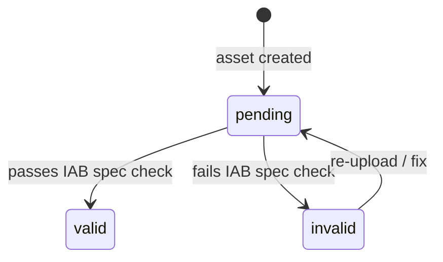
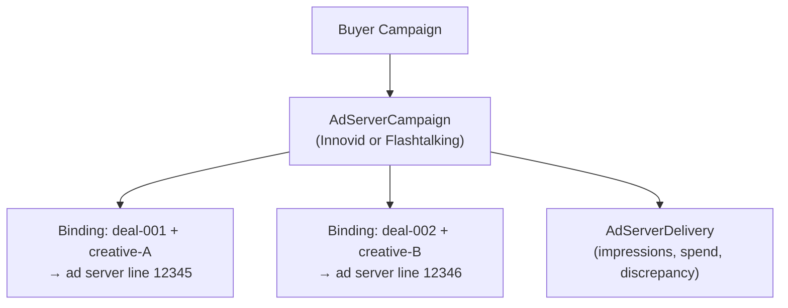

# Creative Management

Creative management covers the lifecycle of ad creative assets within the buyer system --- from uploading and storing assets, through format validation against IAB standards, to binding creatives to deals on external ad servers. The system tracks creative assets per campaign, validates them before they can be attached to deals, and maintains integration records with ad server platforms like Innovid and Flashtalking.

---

## Core Concepts

### Creative Assets

A `CreativeAsset` represents a single ad creative --- a display banner, video, audio clip, interactive unit, or native ad. Each asset belongs to a campaign and carries metadata about its format, validation status, and source location.

| Field | Type | Description |
|-------|------|-------------|
| `asset_id` | `str` | Unique identifier (UUID, auto-generated) |
| `campaign_id` | `str` | The campaign this asset belongs to |
| `asset_name` | `str` | Human-readable name |
| `asset_type` | `AssetType` | `display`, `video`, `audio`, `interactive`, or `native` |
| `format_spec` | `dict` | Format-specific metadata (varies by type) |
| `source_url` | `str` | URL where the creative file is hosted |
| `validation_status` | `ValidationStatus` | `pending`, `valid`, or `invalid` |
| `validation_errors` | `list[str]` | Validation error/warning messages |
| `created_at` | `datetime` | When the asset was created |

### Asset Types

The system supports five asset types, each with its own format specification structure:

| Type | `asset_type` | Typical `format_spec` Fields |
|------|-------------|------------------------------|
| Display | `display` | `width`, `height`, `file_format` (e.g., `{"width": 300, "height": 250, "file_format": "png"}`) |
| Video | `video` | `duration_sec`, `vast_version`, `resolution` (e.g., `{"duration_sec": 30, "vast_version": "4.2", "resolution": "1920x1080"}`) |
| Audio | `audio` | `duration_sec`, `bitrate`, `file_format` (e.g., `{"duration_sec": 30, "bitrate": 192, "file_format": "mp3"}`) |
| Interactive | `interactive` | `width`, `height`, `simid_version` (e.g., `{"width": 300, "height": 250, "simid_version": "1.1"}`) |
| Native | `native` | `headline_length`, `body_length`, `image_dimensions` |

### Validation Status

Every asset starts in `pending` status and must pass validation before it can be attached to a deal:



---

## Working with Creative Assets

### Creating Assets

Use `CampaignStore` to create and manage creative assets:

```python
from ad_buyer.storage.campaign_store import CampaignStore
import json

store = CampaignStore("sqlite:///./ad_buyer.db")
store.connect()

# Create a display creative
asset_id = store.save_creative_asset(
    campaign_id="campaign-abc",
    asset_name="Q3 Hero Banner 300x250",
    asset_type="display",
    format_spec=json.dumps({
        "width": 300,
        "height": 250,
        "file_format": "png",
        "file_size_kb": 45,
    }),
    source_url="https://cdn.example.com/creatives/hero-300x250.png",
)

# Create a video creative
video_id = store.save_creative_asset(
    campaign_id="campaign-abc",
    asset_name="Q3 Brand Spot 30s",
    asset_type="video",
    format_spec=json.dumps({
        "duration_sec": 30,
        "vast_version": "4.2",
        "resolution": "1920x1080",
        "codec": "h264",
        "bitrate_kbps": 5000,
    }),
    source_url="https://cdn.example.com/creatives/brand-spot-30s.mp4",
)
```

### Listing and Filtering

```python
# List all creatives for a campaign
assets = store.list_creative_assets(campaign_id="campaign-abc")
for a in assets:
    print(f"  {a['asset_name']} ({a['asset_type']}) - {a['validation_status']}")

# Filter by asset type
video_assets = store.list_creative_assets(
    campaign_id="campaign-abc",
    asset_type="video",
)
```

### Updating Validation Status

After running spec validation, update the asset's status:

```python
# Mark as valid
store.update_creative_asset(
    asset_id=asset_id,
    validation_status="valid",
)

# Mark as invalid with errors
store.update_creative_asset(
    asset_id=video_id,
    validation_status="invalid",
    validation_errors=json.dumps([
        "Video duration 45s exceeds maximum 30s for pre-roll placement",
        "Missing VPAID companion banner",
    ]),
)
```

---

## Using the CreativeAsset Model

For programmatic use outside the store's dict-based interface, the `CreativeAsset` dataclass provides serialization helpers:

```python
from ad_buyer.models.creative_asset import CreativeAsset, AssetType, ValidationStatus

# Create from code
asset = CreativeAsset(
    campaign_id="campaign-abc",
    asset_name="Q3 Hero Banner",
    asset_type=AssetType.DISPLAY,
    format_spec={"width": 300, "height": 250, "file_format": "png"},
    source_url="https://cdn.example.com/creatives/hero.png",
)

# Serialize to dict (for JSON encoding, API responses, etc.)
asset_dict = asset.to_dict()

# Reconstruct from dict
restored = CreativeAsset.from_dict(asset_dict)
```

---

## Ad Server Integration

After creatives are validated, they need to be trafficked to an external ad server for delivery. The buyer system supports integration with **Innovid** and **Flashtalking** through the ad server campaign binding model.

### How It Works

An `AdServerCampaign` record links a buyer campaign to its representation on the ad server. Within that record, `AdServerBinding` entries map individual deal + creative pairs to ad server line items.



### Data Models

**AdServerCampaign** --- the top-level integration record:

| Field | Type | Description |
|-------|------|-------------|
| `id` | `str` | Record UUID |
| `campaign_id` | `str` | FK to the buyer campaign |
| `ad_server` | `AdServerType` | `INNOVID` or `FLASHTALKING` |
| `ad_server_campaign_id` | `str` | The campaign ID on the ad server |
| `status` | `AdServerCampaignStatus` | `PENDING`, `ACTIVE`, `PAUSED`, `COMPLETED`, or `ERROR` |
| `bindings` | `list[AdServerBinding]` | Deal-to-line-item mappings |
| `delivery` | `AdServerDelivery?` | Aggregated delivery data |
| `created_at` | `datetime` | When the record was created |

**AdServerBinding** --- one deal + creative mapped to an ad server line:

| Field | Type | Description |
|-------|------|-------------|
| `deal_id` | `str` | The buyer deal ID |
| `creative_id` | `str` | The creative asset ID |
| `ad_server_line_id` | `str` | Line item ID on the ad server |
| `serving_status` | `BindingServingStatus` | `ACTIVE`, `PAUSED`, or `ERROR` |
| `last_sync_at` | `datetime` | Last synchronization timestamp |

**AdServerDelivery** --- aggregated delivery data for discrepancy detection:

| Field | Type | Description |
|-------|------|-------------|
| `impressions_served` | `int` | Impressions reported by the ad server |
| `spend_reported` | `float` | Spend reported by the ad server |
| `last_report_at` | `datetime` | When the last report was received |
| `discrepancy_pct` | `float` | Discrepancy between buyer-side and ad-server-side counts |

### Creating Ad Server Bindings

Use `CampaignStore` or the dedicated `AdServerStore`:

```python
from ad_buyer.storage.campaign_store import CampaignStore

store = CampaignStore("sqlite:///./ad_buyer.db")
store.connect()

# Create an ad server campaign binding
binding_id = store.save_ad_server_campaign(
    campaign_id="campaign-abc",
    ad_server="INNOVID",
    external_campaign_id="innovid-camp-789",
    status="PENDING",
    creative_assignments=json.dumps({
        "deal-001": "asset-aaa",
        "deal-002": "asset-bbb",
    }),
)

# Update status after trafficking
store.update_ad_server_campaign(
    binding_id=binding_id,
    status="ACTIVE",
    last_sync_at=datetime.now(timezone.utc).isoformat(),
)
```

For the Pydantic model-based interface with full serialization:

```python
from ad_buyer.models.campaign import (
    AdServerCampaign,
    AdServerType,
    AdServerBinding,
)
from ad_buyer.storage.adserver_store import AdServerStore

adserver_store = AdServerStore("sqlite:///./ad_buyer.db")
adserver_store.connect()

record = AdServerCampaign(
    campaign_id="campaign-abc",
    ad_server=AdServerType.FLASHTALKING,
    ad_server_campaign_id="ft-camp-456",
    bindings=[
        AdServerBinding(
            deal_id="deal-001",
            creative_id="asset-aaa",
            ad_server_line_id="ft-line-001",
        ),
        AdServerBinding(
            deal_id="deal-002",
            creative_id="asset-bbb",
            ad_server_line_id="ft-line-002",
        ),
    ],
)

adserver_store.save_ad_server_campaign(record)

# Query by campaign
records = adserver_store.list_ad_server_campaigns(campaign_id="campaign-abc")
```

---

## Creative Events

The event bus tracks creative lifecycle events:

| Event | When | Payload |
|-------|------|---------|
| `creative.uploaded` | A new creative asset is stored | Asset metadata |
| `creative.validated` | Spec validation completes (pass or fail) | Validation result, errors |
| `creative.matched` | A creative is assigned to a deal | Deal ID, creative ID |
| `creative.rotation_updated` | Rotation rules change | Rotation config |
| `creative.ad_server_pushed` | Creative trafficked to ad server | Ad server, line ID |

---

## Integration with the Campaign Pipeline

The creative management system integrates with the [campaign pipeline](campaign-pipeline.md) at two points:

1. **Brief submission** --- The campaign brief can include `creative_ids` referencing pre-uploaded assets. These are validated and associated with the campaign during ingestion.

2. **Approval gate** --- The `CREATIVE` approval stage (disabled by default) can be enabled in the brief's `approval_config` to require human sign-off before creatives are pushed to ad servers.

After deals are booked and the campaign reaches READY status, the creative-to-deal binding happens: validated creatives are matched to booked deals and trafficked to the appropriate ad server.

---

## Persistence

Creative data lives in two SQLite tables managed by `CampaignStore`:

| Table | Purpose |
|-------|---------|
| `creative_assets` | Creative files, format specs, and validation status |
| `ad_server_campaigns` | Ad server integration records with deal-to-line bindings |

The `AdServerStore` provides a separate, model-aware interface to the `ad_server_campaigns` table with full Pydantic serialization/deserialization of bindings and delivery data.

---

## Related

- [Architecture Overview](../architecture/overview.md) --- Agent hierarchy and system design
- [Deals API](../api/deals.md) --- Deal booking and management
- [Campaign Brief to Deal Pipeline](campaign-pipeline.md) --- Pipeline can auto-assign creatives from the library to deals
- [Budget Pacing & Reallocation](budget-pacing.md) --- Pacing engine that monitors deal delivery
