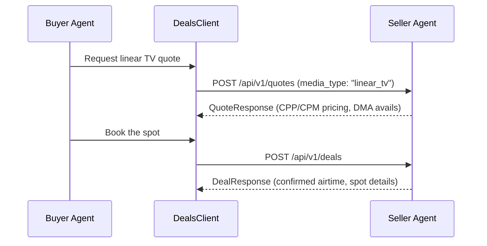

# Linear TV Buying Guide

The buyer agent supports linear television inventory through the same quote-then-book flow used for digital deals. Linear TV buying introduces scatter market purchasing, DMA-level geographic targeting, and traditional TV pricing models (CPP and CPM) — all accessible through the standard `DealsClient` with `media_type: "linear_tv"`.

!!! success "New in v1.1"
    Linear TV buying support shipped in Phase 1 (buyer-6io). The functionality described here is available now.

## Overview

Linear TV buying follows a **scatter market** model: the buyer requests pricing for specific dayparts, networks, and DMAs, receives a non-binding quote, and books confirmed spots. This mirrors the digital quote-then-book flow but adapts to television's unique inventory structure — fixed airtime slots, geographic markets, and audience-based pricing.



## Scatter Market Buying

Scatter buying is the purchase of TV inventory outside the upfront commitment window — typically for the current or next quarter. The buyer agent targets scatter because it maps naturally to the quote-then-book flow: inventory is priced on demand, availability changes frequently, and deals are booked individually rather than as part of a long-term commitment.

### Requesting a Linear TV Quote

Use the standard `DealsClient.request_quote()` with `media_type` set to `"linear_tv"` and linear-specific fields in the request:

```python
from ad_buyer.clients.deals_client import DealsClient
from ad_buyer.models.deals import QuoteRequest, BuyerIdentityPayload

async with DealsClient(seller_url, api_key="key") as client:
    quote = await client.request_quote(QuoteRequest(
        product_id="prod-linear-primetime-001",
        media_type="linear_tv",
        deal_type="PD",
        impressions=2_000_000,
        flight_start="2026-07-01",
        flight_end="2026-09-30",
        target_cpm=12.00,
        linear_tv_params={
            "daypart": "primetime",
            "networks": ["NBC", "CBS", "ABC"],
            "dma_codes": ["501", "803"],  # NYC, LA
            "demo_target": "A25-54",
            "spot_length_seconds": 30,
        },
        buyer_identity=BuyerIdentityPayload(
            seat_id="ttd-seat-123",
            agency_id="omnicom-456",
        ),
    ))

    print(f"Quote ID: {quote.quote_id}")
    print(f"CPM: ${quote.pricing.final_cpm}")
    if hasattr(quote, "cpp"):
        print(f"CPP: ${quote.cpp}")
```

### Linear TV Quote Parameters

| Parameter | Type | Description |
|-----------|------|-------------|
| `daypart` | `str` | Time slot: `"early_morning"`, `"daytime"`, `"primetime"`, `"late_night"`, `"overnight"` |
| `networks` | `list[str]` | Target network call signs (e.g., `["NBC", "CBS"]`) |
| `dma_codes` | `list[str]` | Nielsen DMA codes for geographic targeting |
| `demo_target` | `str` | Demographic target (e.g., `"A25-54"`, `"W18-49"`) |
| `spot_length_seconds` | `int` | Spot duration: `15`, `30`, or `60` |

## DMA-Level Targeting

Linear TV inventory is geographically structured around Nielsen Designated Market Areas (DMAs). The buyer can target specific DMAs or request national coverage.

### Common DMA Codes

| DMA Code | Market |
|----------|--------|
| `501` | New York |
| `803` | Los Angeles |
| `602` | Chicago |
| `504` | Philadelphia |
| `506` | Boston |
| `807` | San Francisco-Oakland-San Jose |
| `623` | Dallas-Fort Worth |
| `511` | Washington, DC |
| `524` | Atlanta |
| `753` | Phoenix |

### National vs. Local Buys

```python
# National buy — no DMA filtering
national_quote = await client.request_quote(QuoteRequest(
    product_id="prod-linear-primetime-001",
    media_type="linear_tv",
    linear_tv_params={
        "daypart": "primetime",
        "networks": ["NBC"],
        "demo_target": "A25-54",
        "spot_length_seconds": 30,
        # No dma_codes = national coverage
    },
))

# Local buy — specific DMAs
local_quote = await client.request_quote(QuoteRequest(
    product_id="prod-linear-local-001",
    media_type="linear_tv",
    linear_tv_params={
        "daypart": "primetime",
        "dma_codes": ["501", "803", "602"],  # NYC, LA, Chicago
        "demo_target": "A18-49",
        "spot_length_seconds": 30,
    },
))
```

## Pricing Models

Linear TV supports two pricing models. The seller's quote response indicates which model applies.

### CPM (Cost Per Mille)

Standard cost-per-thousand-impressions pricing. This is the same model used for digital inventory and is the default for linear TV quotes.

### CPP (Cost Per Point)

Cost per rating point — a traditional TV metric where one "point" equals 1% of the target demographic universe in a given DMA. CPP pricing appears in the quote response alongside CPM when the seller supports it.

```python
quote = await client.request_quote(quote_request)

# CPM is always available
print(f"CPM: ${quote.pricing.final_cpm}")

# CPP may be available for linear TV quotes
if hasattr(quote.pricing, "cpp") and quote.pricing.cpp:
    print(f"CPP: ${quote.pricing.cpp}")
    print(f"Estimated GRPs: {quote.pricing.estimated_grps}")
```

| Metric | Definition | When to Use |
|--------|-----------|-------------|
| **CPM** | Cost per 1,000 impressions | Cross-media comparison, digital-first buyers |
| **CPP** | Cost per rating point (1% of demo universe) | Traditional TV planning, reach/frequency optimization |

## Booking Linear TV Deals

Once you have a quote, booking works identically to digital deals:

```python
from ad_buyer.models.deals import DealBookingRequest

deal = await client.book_deal(DealBookingRequest(
    quote_id=quote.quote_id,
    buyer_identity=BuyerIdentityPayload(seat_id="ttd-seat-123"),
    notes="Q3 primetime scatter buy — NYC and LA",
))

print(f"Deal ID: {deal.deal_id}")
print(f"Status: {deal.status}")
print(f"CPM: ${deal.pricing.final_cpm}")
```

The seller confirms the spot allocation and returns a deal with airtime details. The deal flows through the same lifecycle statuses as digital deals: `proposed` -> `active` -> `completed`.

## TIP Standard Compatibility

The linear TV implementation is designed for compatibility with the [TIP](https://www.tipinitiative.com/) (Television Interface Practices) standard. TIP defines the electronic data interchange formats used by TV buyers and sellers for order management, invoicing, and reconciliation. While the buyer agent communicates via the IAB quote-then-book API, the underlying data model aligns with TIP concepts:

- **Spot** — Individual ad placement within a program or daypart
- **Unit** — A confirmed spot with airtime details
- **Avails** — Available inventory communicated via the quote response

This alignment means linear TV deals booked through the buyer agent can integrate with TIP-compliant trafficking and billing systems downstream.

## How It Works: Hybrid Media Type Handling

Linear TV is treated as a special case of the standard deal flow rather than a separate system. The core quote-then-book flow (quotes, negotiation, booking) remains media-type-agnostic, while media-type-specific parameters are passed through the `linear_tv_params` extension field. This means:

- The `DealsClient` API is the same regardless of media type
- Linear TV-specific validation (daypart values, DMA codes, spot lengths) is applied contextually when `media_type` is `"linear_tv"`
- Digital and linear TV deals coexist in the same `DealStore`
- The negotiation client works unchanged — price negotiation is price negotiation regardless of medium

This hybrid design avoids forking the codebase for each media type while still supporting the unique attributes of linear television.

## Related

- [Deals API](../api/deals.md) — Quote-then-book flow and `DealsClient` reference
- [Negotiation](negotiation.md) — Price negotiation works identically for linear TV deals
- [Multi-Seller Discovery](multi-seller.md) — Discover sellers with linear TV inventory
- [Seller Agent Docs](https://iabtechlab.github.io/seller-agent/) — Seller-side API reference
