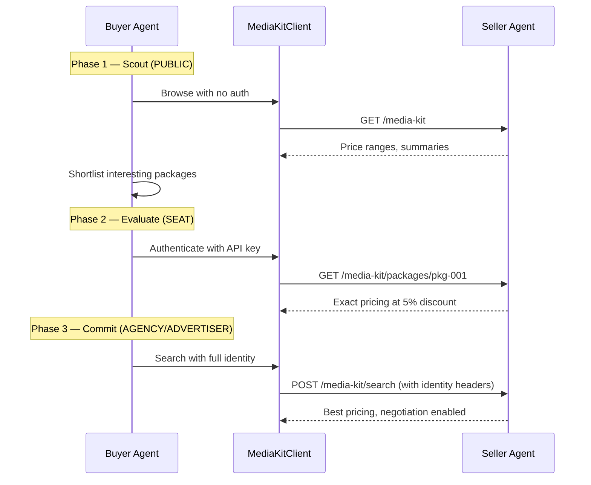
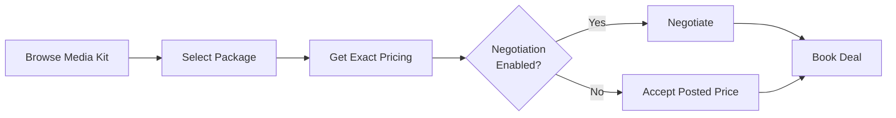

# Media Kit Browsing

A seller's **media kit** is its inventory catalog --- a curated collection of ad packages that describe what the seller has to offer, how it is priced, and who it reaches. Before you can book a deal, you need to browse what is available. The `MediaKitClient` is the buyer agent's tool for doing that.

This guide walks through practical patterns for browsing inventory, interpreting what you see, and connecting discovery to the rest of the buying workflow.

!!! tip "Guide vs API Reference"
    This guide covers **how** and **when** to use media kit features. For endpoint details, data models, and error handling, see the [Media Kit API Reference](../api/media-kit.md).

## Browsing a Seller's Catalog

### Public Browsing (No Authentication)

The fastest way to evaluate a seller's inventory is to browse without authentication. You see package names, descriptions, ad formats, content categories, and price ranges --- enough to decide whether it is worth authenticating for exact pricing.

```python
from ad_buyer.media_kit import MediaKitClient

async with MediaKitClient() as client:
    kit = await client.get_media_kit("http://seller.example.com:8001")

    print(f"Seller: {kit.seller_name}")
    print(f"Packages available: {kit.total_packages}")

    for pkg in kit.featured:
        print(f"  {pkg.name} — {pkg.price_range}")
        print(f"    Formats: {', '.join(pkg.ad_formats)}")
        print(f"    Categories: {', '.join(pkg.cat)}")
```

Public browsing returns `PackageSummary` objects. You get:

- Package name and description
- Ad formats (`video`, `banner`, `native`, etc.)
- Device types, geo targets, content categories, tags
- A price range (e.g., "$28--$42 CPM") rather than a single number
- Featured status

You do **not** get exact pricing, floor prices, placement details, audience segments, or negotiation flags.

### Authenticated Browsing

Once you have identified interesting inventory, authenticate with an API key to unlock exact pricing and richer metadata:

```python
async with MediaKitClient(api_key="your-seller-api-key") as client:
    kit = await client.get_media_kit("http://seller.example.com:8001")

    for pkg in kit.all_packages:
        detail = await client.get_package(
            "http://seller.example.com:8001",
            pkg.package_id,
        )

        if isinstance(detail, PackageDetail):
            print(f"{detail.name}: ${detail.exact_price} CPM")
            print(f"  Floor: ${detail.floor_price} CPM")
            print(f"  Negotiation: {'Yes' if detail.negotiation_enabled else 'No'}")
            print(f"  Volume discounts: {'Yes' if detail.volume_discounts_available else 'No'}")
```

Authenticated responses return `PackageDetail` objects, which extend `PackageSummary` with:

| Field | What It Tells You |
|-------|-------------------|
| `exact_price` | Tier-adjusted CPM for your identity level |
| `floor_price` | Minimum the seller will accept |
| `currency` | ISO 4217 code (e.g., `"USD"`) |
| `placements` | Individual products, their ad formats, device types, and weights |
| `audience_segment_ids` | IAB Audience Taxonomy 1.1 segment IDs |
| `negotiation_enabled` | Whether your tier can negotiate on this package |
| `volume_discounts_available` | Whether bulk buying discounts apply |

## Understanding Package Details

### Ad Formats and Devices

Each package specifies which creative formats it accepts and which devices it targets:

```python
pkg = await client.get_package(seller_url, "pkg-abc12345")

# Ad formats are strings: "video", "banner", "native", "audio"
print(f"Formats: {pkg.ad_formats}")

# Device types are OpenRTB integers:
#   1 = Mobile/Tablet, 2 = PC, 3 = CTV, 4 = Phone, 5 = Tablet, 6 = Connected Device, 7 = Set Top Box
print(f"Devices: {pkg.device_types}")
```

### Content Categories and Geo Targets

Content categories use the IAB Content Taxonomy (the `cattax` field indicates which version). Geo targets use ISO 3166 codes:

```python
# IAB Content Taxonomy categories
print(f"Categories: {pkg.cat}")  # e.g., ["IAB19"] = Technology
print(f"Taxonomy version: {pkg.cattax}")  # 2 = IAB Content Taxonomy 2.x

# Geo targets — country or country-region codes
print(f"Geo: {pkg.geo_targets}")  # e.g., ["US", "US-NY", "US-CA"]
```

### Placements (Authenticated Only)

When authenticated, `PackageDetail` includes a `placements` list that breaks down the package into individual products:

```python
if isinstance(pkg, PackageDetail):
    for placement in pkg.placements:
        print(f"  Product: {placement.product_name} ({placement.product_id})")
        print(f"    Formats: {placement.ad_formats}")
        print(f"    Devices: {placement.device_types}")
        print(f"    Weight: {placement.weight}")
```

The `weight` field indicates how impressions are distributed across placements within the package. A package with two placements at weights 0.7 and 0.3 delivers 70% of impressions to the first and 30% to the second.

### Package Layers

Sellers organize inventory into three layers. Use the `layer` filter to focus on what matters:

| Layer | Source | When to Use |
|-------|--------|-------------|
| `synced` | Ad server import (GAM, FreeWheel) | You want raw ad-server inventory |
| `curated` | Publisher-assembled | You want premium, hand-crafted bundles |
| `dynamic` | Agent-assembled on the fly | Created during negotiation (not listed in media kit) |

```python
# Browse only curated (premium) packages
curated = await client.list_packages(seller_url, layer="curated")

# Browse only synced (ad server) packages
synced = await client.list_packages(seller_url, layer="synced")

# Featured packages only (across all layers)
featured = await client.list_packages(seller_url, featured_only=True)
```

## Searching for Specific Inventory

When you know what you are looking for, use `search_packages` instead of browsing the full catalog. The search matches against package names, descriptions, tags, and content categories:

```python
# Find sports video inventory
results = await client.search_packages(
    "http://seller.example.com:8001",
    query="sports video",
)

for pkg in results:
    print(f"{pkg.name} — {pkg.price_range}")
    print(f"  Tags: {pkg.tags}")
```

### Searching with Identity Context

Pass a `SearchFilter` to include buyer identity in the search request. The seller may return different results or pricing based on who is asking:

```python
from ad_buyer.media_kit.models import SearchFilter

results = await client.search_packages(
    "http://seller.example.com:8001",
    query="premium video",
    filters=SearchFilter(
        buyer_tier="agency",
        agency_id="omnicom-456",
        advertiser_id="coca-cola",
    ),
)
```

This is especially useful when you want to see tier-adjusted pricing in search results or when the seller reserves certain inventory for higher-tier buyers.

## Comparing Packages Across Sellers

The `aggregate_across_sellers` method queries multiple sellers in parallel and returns a combined list of packages:

```python
sellers = [
    "http://seller-a.example.com:8001",
    "http://seller-b.example.com:8002",
    "http://seller-c.example.com:8003",
]

async with MediaKitClient(api_key="your-key") as client:
    all_packages = await client.aggregate_across_sellers(sellers)
    print(f"Found {len(all_packages)} packages across {len(sellers)} sellers")

    # Each package carries its seller_url so you know where it came from
    for pkg in all_packages:
        print(f"  [{pkg.seller_url}] {pkg.name} — {pkg.price_range}")
```

Key details about aggregation:

- Sellers are queried concurrently --- a slow or unreachable seller does not block the others.
- Failed sellers are silently skipped (warnings are logged).
- Every returned `PackageSummary` has its `seller_url` set, so you can trace each package back to its source.

### Filtering Aggregated Results

The aggregation returns a flat list. Apply your own filters after the fact:

```python
# Find all video packages across sellers
video_packages = [
    pkg for pkg in all_packages
    if "video" in pkg.ad_formats
]

# Find packages targeting CTV (device type 3)
ctv_packages = [
    pkg for pkg in all_packages
    if 3 in pkg.device_types
]

# Find packages in a specific content category
sports_packages = [
    pkg for pkg in all_packages
    if "IAB17" in pkg.cat  # IAB17 = Sports
]
```

## How Identity Tier Affects What You See

The seller returns different data depending on your identity tier. Understanding this is key to efficient inventory discovery.

| What You See | PUBLIC | SEAT | AGENCY | ADVERTISER |
|-------------|:------:|:----:|:------:|:----------:|
| Package name, description | Yes | Yes | Yes | Yes |
| Ad formats, devices, categories | Yes | Yes | Yes | Yes |
| Price range (e.g., "$28--$42 CPM") | Yes | Yes | Yes | Yes |
| Exact price (tier-adjusted CPM) | -- | Yes | Yes | Yes |
| Floor price | -- | Yes | Yes | Yes |
| Placements (product details) | -- | Yes | Yes | Yes |
| Audience segments | -- | -- | Yes | Yes |
| Negotiation enabled flag | -- | -- | Yes | Yes |
| Volume discount flag | -- | -- | -- | Yes |

### Pricing Differences by Tier

Sellers apply tiered discounts. The same package shows different `exact_price` values depending on who is asking:

| Tier | Discount | Example ($35 base CPM) |
|------|----------|----------------------|
| PUBLIC | 0% | "$28--$42 CPM" (range only) |
| SEAT | 5% | $33.25 |
| AGENCY | 10% | $31.50 |
| ADVERTISER | 15% | $29.75 |

### Progressive Discovery Pattern

A practical approach is to start anonymous and escalate identity as you narrow your options:



This approach minimizes identity exposure --- you only reveal who you are when you are ready to transact.

!!! info "Identity Strategy Automation"
    The `IdentityStrategy` class can automate tier selection based on deal value, seller trust, and campaign goals. See the [Identity Strategy Guide](identity.md) for details.

## From Browsing to Buying

The media kit is the starting point of the deal lifecycle. Here is how discovery connects to the rest of the workflow:



### Step-by-Step

1. **Browse** --- Use `get_media_kit()` or `list_packages()` to survey what is available. Start public to minimize information exposure.

2. **Select** --- Identify packages that match your campaign requirements (ad format, content category, geo, device targeting).

3. **Get exact pricing** --- Authenticate with your API key and call `get_package()` on your shortlisted packages. Compare `exact_price` and `floor_price`.

4. **Check negotiation eligibility** --- Look at the `negotiation_enabled` flag on `PackageDetail`. This is `True` only for Agency and Advertiser tier buyers.

5. **Negotiate or accept** --- If negotiation is enabled and the price is above your target, use the [Negotiation module](negotiation.md) to drive counter-offers. If not, accept the posted price.

6. **Book the deal** --- Use the [Booking flow](../api/bookings.md) to finalize the transaction via the OpenDirect API.

### Connecting to Negotiation

When you find a package you want to negotiate on, the key fields to carry forward are:

```python
# After browsing, you have a PackageDetail
pkg = await client.get_package(seller_url, "pkg-abc12345")

if isinstance(pkg, PackageDetail) and pkg.negotiation_enabled:
    # These values feed into your negotiation strategy
    print(f"Starting price: ${pkg.exact_price} CPM")
    print(f"Floor price: ${pkg.floor_price} CPM")
    print(f"Volume discounts: {pkg.volume_discounts_available}")

    # Use floor_price to inform your target_cpm
    # Use exact_price as the seller's opening position
```

## Tips

**Cache media kits for performance.** Sellers update their media kits infrequently (typically daily). Cache the result of `get_media_kit()` and refresh periodically rather than calling it on every request.

**Refresh before transacting.** Cached media kits are fine for browsing, but always call `get_package()` for fresh pricing before you negotiate or book. Prices can change between cache refreshes.

**Compare authenticated vs public pricing.** Before deciding whether to authenticate with a seller, compare the public price range against the authenticated exact price. If the range is narrow (e.g., "$30--$32 CPM"), the discount from authenticating may not justify the identity exposure.

**Use aggregation for market research.** The `aggregate_across_sellers` method is useful for comparing inventory and pricing across the market before committing to a specific seller.

**Filter by layer to match your needs.** Curated packages are premium bundles the publisher has assembled --- they tend to perform better but cost more. Synced packages come directly from the ad server and offer broader reach at lower prices.

**Watch for `negotiation_enabled`.** Not all packages support negotiation. Check this flag before investing time in a negotiation strategy. If it is `False`, you must accept the posted price or look elsewhere.

**Leverage identity strategically.** Use the `IdentityStrategy` to decide when revealing more identity is worth the pricing benefit. For low-value browsing, stay public. For serious purchases, escalate to get the best rates. See the [Identity Strategy Guide](identity.md) for the automation.

## Related

- [Media Kit API Reference](../api/media-kit.md) --- Endpoint details, data models, error handling
- [Identity Strategy Guide](identity.md) --- How identity tier affects pricing and access
- [Negotiation Guide](negotiation.md) --- Multi-turn price negotiation after discovery
- [Bookings API](../api/bookings.md) --- Booking deals after negotiation
- [Authentication](../api/authentication.md) --- API key setup for authenticated access
- [Seller Media Kit Setup](https://iabtechlab.github.io/seller-agent/guides/media-kit/) --- How publishers configure their media kit
