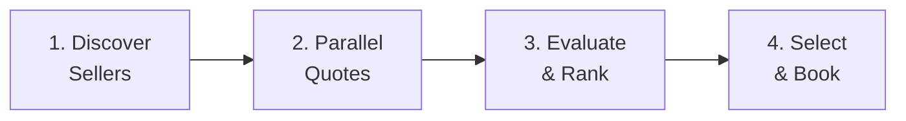

# Multi-Seller Deal Orchestration

Multi-seller deal orchestration extends the buyer agent from shopping multiple sellers individually to **coordinating deals across sellers as a unified portfolio**. Where the existing [multi-seller discovery](multi-seller.md) guide covers finding and comparing inventory, orchestration adds strategic deal execution: running parallel negotiations, applying cross-seller optimization, and managing a portfolio of deals as a coordinated whole.

The orchestration layer is implemented by `MultiSellerOrchestrator` in `ad_buyer.orchestration.multi_seller`. It connects the registry client (for seller discovery), deals client (for quoting and booking), quote normalizer (for cross-seller comparison), and event bus (for observability) into a single end-to-end flow.

---

## How It Works

The orchestrator runs four stages in sequence. Each stage produces data consumed by the next, and every stage emits events to the [event bus](../event-bus/overview.md) for observability.



| Stage | What Happens | Key Class |
|-------|-------------|-----------|
| **Discover** | Query the agent registry for sellers matching media type and capabilities | `RegistryClient` |
| **Parallel Quotes** | Send `QuoteRequest` to all discovered sellers concurrently | `DealsClient` via `asyncio.gather` |
| **Evaluate & Rank** | Normalize quotes to effective CPM and score them | `QuoteNormalizer` |
| **Select & Book** | Pick the top-ranked deals within budget and book them | `DealsClient` |

---

## Quick Example

```python
from ad_buyer.orchestration.multi_seller import (
    MultiSellerOrchestrator,
    InventoryRequirements,
    DealParams,
)
from ad_buyer.registry.client import RegistryClient
from ad_buyer.clients.deals_client import DealsClient
from ad_buyer.events.bus import InMemoryEventBus

# Setup
registry = RegistryClient(registry_url="http://localhost:8080/agent-registry")
bus = InMemoryEventBus()

orchestrator = MultiSellerOrchestrator(
    registry_client=registry,
    deals_client_factory=lambda url, **kw: DealsClient(url, **kw),
    event_bus=bus,
)

# Run the full flow
result = await orchestrator.orchestrate(
    inventory_requirements=InventoryRequirements(
        media_type="ctv",
        deal_types=["PD", "PG"],
        max_cpm=35.0,
    ),
    deal_params=DealParams(
        product_id="prod-ctv-001",
        deal_type="PD",
        impressions=500_000,
        flight_start="2026-07-01",
        flight_end="2026-09-30",
    ),
    budget=100_000.0,
    max_deals=3,
)

# Inspect the result
print(f"Sellers discovered: {len(result.discovered_sellers)}")
print(f"Quotes received: {len([q for q in result.quote_results if q.quote])}")
print(f"Deals booked: {len(result.selection.booked_deals)}")
print(f"Total spend: ${result.selection.total_spend:,.2f}")
print(f"Remaining budget: ${result.selection.remaining_budget:,.2f}")
```

---

## Stage 1: Discover Sellers

The orchestrator queries the [AAMP agent registry](multi-seller.md) for sellers matching the campaign's inventory requirements. Discovery filters on media type and applies exclusion rules.

```python
requirements = InventoryRequirements(
    media_type="ctv",            # What kind of inventory
    deal_types=["PD", "PG"],     # Acceptable deal types
    content_categories=["IAB1"], # Optional content filter
    excluded_sellers=["seller-block-123"],  # Sellers to skip
    max_cpm=35.0,                # Used later in evaluation
)

sellers = await orchestrator.discover_sellers(requirements)
```

**Filtering rules:**

- Sellers matching the `capabilities_filter` (derived from `media_type`) are returned from the registry
- Sellers in the `excluded_sellers` list are removed
- Sellers with `BLOCKED` trust level are removed

After discovery, the orchestrator emits an `inventory.discovered` event with the count and IDs of qualifying sellers.

---

## Stage 2: Parallel Quote Requests

The orchestrator sends quote requests to all discovered sellers **concurrently** using `asyncio.gather`. Each request runs independently --- a timeout or error on one seller does not block the others.

```python
quote_results = await orchestrator.request_quotes_parallel(
    sellers=sellers,
    deal_params=DealParams(
        product_id="prod-ctv-001",
        deal_type="PD",
        impressions=500_000,
        flight_start="2026-07-01",
        flight_end="2026-09-30",
        target_cpm=25.0,          # Hint to the seller
        media_type="ctv",
    ),
)
```

Each result is a `SellerQuoteResult` containing either a successful `QuoteResponse` or an error string:

| Field | Type | Description |
|-------|------|-------------|
| `seller_id` | `str` | The seller's agent ID |
| `seller_url` | `str` | The seller's base URL |
| `quote` | `QuoteResponse?` | The quote if successful, None on failure |
| `deal_type` | `str` | The deal type that was requested |
| `error` | `str?` | Error message if the request failed |

!!! tip "Timeout handling"
    The default quote timeout is **30 seconds** per seller. You can adjust this via the `quote_timeout` parameter on the orchestrator constructor. Timed-out sellers are recorded as errors, not exceptions --- the flow continues with whatever quotes came back.

---

## Stage 3: Evaluate and Rank

Raw quotes from different sellers are not directly comparable. A $25 CPM Preferred Deal from Seller A is not the same as a $22 CPM Private Auction floor from Seller B (which will likely clear higher). The `QuoteNormalizer` accounts for these differences.

### How Normalization Works

The normalizer computes an **effective CPM** for each quote by applying three adjustments:

1. **Deal-type adjustment** --- Private Auction (PA) floor CPMs are marked up by 20% to estimate the expected clearing price. PG and PD quotes are taken at face value.

2. **Supply-path fee estimation** --- If supply-path data is available, intermediary fees (SSP take-rate, exchange fees) and tech fees (data, verification) are added to the raw CPM.

3. **Effective CPM** = adjusted CPM + estimated fees

### Scoring

Each normalized quote receives a composite score (0--100, higher is better) based on three weighted components:

| Component | Weight | Logic |
|-----------|--------|-------|
| Effective CPM | 60% | Lower CPM scores higher. Best CPM in the set gets 100. |
| Deal type | 20% | PG = 100, PD = 70, PA = 40 |
| Fill rate | 20% | Higher estimated fill rate scores higher. Default: 70% if not reported. |

When comparing multiple quotes, the normalizer uses **relative scoring** --- the best effective CPM in the competitive set gets the maximum CPM sub-score, and others are scaled relative to it. This provides better differentiation within a single auction.

```python
from ad_buyer.booking.quote_normalizer import QuoteNormalizer, SupplyPathInfo

# Optional: provide supply-path fee data for more accurate normalization
normalizer = QuoteNormalizer(supply_paths={
    "seller-a": SupplyPathInfo(
        seller_id="seller-a",
        intermediary_fee_pct=5.0,   # 5% SSP take-rate
        tech_fee_cpm=0.50,          # $0.50/mille verification fees
    ),
})

# Use within the orchestrator
orchestrator = MultiSellerOrchestrator(
    registry_client=registry,
    deals_client_factory=deals_factory,
    quote_normalizer=normalizer,
)
```

!!! note "Default normalization"
    If you don't supply a `QuoteNormalizer`, the orchestrator creates a default one with no supply-path data. Fee estimates will be zero, but deal-type adjustment and relative scoring still apply.

---

## Stage 4: Select and Book

The orchestrator iterates through ranked quotes (best score first) and books deals until either the budget is exhausted or `max_deals` is reached.

**Budget enforcement:**

- Each quote's `minimum_spend` is checked against the remaining budget
- Quotes whose minimum spend exceeds the remaining budget are skipped
- Booking failures are recorded but do not abort the loop --- the orchestrator moves to the next-best quote

```python
# The orchestrator handles selection internally, but you can also
# call select_and_book directly for custom flows:
selection = await orchestrator.select_and_book(
    ranked_quotes=ranked,
    budget=100_000.0,
    count=3,
    quote_seller_map={"quote-abc": "http://seller-a:8001"},
)

print(f"Booked: {len(selection.booked_deals)}")
print(f"Failed: {len(selection.failed_bookings)}")
print(f"Spend: ${selection.total_spend:,.2f}")
print(f"Remaining: ${selection.remaining_budget:,.2f}")
```

Each booked deal emits a `deal.booked` event. After all channels complete, a `campaign.booking_completed` event summarizes the results.

---

## The OrchestrationResult

The `orchestrate()` method returns an `OrchestrationResult` that captures data from every stage:

```python
@dataclass
class OrchestrationResult:
    discovered_sellers: list[AgentCard]     # Stage 1 output
    quote_results: list[SellerQuoteResult]  # Stage 2 output
    ranked_quotes: list[NormalizedQuote]    # Stage 3 output
    selection: DealSelection                # Stage 4 output
```

The `DealSelection` inside captures the booking outcome:

| Field | Type | Description |
|-------|------|-------------|
| `booked_deals` | `list[DealResponse]` | Successfully booked deals |
| `failed_bookings` | `list[dict]` | Quotes that failed to book (with error details) |
| `total_spend` | `float` | Total estimated spend across booked deals |
| `remaining_budget` | `float` | Budget left after booking |

---

## Integration with the Campaign Pipeline

You don't need to call `MultiSellerOrchestrator` directly for most use cases. The [Campaign Pipeline](campaign-pipeline.md) calls it internally during its **execute_booking** stage --- once per channel in the campaign plan. The pipeline:

1. Builds `InventoryRequirements` from each channel's media type
2. Constructs `DealParams` from the channel plan and flight dates
3. Calls `orchestrator.orchestrate()` with the channel budget
4. Collects per-channel `OrchestrationResult` objects

If you need finer control --- for example, to use a custom `QuoteNormalizer` with supply-path data, or to orchestrate outside of a campaign --- use the orchestrator directly as shown in this guide.

---

## Events Emitted

The orchestrator emits these events to the [event bus](../event-bus/overview.md):

| Event | When | Payload |
|-------|------|---------|
| `inventory.discovered` | After seller discovery | `media_type`, `sellers_found`, `seller_ids` |
| `quote.received` | After parallel quote collection | `quotes_received`, `quotes_failed`, seller ID lists |
| `deal.booked` | After each successful booking | `deal_id`, `quote_id`, `seller_id`, `deal_type`, `final_cpm` |
| `campaign.booking_completed` | After all bookings finish | `deals_booked`, `deals_failed`, `total_spend`, `remaining_budget` |

---

## Error Handling

The orchestrator is designed to be **resilient to partial failures**:

- **Seller discovery returns zero results** --- The flow returns an empty `OrchestrationResult` immediately. No quotes are requested.
- **A seller times out or errors during quoting** --- The error is captured in `SellerQuoteResult.error`. Other sellers' quotes proceed normally.
- **All quotes are filtered out by max_cpm** --- The flow returns with an empty `ranked_quotes` list and no bookings.
- **A booking fails** --- The failure is recorded in `DealSelection.failed_bookings`. The orchestrator moves to the next-best quote.
- **Event bus fails** --- Events are emitted on a best-effort basis. A bus failure is logged as a warning and does not interrupt the flow.

---

## Related

- [Multi-Seller Discovery](multi-seller.md) --- Foundation: discovering and comparing sellers
- [Negotiation](negotiation.md) --- Individual negotiation strategies (SimpleThreshold, and planned Adaptive/Competitive)
- [Architecture Overview](../architecture/overview.md) --- Agent hierarchy including Portfolio Manager
- [Deals API](../api/deals.md) --- Quote-then-book flow used by the orchestrator
- [Campaign Brief to Deal Pipeline](campaign-pipeline.md) --- End-to-end campaign execution (uses orchestration internally)
