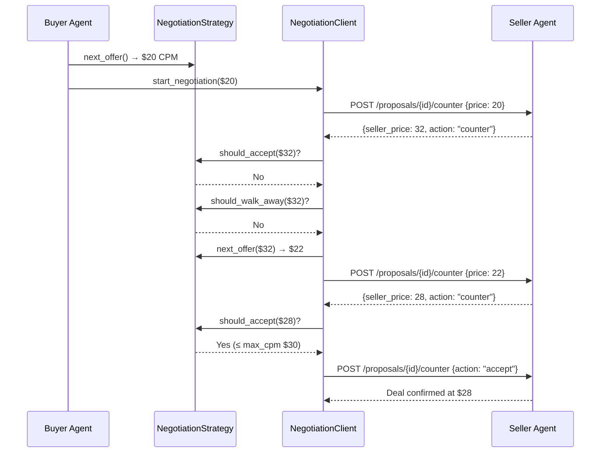

# Negotiation

The buyer agent includes a pluggable negotiation module for multi-turn price negotiation with seller agents. You can run fully automatic negotiations or drive them step-by-step.

!!! info "Tier Requirement"
    Only **Agency** and **Advertiser** tier buyers can negotiate. Public and Seat tier buyers cannot — the seller will reject negotiation attempts from those tiers.

## How It Works



## Strategies

Negotiation behavior is controlled by a **strategy** — a pluggable class that decides when to accept, what to counter, and when to walk away.

### SimpleThresholdStrategy (v1)

The production-ready strategy. Uses fixed thresholds with linear concession steps.

```python
from ad_buyer.negotiation.strategies.simple_threshold import SimpleThresholdStrategy

strategy = SimpleThresholdStrategy(
    target_cpm=20.0,       # Ideal price — our opening offer
    max_cpm=30.0,          # Absolute ceiling — accept anything at or below
    concession_step=2.0,   # Concede $2 per round
    max_rounds=5,          # Walk away after 5 rounds
)
```

**Decision logic:**

| Decision | Rule |
|----------|------|
| **Accept** | Seller price ≤ `max_cpm` |
| **Next offer** | Last offer + `concession_step` (capped at `max_cpm`) |
| **Walk away** | Rounds exceeded `max_rounds` OR seller hasn't moved since last round |

**Behavior profiles:**

| Profile | target_cpm | max_cpm | concession_step | max_rounds | Behavior |
|---------|-----------|---------|-----------------|------------|----------|
| Conservative | $15 | $20 | $1 | 3 | Tight budget, small concessions, quick exit |
| Balanced | $20 | $30 | $2 | 5 | Moderate flexibility |
| Aggressive | $15 | $35 | $5 | 10 | Wide range, big concessions, persistent |

### AdaptiveStrategy (Coming Soon)

Adjusts concession behavior based on observed seller patterns. The adaptive strategy tracks the seller's concession magnitude across rounds and modulates the buyer's response accordingly:

- **Seller conceding aggressively** — Hold firm. If the seller is dropping price by large increments, the buyer reduces its own concession step to capture more of the surplus.
- **Seller holding firm** — Concede faster. If the seller is barely moving, the buyer increases its concession step to avoid a stalemate and reach agreement sooner.
- **Seller pattern shift** — Re-calibrate. If the seller changes behavior mid-negotiation (e.g., switches from firm to aggressive after round 3), the strategy adapts within the same session.

The adaptive strategy is planned as part of Phase 2 (buyer-llu). It will implement the same `NegotiationStrategy` interface as `SimpleThresholdStrategy`, so it can be used as a drop-in replacement in `auto_negotiate()` or manual step-by-step flows.

### CompetitiveStrategy (Coming Soon)

Strategy for when the buyer is shopping multiple sellers simultaneously via [Multi-Seller Orchestration](multi-seller-orchestration.md). The competitive strategy uses cross-seller intelligence to drive harder bargains:

- **Quote benchmarking** — Uses the best quote received from other sellers as an anchor point, countering above that floor rather than the buyer's internal target
- **Walk-away credibility** — Willing to walk away from a seller when a comparable deal exists elsewhere, making the walk-away threat credible rather than a bluff
- **Last-look leverage** — Gives each seller a "last look" opportunity to beat the best competing offer before the buyer commits elsewhere
- **Portfolio awareness** — Factors in the buyer's total portfolio needs (e.g., if CTV inventory is scarce across sellers, compete less aggressively on CTV and focus competitive pressure on display)

The competitive strategy is planned as part of Phase 2 (buyer-8ih). It requires the [Multi-Seller Orchestration](multi-seller-orchestration.md) capability to provide the cross-seller context.

## Auto-Negotiate

The simplest way to negotiate — hand it a strategy and let the client drive the entire loop:

```python
from ad_buyer.negotiation.client import NegotiationClient
from ad_buyer.negotiation.strategies.simple_threshold import SimpleThresholdStrategy

client = NegotiationClient(api_key="your-seller-api-key")

strategy = SimpleThresholdStrategy(
    target_cpm=20.0,
    max_cpm=30.0,
    concession_step=2.0,
    max_rounds=5,
)

result = await client.auto_negotiate(
    seller_url="http://seller.example.com:8001",
    proposal_id="prop-abc123",
    strategy=strategy,
)

print(f"Outcome: {result.outcome}")       # "accepted" or "walked_away"
print(f"Final price: ${result.final_price}")  # e.g. 28.0
print(f"Rounds: {result.rounds_count}")    # e.g. 3
```

The `auto_negotiate` loop:

1. Calls `strategy.next_offer()` for the opening price
2. Sends counter-offer to seller's `/proposals/{id}/counter`
3. Checks `strategy.should_accept()` — if yes, accepts and returns
4. Checks `strategy.should_walk_away()` — if yes, declines and returns
5. Otherwise, computes `strategy.next_offer()` and loops back to step 2

## Manual Step-by-Step

For more control, drive the negotiation round by round:

```python
from ad_buyer.negotiation.client import NegotiationClient
from ad_buyer.negotiation.strategies.simple_threshold import SimpleThresholdStrategy

client = NegotiationClient(api_key="your-seller-api-key")
strategy = SimpleThresholdStrategy(target_cpm=20, max_cpm=30, concession_step=2, max_rounds=5)

# Start with our opening offer
session = await client.start_negotiation(
    seller_url="http://seller.example.com:8001",
    proposal_id="prop-abc123",
    initial_price=20.0,
    strategy=strategy,
)

print(f"Seller countered at: ${session.current_seller_price}")

# Send our counter-offer
round_2 = await client.counter_offer(session, price=22.0)
print(f"Seller response: ${round_2.seller_price} ({round_2.action})")

# Accept or continue
if round_2.action == "accept" or round_2.seller_price <= 30.0:
    confirmation = await client.accept(session)
    print("Deal accepted!")
else:
    await client.decline(session)
    print("Walked away.")
```

## Writing a Custom Strategy

Implement the `NegotiationStrategy` ABC to create any negotiation behavior:

```python
from ad_buyer.negotiation.strategy import NegotiationStrategy, NegotiationContext

class MyCustomStrategy(NegotiationStrategy):
    def should_accept(self, seller_price: float, context: NegotiationContext) -> bool:
        """Accept if seller's price is acceptable."""
        return seller_price <= 25.0

    def next_offer(self, seller_price: float, context: NegotiationContext) -> float:
        """Calculate our next counter-offer."""
        if context.our_last_offer is None:
            return 18.0  # Opening offer
        # Split the difference
        return (context.our_last_offer + seller_price) / 2

    def should_walk_away(self, seller_price: float, context: NegotiationContext) -> bool:
        """Walk away after 3 rounds or if seller isn't budging."""
        if context.rounds_completed >= 3:
            return True
        if (context.seller_previous_price is not None
                and seller_price >= context.seller_previous_price):
            return True  # Seller isn't moving
        return False
```

The `NegotiationContext` provides:

| Field | Type | Description |
|-------|------|-------------|
| `rounds_completed` | `int` | Number of rounds so far |
| `seller_last_price` | `float` | Seller's most recent price |
| `our_last_offer` | `float?` | Our most recent counter (None for first round) |
| `seller_previous_price` | `float?` | Seller's price from the round before last |
| `started_at` | `datetime` | When the negotiation started |

## Data Models

### NegotiationResult

Returned by `auto_negotiate()`:

```python
class NegotiationResult:
    proposal_id: str
    outcome: NegotiationOutcome  # "accepted", "walked_away", "declined", "error"
    final_price: Optional[float]  # None if walked away
    rounds_count: int
    rounds: list[NegotiationRound]
    completed_at: datetime
```

### NegotiationRound

Each round in the negotiation history:

```python
class NegotiationRound:
    round_number: int
    buyer_price: float       # What we offered
    seller_price: float      # What the seller countered
    action: str              # "counter", "accept", "reject", "final_offer"
    rationale: str           # Seller's explanation (if provided)
    timestamp: datetime
```

### NegotiationSession

Tracks an active negotiation (used in manual mode):

```python
class NegotiationSession:
    proposal_id: str
    seller_url: str
    negotiation_id: str
    current_seller_price: float
    our_last_offer: Optional[float]
    rounds: list[NegotiationRound]
    started_at: datetime
```

## Seller-Side Integration

The buyer's `NegotiationClient` communicates with the seller's negotiation endpoints:

| Action | HTTP Call |
|--------|-----------|
| Counter-offer | `POST /proposals/{id}/counter` with `{price: float}` |
| Accept | `POST /proposals/{id}/counter` with `{price: float, action: "accept"}` |
| Decline | `POST /proposals/{id}/counter` with `{action: "decline"}` |

The seller's negotiation engine responds with its own strategy (AGGRESSIVE, STANDARD, COLLABORATIVE, or PREMIUM depending on the buyer's tier). See the [Seller Negotiation Protocol](https://iabtechlab.github.io/seller-agent/integration/negotiation/) for the seller-side view.

## Negotiation Eligibility

Whether a buyer can negotiate depends on its access tier:

| Tier | Can Negotiate | How |
|------|:---:|------|
| PUBLIC | No | — |
| SEAT | No | — |
| AGENCY | Yes | Reveal `agency_id` via identity headers |
| ADVERTISER | Yes | Reveal `advertiser_id` via identity headers |

Check programmatically:

```python
from ad_buyer.models.buyer_identity import BuyerContext

if buyer_context.can_negotiate():
    result = await client.auto_negotiate(seller_url, proposal_id, strategy)
```

## Roadmap

!!! note "Planned Improvements"
    See [PROGRESS.md](https://github.com/IABTechLab/buyer-agent/blob/main/.beads/PROGRESS.md) for current status on:

    - **AdaptiveStrategy** — Dynamic concession based on seller patterns
    - **CompetitiveStrategy** — Multi-seller competitive bidding
    - **Negotiation rules engine** — Configure strategies via API instead of code
    - **Historical negotiation analytics** — Track outcomes across deals
    - **Integration into booking flow** — Auto-negotiate as a step in `deal_booking_flow`

## Related

- [Media Kit](../api/media-kit.md) — Discover packages and check `negotiation_enabled`
- [Bookings](../api/bookings.md) — Book deals after negotiation
- [Seller Negotiation Protocol](https://iabtechlab.github.io/seller-agent/integration/negotiation/) — Seller-side view
- [Authentication](../api/authentication.md) — API key setup for authenticated access
