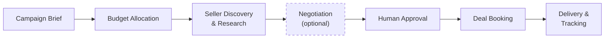

# Buyer Guide Overview

The buyer agent automates the full media buying workflow --- from receiving a campaign brief through discovering seller inventory, negotiating pricing, obtaining human approval, and booking confirmed deals. This overview orients you on the end-to-end process and points you to the right guide for each stage.

## End-to-End Buyer Workflow

A campaign moves through these stages. Negotiation is optional (it depends on your [identity tier](identity.md)), and the human approval gate ensures no spend is committed without explicit sign-off.

| Stage | What Happens | Guide |
|-------|-------------|-------|
| **Campaign Brief** | You submit objectives, budget, dates, audience, and KPIs | [Deal Booking](deal-booking.md) |
| **Budget Allocation** | The portfolio manager splits budget across channels (branding, CTV, mobile, performance) | [Configuration](configuration.md) |
| **Seller Discovery & Research** | Channel specialists find sellers via AAMP registry, browse media kits, and evaluate inventory | [Multi-Seller Discovery](multi-seller.md), [Media Kit Browsing](media-kit.md) |
| **Negotiation** | For Agency/Advertiser tier access, the buyer negotiates pricing with sellers via A2A | [Negotiation](negotiation.md) |
| **Human Approval** | Recommendations are presented for review; no deals are booked without approval | See [Human Approvals](#human-approvals) below |
| **Deal Booking** | Approved deals are booked via the seller's MCP or OpenDirect API | [Deal Booking](deal-booking.md) |
| **Delivery & Tracking** | Booked deals move through the order state machine; events are logged for observability | [Architecture: State Machine](../state-machines/order-lifecycle.md), [Architecture: Event Bus](../event-bus/overview.md) |

## Two Flow Entry Points

The buyer supports two distinct entry points depending on your use case:

- **DealBookingFlow** (campaign flow) --- The full multi-channel path. Starts from a campaign brief, allocates budget, researches across channels in parallel, builds recommendations, and books multiple deals after approval. This is the primary workflow for campaign managers.
- **DSPDealFlow** (deal flow) --- The lightweight single-deal path. Discovers inventory and books one deal directly. Designed for programmatic DSP integration where the campaign planning happens externally.

Both flows share the same [deal state machine](../state-machines/order-lifecycle.md), [event bus](../event-bus/overview.md), and DealStore persistence. For architectural details, see [Architecture Overview](../architecture/overview.md).

## Cross-Cutting Concerns

### Human Approvals

The buyer agent enforces a human-in-the-loop approval gate before committing any spend. After channel specialists build their recommendations, the campaign enters the `awaiting_approval` state. A human reviewer can:

- **Approve all** recommendations (`POST /bookings/{job_id}/approve-all`)
- **Approve selectively** by specifying which product IDs to book (`POST /bookings/{job_id}/approve`)
- **Reject** by not approving (the campaign stays in `awaiting_approval` until approved or timed out)

Set `auto_approve: true` in the campaign brief to bypass the gate for testing. In production, the approval gate is the safety net that prevents unintended spend.

### Logging & Observability

Every significant action the buyer takes --- quote requests, negotiation rounds, deal bookings, budget allocations --- is recorded as a structured event on the [event bus](../event-bus/overview.md). This is the buyer's observability layer: it answers "what happened, when, and why" for any workflow execution. Events are correlated by `flow_id`, `deal_id`, and `session_id`, making it straightforward to trace the full history of a campaign or a single deal.

For operational monitoring, query the `/events` API endpoint or subscribe to events programmatically.

### Identity & Access Tiers

Your [identity tier](identity.md) determines what the buyer can do with a given seller. Public-tier access gets list prices with no negotiation. Seat, Agency, and Advertiser tiers unlock progressively better rates and the ability to negotiate. Identity is resolved per seller connection and affects both pricing and available API operations.

## Guide Topics

| Guide | When to Read It |
|-------|----------------|
| [Deal Booking](deal-booking.md) | You want to understand the core booking lifecycle from brief to confirmed deal |
| [Negotiation](negotiation.md) | You want to configure or customize how the buyer negotiates pricing |
| [Identity Strategy](identity.md) | You need to understand access tiers and how they affect pricing and capabilities |
| [Media Kit Browsing](media-kit.md) | You want to explore seller inventory before or outside of a booking flow |
| [Sessions](sessions.md) | You need to understand how conversation state persists across interactions |
| [Multi-Seller Discovery](multi-seller.md) | You are connecting to multiple sellers and need to understand the AAMP registry |
| [Linear TV Buying](linear-tv.md) | You are buying linear TV inventory with DMA targeting and scatter/upfront pricing |
| [Configuration](configuration.md) | You need to set environment variables, seller connections, or feature flags |
| [Deployment](deployment.md) | You are deploying the buyer agent to production |

!!! note "Coming Soon"
    The following guides cover features that are planned but not yet implemented:

    - **[Multi-Seller Orchestration](multi-seller-orchestration.md)** --- Coordinating bookings across multiple sellers in a single campaign
    - **[Campaign Pipeline](campaign-pipeline.md)** --- Managing multiple campaigns with shared budgets and scheduling
    - **[Budget Pacing](budget-pacing.md)** --- Controlling spend rate across a campaign's flight dates
    - **[Creative Management](creative-management.md)** --- Associating and validating creative assets for booked deals

## Related

For architecture details behind the buyer workflow, see the [Architecture Overview](../architecture/overview.md). For API endpoint reference, see the [API Reference](../api/overview.md). To get the buyer running locally, start with the [Quickstart](../getting-started/quickstart.md).
