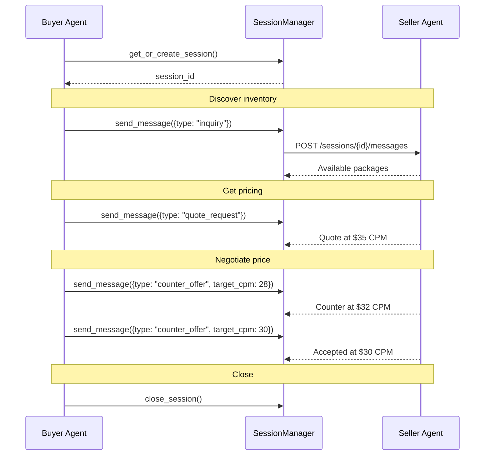

# Session Management

Sessions enable multi-turn conversations with seller agents. Instead of treating each API call as a one-off request, a session maintains context across a sequence of messages --- the seller remembers what you've asked, what you've negotiated, and where you left off. This is essential for any workflow that spans more than a single request: browsing inventory, negotiating prices, and booking deals all benefit from conversational continuity.

!!! tip "Looking for method signatures and data models?"
    For constructor parameters, method signatures, return types, `SessionRecord` fields, and error codes, see the [Sessions API Reference](../api/sessions.md).

## Why Sessions Matter

Without sessions, every message to a seller starts from scratch. The seller has no memory of prior interactions, so you would need to re-identify yourself, re-state your interests, and re-establish any negotiation progress on every call.

Sessions solve three problems:

1. **Context continuity** --- The seller tracks the full conversation history. When you counter-offer in round three of a negotiation, the seller knows what happened in rounds one and two.
2. **Negotiation state** --- Price discussions, counter-offers, and concessions are tied to the session. Walking away and coming back later picks up where you left off (within the 7-day TTL).
3. **Conversation history** --- Inquiries, quotes, and agreements are all linked. The seller can reference a quote it gave earlier in the session when confirming a deal.

## Starting a Session with a Seller

The `SessionManager` is your primary interface for all session operations. Initialize it once and reuse it across your application:

```python
from ad_buyer.sessions import SessionManager

manager = SessionManager()
```

By default, sessions are persisted to `~/.ad_buyer/sessions.json`. You can customize the store path and HTTP timeout:

```python
manager = SessionManager(
    store_path="/var/data/buyer_sessions.json",
    timeout=60.0,
)
```

### Creating a New Session

To start a conversation with a seller, call `create_session` with the seller's URL and your buyer identity:

```python
session_id = await manager.create_session(
    seller_url="http://seller.example.com:8001",
    buyer_identity={
        "seat_id": "ttd-seat-123",
        "name": "Acme Media Buying",
        "agency_id": "omnicom-456",
    },
)
print(f"Session established: {session_id}")
```

The manager posts to the seller's `POST /sessions` endpoint. The seller returns a session ID, creation timestamp, and expiry timestamp (defaulting to 7 days). The manager persists this information to disk automatically.

!!! tip "Prefer `get_or_create_session`"
    In most cases, use `get_or_create_session` instead of `create_session`. It checks for an existing active session with the seller before creating a new one, avoiding unnecessary session creation. See [Resuming Expired Sessions](#resuming-expired-sessions) for details.

### Get or Create (Recommended)

The recommended entry point for session management reuses existing sessions when available:

```python
session_id = await manager.get_or_create_session(
    seller_url="http://seller.example.com:8001",
    buyer_identity={"seat_id": "ttd-seat-123"},
)
```

This method:

1. Checks the local store for a non-expired session with the given seller URL
2. If found, returns the existing session ID (no HTTP call)
3. If not found, creates a new session and persists it

## Sending Messages and Maintaining Context

Once a session is established, send messages through the session to maintain conversational context:

```python
response = await manager.send_message(
    seller_url="http://seller.example.com:8001",
    session_id=session_id,
    message={
        "type": "inquiry",
        "content": "What premium CTV inventory is available for Q3?",
    },
)
print(f"Seller response: {response}")
```

Each message is sent to `POST /sessions/{session_id}/messages` on the seller's endpoint. The seller processes the message within the context of the full conversation history and returns a response.

### Message Types

The message payload is a dictionary with a `type` field and type-specific content. Common message types:

| Type | Purpose | Example Content |
|------|---------|-----------------|
| `inquiry` | Ask about inventory or capabilities | `"Show me sports packages"` |
| `quote_request` | Request pricing for a specific product | `{product_id, impressions, flight_dates}` |
| `counter_offer` | Submit a price counter-offer | `{target_cpm: 10.50, rationale: "..."}` |
| `accept` | Accept the seller's current terms | `{}` |

### Building a Conversation

Messages build on each other. The seller uses the full session history to inform its responses:

```python
# First: ask what's available
packages = await manager.send_message(
    seller_url=seller_url,
    session_id=session_id,
    message={
        "type": "inquiry",
        "content": "What premium CTV sports packages do you have for Q3?",
    },
)

# Second: request pricing on a specific package
# The seller already knows which packages it showed you
quote = await manager.send_message(
    seller_url=seller_url,
    session_id=session_id,
    message={
        "type": "quote_request",
        "product_id": "prod-ctv-sports-001",
        "impressions": 500_000,
        "flight_start": "2026-07-01",
        "flight_end": "2026-09-30",
    },
)

# Third: counter-offer based on the quote
# The seller remembers the quote it gave you
counter = await manager.send_message(
    seller_url=seller_url,
    session_id=session_id,
    message={
        "type": "counter_offer",
        "target_cpm": 10.50,
        "rationale": "Volume commitment of 500K+ impressions across Q3",
    },
)
```

## Resuming Expired Sessions

Sessions have a 7-day TTL. When a session expires, the buyer agent handles recovery automatically --- you do not need to detect or manage expiry yourself.

### Automatic Recovery

When you call `send_message` on an expired session, the `SessionManager` detects the seller's 404 response and transparently:

1. Removes the stale session from the local store
2. Creates a new session with the seller
3. Retries the message on the new session
4. Returns the response as if nothing happened

```python
# This works even if the session expired since your last message.
# The manager handles recreation automatically.
response = await manager.send_message(
    seller_url=seller_url,
    session_id=session_id,
    message={"type": "inquiry", "content": "Any updates on available inventory?"},
    buyer_identity={"seat_id": "ttd-seat-123"},  # needed for recreation
)
```

!!! warning "Pass `buyer_identity` when recovery may be needed"
    If the session might have expired (e.g., you haven't contacted this seller in days), include `buyer_identity` in the `send_message` call. The manager needs it to create the replacement session. Without it, the new session is created with no identity context.

### Local Expiry Filtering

The `SessionStore` also filters expired sessions locally. When you call `get_or_create_session`, it only returns sessions that haven't passed their `expires_at` timestamp. Expired sessions remain in the store file but are treated as if they don't exist:

```python
# After 7+ days of inactivity, this creates a fresh session
session_id = await manager.get_or_create_session(
    seller_url="http://seller.example.com:8001",
    buyer_identity={"seat_id": "ttd-seat-123"},
)
```

### Cleaning Up Expired Records

Expired sessions stay in the store file until explicitly removed. To clean them up:

```python
from ad_buyer.sessions import SessionStore

store = SessionStore("~/.ad_buyer/sessions.json")
removed = store.cleanup_expired()
print(f"Cleaned up {removed} expired sessions")
```

## Using Sessions for Negotiation

Sessions are the foundation for multi-round price negotiations. While the `NegotiationClient` manages the negotiation protocol itself (counter-offers, acceptance, walk-away), sessions provide the underlying conversational context that makes multi-round discussions possible.

### Session-Based Negotiation Flow

A typical negotiation within a session:



### Combining SessionManager with NegotiationClient

For automated negotiation, you can use `SessionManager` to establish the session and then hand off to `NegotiationClient` for the price discussion:

```python
from ad_buyer.sessions import SessionManager
from ad_buyer.negotiation.client import NegotiationClient
from ad_buyer.negotiation.strategies.simple_threshold import SimpleThresholdStrategy

# 1. Establish session for context
manager = SessionManager()
session_id = await manager.get_or_create_session(
    seller_url="http://seller.example.com:8001",
    buyer_identity={
        "seat_id": "ttd-seat-123",
        "agency_id": "omnicom-456",
    },
)

# 2. Browse inventory within the session
packages = await manager.send_message(
    seller_url="http://seller.example.com:8001",
    session_id=session_id,
    message={"type": "inquiry", "content": "Premium CTV packages for Q3"},
)

# 3. Negotiate a specific package using NegotiationClient
neg_client = NegotiationClient(api_key="your-seller-api-key")
strategy = SimpleThresholdStrategy(
    target_cpm=20.0,
    max_cpm=30.0,
    concession_step=2.0,
    max_rounds=5,
)

result = await neg_client.auto_negotiate(
    seller_url="http://seller.example.com:8001",
    proposal_id="prop-abc123",
    strategy=strategy,
)

print(f"Outcome: {result.outcome}")        # "accepted" or "walked_away"
print(f"Final price: ${result.final_price}")

# 4. Close the session
await manager.close_session(
    "http://seller.example.com:8001", session_id
)
```

!!! info "Two layers, one conversation"
    `SessionManager` handles conversational context (browsing, inquiries, general messages). `NegotiationClient` handles the negotiation protocol (counter-offers, acceptance, walk-away). They can work together or independently depending on your workflow.

## Session Persistence

Sessions are persisted to a JSON file on disk so they survive process restarts. The `SessionStore` handles all persistence operations --- sessions are keyed by seller URL (one active session per seller at a time) and written to disk on every change.

Because sessions are persisted, a buyer agent picks up where it left off after a restart without any special handling:

```python
# After a process restart -- SessionStore loads from disk automatically
manager = SessionManager()

# Returns the existing session from disk, no HTTP call
session_id = await manager.get_or_create_session(
    seller_url="http://seller.example.com:8001",
)
print(f"Resumed session: {session_id}")

# Continue the conversation seamlessly
response = await manager.send_message(
    seller_url="http://seller.example.com:8001",
    session_id=session_id,
    message={"type": "inquiry", "content": "Any updates on my quote?"},
)
```

For store file format, direct store access, and `SessionRecord` field details, see the [Sessions API Reference](../api/sessions.md#sessionstore).

## Managing Multiple Seller Sessions

The buyer agent often works with multiple sellers simultaneously --- comparing inventory, running parallel negotiations, or maintaining ongoing relationships. The session system supports this natively because sessions are keyed by seller URL.

### One Session Per Seller

The `SessionStore` maintains at most one active session per seller URL. Calling `get_or_create_session` for a seller that already has an active session returns the existing one:

```python
# These return the same session_id (single session per seller)
session_a = await manager.get_or_create_session(
    seller_url="http://seller-a.example.com:8001",
    buyer_identity=identity,
)
session_a_again = await manager.get_or_create_session(
    seller_url="http://seller-a.example.com:8001",
    buyer_identity=identity,
)
assert session_a == session_a_again
```

### Parallel Conversations

Work with multiple sellers at the same time by establishing a session with each:

```python
sellers = [
    "http://seller-a.example.com:8001",
    "http://seller-b.example.com:8002",
    "http://seller-c.example.com:8003",
]

identity = {"seat_id": "ttd-seat-123", "agency_id": "omnicom-456"}

# Establish sessions with all sellers
sessions = {}
for seller_url in sellers:
    session_id = await manager.get_or_create_session(
        seller_url=seller_url,
        buyer_identity=identity,
    )
    sessions[seller_url] = session_id

# Send inquiries to all sellers
for seller_url, session_id in sessions.items():
    response = await manager.send_message(
        seller_url=seller_url,
        session_id=session_id,
        message={
            "type": "inquiry",
            "content": "Premium CTV sports packages for Q3?",
        },
    )
    print(f"{seller_url}: {response}")
```

### Listing All Active Sessions

Check which sellers have active sessions:

```python
active = manager.list_active_sessions()
print(f"Active sessions with {len(active)} sellers:")
for seller_url, session_id in active.items():
    print(f"  {seller_url}: {session_id}")
```

This returns only non-expired sessions. Expired sessions are filtered out automatically.

## Closing Sessions and Cleanup

When a conversation is complete, close the session explicitly. This is good practice but not strictly required --- sessions expire automatically after 7 days.

### Closing a Single Session

```python
await manager.close_session(
    seller_url="http://seller.example.com:8001",
    session_id=session_id,
)
```

This sends `POST /sessions/{session_id}/close` to the seller and removes the session from the local store. If the remote close fails (e.g., the session already expired on the seller side), the error is logged but not raised --- local cleanup always happens.

### Closing All Sessions

To close all active sessions (e.g., during application shutdown):

```python
active = manager.list_active_sessions()
for seller_url, session_id in active.items():
    await manager.close_session(seller_url, session_id)
print("All sessions closed")
```

### Cleaning Up Expired Records

Expired sessions linger in the store file until removed. Periodically clean them up:

```python
from ad_buyer.sessions import SessionStore

store = SessionStore("~/.ad_buyer/sessions.json")
removed = store.cleanup_expired()
print(f"Removed {removed} expired sessions from store")
```

## Tips and Best Practices

**Use `get_or_create_session` as your default entry point.** It handles the common case of resuming an existing conversation and only creates a new session when necessary. Reserve `create_session` for cases where you specifically need a fresh session.

**Always pass `buyer_identity` when the session might be stale.** If you haven't contacted a seller in a while, include `buyer_identity` in your `send_message` call. The manager needs it to create a replacement session if the old one has expired.

**Close sessions when you're done.** While sessions expire automatically after 7 days, explicit closure frees resources on the seller side and keeps your local store clean. This is especially important when working with many sellers.

**Run `cleanup_expired` periodically.** Expired session records stay in the store file until explicitly removed. In long-running applications, call `store.cleanup_expired()` on a schedule (e.g., daily) to keep the store file compact.

**One session per seller is intentional.** The system enforces a single active session per seller URL. If you need to start a fresh conversation with a seller, close the existing session first, then create a new one.

**Handle `RuntimeError` from session creation and messaging.** The `SessionManager` raises `RuntimeError` when the seller rejects a session or a message fails after auto-recovery. Wrap session operations in try/except for production use:

```python
try:
    session_id = await manager.get_or_create_session(
        seller_url=seller_url,
        buyer_identity=identity,
    )
    response = await manager.send_message(
        seller_url=seller_url,
        session_id=session_id,
        message={"type": "inquiry", "content": "Available inventory?"},
    )
except RuntimeError as e:
    print(f"Session error: {e}")
```

**Session closure never raises.** Unlike creation and messaging, `close_session` is fire-and-forget. It logs warnings on failure but always cleans up the local store. You do not need to wrap close calls in try/except.

## Related

- [Sessions API Reference](../api/sessions.md) --- Full API documentation for SessionManager and SessionStore
- [Negotiation Guide](negotiation.md) --- Multi-turn price negotiation with strategies
- [Identity Strategy](identity.md) --- How identity tiers affect session behavior and pricing
- [Authentication](../api/authentication.md) --- API key setup for authenticated sessions
- [Seller Agent Integration](../integration/seller-agent.md) --- End-to-end integration with seller agents
