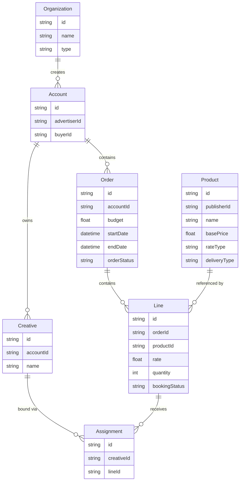
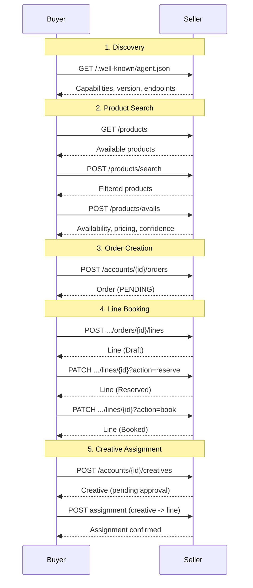
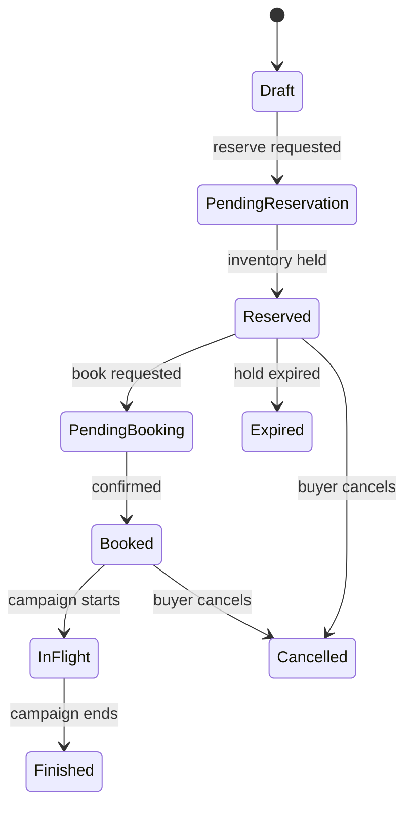

# OpenDirect Protocol

When the buyer agent books a deal, it speaks OpenDirect --- the industry-standard protocol that defines how orders, line items, and creatives flow between a buyer and a seller. Understanding OpenDirect is useful if you need to debug a booking that stalled mid-lifecycle, extend the buyer's booking logic, or integrate the buyer with a seller that implements OpenDirect differently. If you just want to submit a campaign and get deals booked, the [Bookings API](../api/bookings.md) handles the OpenDirect mechanics for you.

The buyer agent implements the [IAB OpenDirect 2.1](https://iabtechlab.com/standards/opendirect/) protocol for automated direct deal booking between buyers and sellers.

## What Is OpenDirect?

OpenDirect is an IAB Tech Lab standard that defines a RESTful API for automating the buying and selling of guaranteed and premium digital advertising. It standardizes:

- How buyers discover seller inventory
- How availability and pricing are negotiated
- How orders and line items are created, reserved, and booked
- How creatives are submitted and assigned

OpenDirect enables programmatic guaranteed deals without requiring a custom integration for each seller.

## Key Entities

### Organization

Represents an advertiser, agency, or publisher. The entry point for establishing business relationships.

### Account

Links a buyer (agency/advertiser) to a publisher. All orders and creatives live under an account.

### Product

A sellable inventory item defined by the publisher. Products have a base price, rate type (CPM, CPC, CPD, FlatRate), delivery type (Exclusive, Guaranteed, PMP), and optional targeting capabilities.

### Order

A campaign container analogous to an insertion order (IO). Groups line items under a budget and date range.

### Line

An individual booking against a product. Lines have a rate, quantity (impressions/units), date range, and a booking status that progresses through the lifecycle.

### Creative

An ad asset (banner, video, etc.) submitted by the buyer for approval by the publisher.

### Assignment

Binds a creative to a line item, completing the ad delivery chain.

## Protocol Flow

The standard OpenDirect workflow, as implemented by the buyer agent:

## Line Booking Status Lifecycle

## How the Buyer Agent Implements OpenDirect

The `OpenDirectClient` (`clients/opendirect_client.py`) provides typed async methods for every OpenDirect operation:

| Operation | Client Method | HTTP Call |
|-----------|--------------|-----------|
| List products | `list_products()` | `GET /products` |
| Search products | `search_products()` | `POST /products/search` |
| Check availability | `check_avails()` | `POST /products/avails` |
| Create account | `create_account()` | `POST /accounts` |
| Create order | `create_order()` | `POST /accounts/{id}/orders` |
| Create line | `create_line()` | `POST .../orders/{id}/lines` |
| Reserve line | `reserve_line()` | `PATCH .../lines/{id}?action=reserve` |
| Book line | `book_line()` | `PATCH .../lines/{id}?action=book` |
| Cancel line | `cancel_line()` | `PATCH .../lines/{id}?action=cancel` |
| Get line stats | `get_line_stats()` | `GET .../lines/{id}/stats` |
| Create creative | `create_creative()` | `POST /accounts/{id}/creatives` |

All methods return typed Pydantic models from `models/opendirect.py`.

!!! note "Negotiation Is Not Part of OpenDirect"
    Price negotiation happens via the A2A protocol and the `NegotiationClient`, not through OpenDirect endpoints. OpenDirect handles the booking lifecycle (orders, lines, reservation, confirmation) after pricing has been agreed upon. See the [Negotiation Guide](../guides/negotiation.md) for how negotiation integrates with the booking flow.

## References

- [IAB OpenDirect 2.1 Specification](https://iabtechlab.com/standards/opendirect/)
- [IAB Tech Lab](https://iabtechlab.com/)
- [Seller Agent Documentation](https://iabtechlab.github.io/seller-agent/)
- [Negotiation Guide](../guides/negotiation.md)
