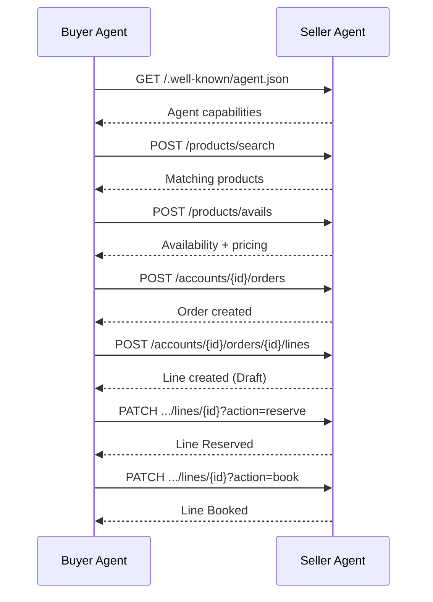

# Seller Agent Integration

The buyer agent connects to one or more seller agents to search inventory, check availability, and book deals using the IAB OpenDirect 2.1 protocol.

## Connection Configuration

The `OpenDirectClient` is configured through environment variables:

| Variable | Description | Default |
|----------|-------------|---------|
| `OPENDIRECT_BASE_URL` | Base URL of the seller's OpenDirect API | `http://localhost:3000/api/v2.1` |
| `OPENDIRECT_TOKEN` | OAuth 2.0 bearer token for seller auth | (none) |
| `OPENDIRECT_API_KEY` | API key for seller auth (fallback if no token) | (none) |

The client is instantiated in `interfaces/api/main.py`:

```python
OpenDirectClient(
    base_url=settings.opendirect_base_url,
    oauth_token=settings.opendirect_token,
    api_key=settings.opendirect_api_key,
)
```

### Authentication Priority

The client sets headers in this order:

1. If `oauth_token` is provided: `Authorization: Bearer <token>`
2. Else if `api_key` is provided: `X-API-Key: <key>`
3. Otherwise: no authentication header

### Multi-Seller Mode

For connecting to multiple seller agents, use the `SELLER_ENDPOINTS` setting (comma-separated URLs):

```dotenv
SELLER_ENDPOINTS=https://seller-a.example.com/api/v2.1,https://seller-b.example.com/api/v2.1
```

Parse with `settings.get_seller_endpoints()`.

## Discovery

Seller agents may expose a well-known discovery endpoint:

```
GET <seller-base>/.well-known/agent.json
```

This returns the seller's capabilities, supported OpenDirect version, and available endpoints. The buyer agent can use this to verify compatibility before starting a booking flow.

## Main Integration Points

### Product Search

The buyer queries the seller's product catalog during the research phase:

- **List products**: `GET /products?$skip=0&$top=50` --- paginated product listing
- **Search products**: `POST /products/search` --- filtered search with channel, format, pricing criteria
- **Get product**: `GET /products/{id}` --- single product details

### Availability and Pricing

Before recommending products, channel specialists check availability:

- **Check avails**: `POST /products/avails` --- returns available impressions, estimated CPM, total cost, and delivery confidence

### Order and Line Management

After approval, the buyer creates orders and books line items:

- **Create order**: `POST /accounts/{id}/orders` --- creates an insertion order
- **Create line**: `POST /accounts/{id}/orders/{id}/lines` --- creates a line item for a product
- **Reserve line**: `PATCH /accounts/{id}/orders/{id}/lines/{id}?action=reserve` --- reserves inventory
- **Book line**: `PATCH /accounts/{id}/orders/{id}/lines/{id}?action=book` --- confirms the booking

### Performance Monitoring

For in-flight campaigns:

- **Line stats**: `GET /accounts/{id}/orders/{id}/lines/{id}/stats` --- delivery metrics, pacing, spend

## Request Flow



## Related

- [Seller Agent Documentation](https://iabtechlab.github.io/seller-agent/)
- [Seller Agent Buyer Integration Guide](https://iabtechlab.github.io/seller-agent/integration/buyer-agent/)
- [OpenDirect Protocol](opendirect.md)
